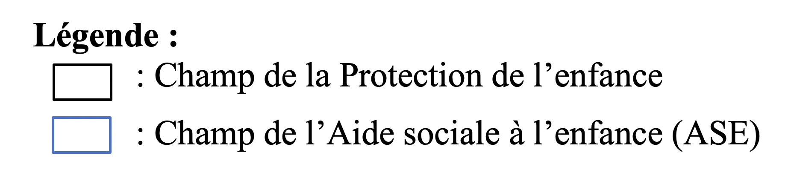
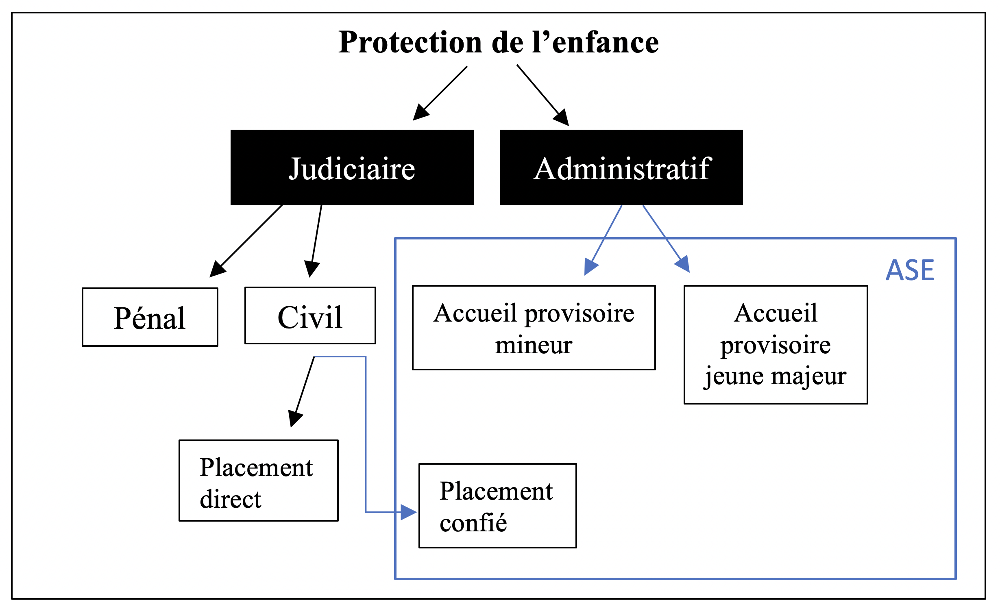
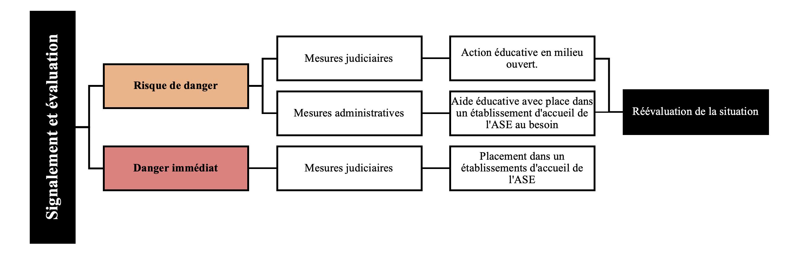
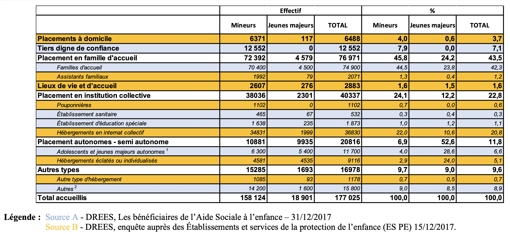

```{r setup, include=FALSE}
knitr::opts_chunk$set(echo=FALSE, warning=FALSE, message=FALSE,fig.align = 'center')
```

# Placer un enfant à la Protection de l'enfance : enjeux et fonctionnement

*Revenir sur nécessité de présenter le fonctionnement de la Protection de l'enfance qui est assez complexe en France et hérité d'évolutions sur un temps long.* *Une évolution qui a eu un effet sur la production de données sur le sujet.* *Et qui donne lieu à certains types d'établissements qui sont au cœur de ses évolutions et de l'innovation.*

## La Protection de l'enfance en France : évolutions et fonctionnement

### Qu'est-ce que la Protection de l'enfance ?

> *La Protection de l'enfance, fonctionnement général*

En France, la Protection de l'enfance s'organise depuis la fin de la Seconde Guerre  mondiale en deux branches qui protègent parfois les mêmes enfants : le judiciaire et l'administratif. La protection judiciaire s'occupe de deux catégories d'enfants : les enfants délinquants et les enfants en danger mineurs ou jeunes majeurs. La protection administrative, prise en charge par l'Aide sociale à l'enfance, s'occupe des enfants mineurs ou majeurs de moins de 21 ans en risque de danger ou en danger.

Figure -- Schéma de l'organisation de la Protection de l'enfance en France

```{r, out.width="40%"}

```

```{r, out.width="60%"}

```

Si on replace la Protection de l'enfance dans le paysage de l'aide sociale en France, elle entre dans le cadre des systèmes de solidarité et non dans celui de prévoyance.
En effet, les systèmes de prévoyance sont financés par les cotisations et donc ouverts qu'à ceux qui y cotisent.
Les systèmes de solidarité quant à eux s'applique à des personnes qui n'ont pas cotisé.
Il s'agit de ce fait d'une aide subsidiaire, puisqu'elle n'intervient qu'en cas de défaillance ou déficience de la famille, puis du droit commun .
La Protection de l'enfance par sa fonction remplit un droit fondamental stipulé par l'article 11 du préambule de la Constitution de 1946 garantissant « à tous, notamment à l'enfant, à la mère et aux vieux travailleurs la protection de la santé, la sécurité matérielle, le repos et les loisirs.
».

> *La protection judiciaire*

Nous le disions, la protection judiciaire s'occupe à la fois des enfants délinquants et des enfants en danger mineurs ou jeunes majeurs.
Dans les deux cas, c'est le Tribunal pour enfants représenté par le Juge pour enfants qui décide de la mesure éducative qui sera prise.

Pour les mineurs délinquants, la mesure prise peut être un placement chez ses parents ou son tuteur, tout comme un placement sous liberté surveillée (le mineur sera suivi par un éducateur dépendant directement du tribunal) et/ou un placement dans une institution ou un établissement public ou privé d'éducation ou de formation professionnelle habilité.
La mesure ne peut excéder l'âge de 18 ans.

Dans le cas des enfants en dangers mineurs ou jeunes majeurs, le juge des enfants peut décider de mesures éducatives.
En la matière, c'est l'ordonnance de 1958 relative à la protection de l'enfance et de l'adolescence en danger qui spécifie le champ et l'objectif de l'action du juge des enfants en indiquant que le juge ne travaille désormais aussi dans le domaine du civil et n'est plus restreint au pénal .
Ainsi, ce dernier doit vérifier qu'il s'agit bien d'un cas d'enfant en danger ou en risque de danger.
Une fois cette première étape remplie, il oriente l'enfant soit en protection administrative ou il détermine l'absence de danger et se retire du dossier.
N'existant pas de définition claire d'enfant en situation de danger, ce point est laissé à l'appréciation personnelle du juge des enfants.
Dans le cas d'un choix d'action de la part du juge, ce dernier peut choisir de la faire appliquer avec ou sans l'accord des parents ou des tuteurs légaux.
Il doit néanmoins par la loi chercher le plus possible l'adhésion de la famille.
Les enfants de cette catégorie peuvent être pris en charge jusqu'à l'âge de 21 ans.

> *La protection administrative*

Concernant, la branche administrative de la Protection de l'enfance, cette dernière est gérée par l'Aide sociale à l'enfance (ASE), anciennement appelée assistance publique.
Elle a autant un rôle préventif que protecteur .
Pour appliquer une mesure, elle doit impérativement obtenir le consentement des parents ou du/des tuteurs légaux.

Deux ensembles de moyens d'actions sont menés par l'ASE : les actions collectives et les prestations individuelles.
Les actions collectives ont pour objectif la promotion sociale et l'insertion des enfants et des familles.
Les prestations individuelles sont soit des aides à domicile, soit l'accueil de l'enfant dans des structures de l'ASE à la demande des parents ou suite à une décision judiciaire .

L'ASE a connu une suite de changements législatifs importants également depuis la fin de la Seconde Guerre mondiale, mais particulièrement lors de la décentralisation au début des années 1980.
L'ASE est en effet un service départemental depuis la loi du 22 juillet 1983.
L'état laisse ainsi à la charge de chaque département d'organiser ce service d'aide sociale obligatoire.
L'objectif de l'ASE est d'apporter un soutien matériel, éducatif et psychologique aux mineurs et jeunes majeurs, à leur famille ou à leurs responsables légaux qui seraient confrontés à des difficultés mettant ou risquant de mettre en danger la sécurité, la santé, la moralité, l'éducation, le développement physique affectif, intellectuel et social, des mineurs ou jeunes majeurs.
Le public concerné est aussi vaste que la mission de l'ASE.
Elle accueille ainsi les mineurs émancipés, les majeurs de moins de 21 ans, les mineurs isolés, les femmes seules avec enfants de moins de 3 ans.

> *Des critiques et des évolutions*

Les critiques envers la Protection de l'enfance sont depuis longtemps virulentes, particulièrement envers le fonctionnement de l'ASE.
Elles dépeignent un service d'accueil violent, qui agirait plus à l'encontre des familles qu'en leur faveur .
Rapidement, face à ces critiques, les politiques publiques ont évolué.
D'abord avec la loi de 2002, qui revoit le cadre d'intervention en réaffirmant les droits des usagers, qu'ils s'agissent de l'enfant (mineur ou majeur) ou des familles et en assurant leur participation dans la vie des établissements.
La réforme de la protection de l'enfance de mars 2007 confirme quant à elle l'ensemble des dernières évolutions législatives et institue les Conseils Généraux comme en charge du plan départemental.
Elle pose aussi trois axes prioritaires pour l'avenir de la Protection de l'enfance : renforcer les actions de prévention sur les territoires, organiser le recueil des signalements des situations de danger sur les départements, et diversifier les modes de prises en charge pour les adapter aux besoins de chaque enfant en danger ou en risque de danger.
Cette loi sera enfin complétée par celle du 14 mars 2016 qui inscrit notamment dans les missions de l'ASE de veiller à la stabilité du parcours de l'enfant.
Outre des réformes sur certains points légaux de l'adoption, cette loi réécrit aussi l'article du code de l'action sociale et des familles relatif au projet pour l'enfant (PPE) afin qu'il serve l'intérêt supérieur de l'enfant.
Enfin, autre développement majeur porté par la loi de 2016, est l'ajout aux missions des observatoires départementaux de la protection de l'enfance d'une mission pour la formation continue des professionnels de la PE .

### Un développement en lien avec l'évolution de la notion de famille et de la perception de l'enfance

> *Les évolutions de la famille contemporaine et l'intervention croissante de l'état*

Pour comprendre l'institution qu'est la Protection de l'enfance et son champ professionnel, il faut saisir l'arrière-fond des connaissances, des savoirs, des normes sociales, voire des prescriptions, en matière de famille et d'enfance, puisque cet arrière-fond sous-tend leur action.
Nous nous concentrerons d'abord sur la famille avant de porter notre regard sur l'enfance.

Bien qu'il serait pertinent d'effectuer un retour historique, déjà mainte fois réalisé, sur la famille au travers des sociétés médiévales et modernes, tant il éclaire la forme actuelle de la famille contemporaine, nous nous attarderons sur les évolutions récentes de l'institution familiale depuis le début du XXe siècle .
En effet, durant ce siècle, la famille a connu des changements majeurs qui peuvent être résumés dans des facteurs démographiques : la baisse du taux de mortalité infantile et du taux de natalité, la diffusion des méthodes modernes de contraception, la légalisation de l'avortement, la réduction de la taille de la famille.
Parallèlement à ces éléments, l'émergence de l'état-providence a poussé à une plus forte implication de l'état dans les sujets sociétaux .
Ainsi, en France, dans l'exemple des politiques concernant la jeunesse, ces dernières suivent une logique « sociale-démocrate » qui tendent à atténuer la dépendance du jeune à sa famille avec des aides directes de l'état (Frechon, Breugnot et Marquet, 2017 ; Van de Velde, 2012).
Un cadre législatif et de nombreuses réformes ont été mises en place et ont fait évoluer la forme et l'action de la Protection de l'Enfance, et ce, particulièrement depuis la fin de la Seconde Guerre mondiale.

Ces évolutions aboutissent à la mise en place de la famille contemporaine, pour reprendre les réflexions de François de Singly.
Ce dernier démontre le phénomène d'intervention croissante de l'état dans la famille qui se fait en parallèle avec une privatisation de cette dernière .
C'est dans ce double mouvement que la Protection de l'enfance s'inscrit en ce faisant un outil de l'intervention étatique au sein de l'institution familiale.
F.
de Singly reprend ainsi les suites de la sociologie de la famille développée par émile Durkheim qui la percevait déjà comme à la fois privée et publique, privée car il constatait son autonomisation vis-vis des voisins, publique parce que sa dépendance à l'état ne cessait de croître .
Pour F.
de Singly, plus qu'un rôle d'aide, l'état encadre, voire étend son contrôle sur les familles, il se fait ainsi le régulateur des relations familiales.
Ce contrôle croissant de la parentalité se fait en parallèle de nombreuses réformes sociales qui garantissent l'autonomisation de l'homme et de la femme en tant que conjoints .

On peut ainsi s'interroger sur les effets que produisent cette intervention croissante de l'état dans une perspective critique.
Si ces évolutions peuvent s'apparenter à un développement positif des libertés individuelles et du respect des droits de l'Homme avec une protection légale renforcée des enfants, il existe un versant négatif à cette intervention.
En effet, comme Franz Schultheis l'a souligné, elle augmenterait les risques socioéconomiques pour les familles en facilitant la séparation conjugale.
Ce risque selon lui dépend du sexe, de la situation familiale ou encore du statut socioéconomique.
Il s'appuie sur l'exemple des mères célibataires qui font face à de lourdes difficultés économiques.
Ce risque rejaillit sur l'enfant et nécessite pour l'équilibrer une intervention de l'état .
Ici, de nouveau, la Protection de l'enfance tendrait à pallier ce déséquilibre.

Outre ces points, la société chercherait dès lors à responsabiliser d'autant plus les parents vis-à-vis de leur·s enfant·s.
En effet, en contrepartie d'un gain de liberté individuelle par une plus grande facilité de se séparer de son.sa conjoint·e, les deux parents doivent assurer une continuité parentale auprès de leur·s enfant·s.
C'est ce que souligne particulièrement Irène Thery, pour qui dès lors le bien le plus précieux de la famille est l'enfant qui devient le socle familial .
Ainsi, les attentes envers l'éducation des enfants augmentent, justifiant d'autant plus une intervention de la Protection de l'enfance afin d'assurer une égalité de traitement dans les cas où ces attentes ne seraient pas remplies.

Du fait de ces évolutions sociétales, le droit a dès lors poussé les états-providence à agir en matière de protection de l'enfant.
La Convention internationale de l'enfant de 1989 (CIDE) , pour ne citer qu'elle, parachève un ensemble de textes internationaux qui visent à garantir les droits en tant que citoyens de l'enfant.
Ceci s'explique par une notion mise en avant par la CIDE de 1989 ratifié par la France en 1990 qui est celle de l'« intérêt de l'enfant ».
Dans le droit français, cette notion apparaît déjà avec la loi de 1904 portant sur l'organisation de l'Assistance publique, future Aide sociale à l'enfance.
Ce principe est devenu rapidement un leitmotiv des politiques publiques.
Il apparaît dans les textes de loi et fonde plusieurs de ses principes d'action et définit les objectifs de prise en charge de l'enfant.

> *Les représentations de l'enfance et leurs effets sur les pratiques professionnelles*

L'ensemble de ces réflexions nous amène à nous concentrer plus particulièrement sur l'enfant et les représentations de l'enfance.
Ces dernières changent et évoluent d'une culture à une autre.
La dimension historique dans le cas français le met clairement en évidence , notamment dans l'évolution qu'a connu l'âge du passage à la majorité et donc de la fin du statut d'enfant.
L'enfance est ainsi une catégorie sociale, qui par rapport aux autres catégories sociales a la particularité d'être vécue par tout le monde une fois dans leur vie.
Pour aller plus loin dans cette définition de l'enfance, on peut reprendre les réflexions de Virginie Vinel et Francesca Zaltron, pour qui l'enfant est un individu qui appartient à une strate sociale relative à la société et à une époque donnée .

Ce sont donc les adultes qui fondent les représentations de l'enfance et créé les contours de cette catégorie.
Il est intéressant de noter ici, que depuis la fin du XIXe siècle et durant tout le XXe siècle jusqu'à nos jours, l'enfant est défini aux yeux de la société par un ensemble de savoirs psychologiques et médicaux qui dressent des stades de développement aboutissant à l'adulte, pour reprendre la réflexion de André Turmel (Turmel, 2013).
Ces derniers régularisent et standardisent les phases physiques et psychologiques de l'enfant.
Ils permettent aussi de définir les besoins vitaux tant en termes physiques qu'émotionnels de l'enfant en fonction de son âge, des besoins auxquels la famille se doit de répondre, et à défaut d'elle, auquel l'état doit suppléer.
Ce sont sur ces connaissances qui sont transmises dans le cadre de leur formation que les professionnels encadrant les mineurs s'appuient et qui définit leur mode d'action.

Ces évolutions de la perception de l'enfance ont été étudiées par les sociologues notamment avec les childhood studies dans lesquelles deux visions s'affrontent : soit observer les enfants comme des adultes en formation, soit étudier les enfants en tant qu'être présents, en lien avec la notion d'agency .
Il est intéressant de voir dès lors des études cherchant à souligner l'effet des différents regards portés sur les enfants dans la recherche, les institutions, les sociétés et comment ces différents regards se diffusent et questionnent les acteurs des champs qui encadrent les mineurs .
En effet, le travail des professionnels du secteur de la protection de l'enfance témoigne de l'évolution de ces visions de la société.
En effet, pour reprendre les mots de Jérôme Delfortie : « L'édifice Protection de l'Enfance a évolué au gré des différentes lectures de l'enfance par le prisme social.
» .
Les relations entre adultes et enfants ont du fait de ces savoirs sur l'enfance évolué, que cela soit dans le champ familial ou professionnel.
L'état a augmenté aussi son intervention, ce qui a conduit à judiciariser les rapports avec enfant, pour reprendre les termes de Alain Renaut.
Un point qui a eu pour effet sa libération de l'autorité traditionnelle .
C'est cette libération qui a court depuis le XIXe siècle et est même datée par certains à la loi du 24 juillet 1889 où l'état instaure la déchéance des droits de la puissance paternelle, qui rend possible l'intervention de la Protection de l'Enfance en la matière.
En effet, l'état devient dès lors le protecteur des enfants en situation de danger ou risque de danger .

### L'organisation concrète du placement

> *Parcours type en Protection de l'enfance*

Jusqu'à présent nous avons vu l'organisation globale de la Protection de l'enfance, les types d'enfants dont elle s'occupait et les évolutions de la société dans la perception de l'enfance et de la famille qui explique son mode d'action.
Dans tout cela, le parcours en soi de placement n'a pas été abordé.
Ce dernier suit un déroulement typique qui va du signalement et de l'évaluation de la situation à sa réévaluation avant la sortie de placement ou la mise en place d'une nouvelle mesure.

**Figure -- Schéma du parcours type de placement en Protection de l'enfance**

```{r, out.width="80%"}

```

Ainsi, après signalement, la Cellule de recueil des informations préoccupantes (Crip) enquête sur la situation de l'enfant.
Cette première étape consiste à une visite d'une assistante sociale au domicile de l'enfant, elle tente alors de déterminer s'il y a risque de danger ou danger immédiat.
Mais aussi, elle cherche à savoir si les parents sont enclins à accepter une aide.
Suite à cette visite, l'assistante sociale fait remonter en cas de risque de danger ou danger immédiat l'information, afin qu'une aide soit mise en place.

S'il y a selon elle danger immédiat, l'affaire est envoyée au juge des enfants qui jauge la situation et tente de mettre en place une mesure de commun accord avec les parents ou tuteurs légaux.
Dans le cas du danger immédiat, c'est néanmoins le juge des enfants qui a le dernier mot en la matière, il n'a donc pas besoin de recueillir l'aval des parents ou tuteurs légaux.
Une mesure judiciaire va être prise qui débouche sur un placement en famille d'accueil, Maison d'enfant à caractère sociale, pouponnières ou villages d'enfants.

S'il y a risque de danger, une assistance éducative va être proposée par le département et être appliquée généralement sous la forme d'une aide éducative à domicile si les parents sont d'accord.
Si les parents refusent ou que l'aide éducative à domicile échoue, l'affaire peut être transférée au juge des enfants qui peut dès lors prendre une mesure sans l'aval des parents.
Généralement, une mesure d'action éducative en milieu ouvert, couramment appelée AEMO, est mise en place.
La situation de l'enfant est à la fin réévaluée.
Si le risque de danger persiste ou que l'AEMO est un échec, l'affaire est renvoyée devant le juge des enfants qui reconduit la mesure ou décide d'un placement.

Le processus de placement suit ainsi un parcours type qu'émilie Potin s'est attachée à décrire d'un point de vue sociologique prenant en compte l'expérience de l'enfant.
Elle décrit ainsi le parcours de placement comme traversé par trois phases principales : « la désignation du danger (processus d'étiquetage) », puis le « déplacement d'un lieu à l'autre et d'un milieu social à l'autre (processus d'apprentissage, d'adaptation et de socialisation) » et enfin : « l'intégration dans le quotidien du placement (phase de routinisation) » .
Le processus d'étiquetage appelle par la suite à un déplacement dans une structure.
à l'aide de l'étiquette attribuée à la situation de l'enfant, l'ASE appelle ensuite les structures qu'elle juge adaptées à accueillir l'enfant afin d'appliquer la décision de protection.
Les structures elles-mêmes acceptent ou non d'accueillir l'enfant en fonction de leur jugement en leur capacité d'accueillir l'enfant, leurs places disponibles et le public déjà accueilli.

> *Les catégories juridiques des enfants accueillis*

De ce système de protection résulte sept catégories juridiques d'enfants protégés répartis en deux catégories : les mesures judiciaires et les mesures administratives.
Le tableau ci-dessous les présente.

**Tableau 1 - Les catégories juridiques des enfants accueillis**

| **Type de mesure**      | **Catégorie juridique**                                                                       | **Définition**                                                                                                                                                                                                                                                                                                                                                              |
|---------------|---------------|----------------------------------------------|
| MESURES JUDICIAIRES     | *Les mineurs délinquants* pris en charge directement par le juge (Ord. de 1945 du code pénal) | Prise en charge décidée, suivie et financée par la justice, pour une mesure qui peut être soit un hébergement physique en secteur public ou associatif habilité, ou une liberté surveillée                                                                                                                                                                                  |
|                         | *Les enfants confiés à l'ASE par le juge*                                                     | Prise en charge sera décidée par le juge des enfants mais une fois confié, c'est l'ASE qui orientera l'enfant, financera et suivra la prise en charge. Cette catégorie réunis les enfants en danger (Art. 375 et suiv. du code civil) et les mineurs délinquants (Ord. de 1945 du code pénal). Placement en établissement ou famille d'accueil.                             |
|                         | *Les enfants placés directement par le juge des enfants*                                      | Concerne uniquement les enfants en danger (Art. 375 et suiv. du Code civil) dont la décision et le suivi éducatif de prise charge sont assurés par le juge des enfants. L'enfant est alors orienté soit en secteur public PJJ ou en secteur associatif habilité. Dans ce dernier cas, c'est l'ASE qui financera, contrôlera et suivra l'enfant.                             |
|                         | *Les jeunes majeurs PJJ* (Décret du 18 février 1975)                                          | Âgés entre 18 et 21 ans, ils ont fait la demande de protection auprès du juge des enfants qui a la charge dans son ensemble de la prise en charge (décision, suivi et financement).                                                                                                                                                                                         |
| MESURES ADMINISTRATIVES | *Les pupilles de l'État*                                                                      | Enfants orphelins, ou dont aucun de leurs deux parents n'exerce d'autorité parentale, ni même un tiers digne de confiance. Le préfet est alors tuteur des pupilles de l'Etat et le président du conseil généralen est le gardien. Il délègue ainsi sa fonction à l'ASE. Les décisions de prise en charge, le suivi et le financement reviennent donc intégralement à l'ASE. |
|                         | *Les accueils provisoires de mineurs*                                                         | Il s'agit des enfants « en risque de danger », la décision (avec l'accord des parents) d'une prise en charge, le suivi et le financement reviennent intégralement à l'ASE.                                                                                                                                                                                                  |
|                         | *Les accueils provisoires de jeunes majeurs* (Décret du 2 décembre 1975)                      | De même que pour les jeunes majeurs PJJ, il s'agit de jeunes de 18 à 21 ans qui font la demande à l'ASE d'être protégé. La décision d'une prise en charge, le suivi et le financement sera assuré par l'ASE.                                                                                                                                                                |

Il est à noter que quand bien même un enfant entre à la Protection de l'enfance dans une catégorie juridique, cette dernière n'est pas immuable.
Il peut ainsi, au moment de la réévaluation de sa situation, se retrouver dans une autre catégorie pour pouvoir poursuivre sa prise en charge à la Protection de l'enfance dans les meilleures conditions.
Pour la recherche scientifique, ces catégories juridiques font l'objet de réflexion, puisqu'on les retrouve dans les données produites sur le sujet.
Ainsi, la question de leur utilisation et de leur signification sociologique se pose comme le souligne I.
Frechon .
Le problème majeur de ces catégories est qu'elles concentrent des enfants aux situations très diverses dans les mêmes groupes.
Ce point rend difficile de se servir de ces catégories pour définir les enfants pris en charge, néanmoins il rend utile de tels variables afin de porter son regard sur les pratiques des professionnels et surtout les différences entre pratiques du secteur judiciaire et du secteur administratif.

|       *Définitions des différents types d'établissements et d'hébergements*

Nous venons brièvement de l'évoquer dans le parcours type de placement, mais il existe différents lieux d'accueil qui sont destinés à accueillir les enfants en fonction de leurs besoins individuels, c'est-à-dire en fonction de leur âge, de leur motif de placement et d'éventuelles particularités dans leur situation : mineurs non accompagnés, situation de handicap.

Si on structure ce tour d'horizon des types d'établissements de placement de l'ASE par âge, il convient de débuter avec les pouponnières.
Ces dernières sont spécialisées dans l'accueil des tout petits enfants de 0 à 3 ans, ce sont des structures de taille moyenne avec comme capacité autorisée en 2017 une moyenne de 23 places, n'excédant pas les 30 places dans 75% des cas en 2017.

Ensuite, les villages d'enfants sont peu nombreux sur le territoire, 37 structures en tout.
Ils sont spécialisés dans l'accueil des enfants sur le long terme.
Ce sont de grandes structures avec une capacité moyenne de 57 enfants par structures répartis en unité de vie, ce qui permet de proposer néanmoins un accueil personnalisé et une stabilité dans le placement.

Les lieux de vie et d'accueil proposent quant à eux un accueil individualisé des enfants dans de petites structures ayant en moyenne 6 places et qui ne peuvent accueillir plus de 7 enfants.
Ils accueillent les enfants avec des problèmes psychologiques ou ceux que l'on considère comme des « incasables », c'est-à-dire qui enchainent les types de placement, sans qu'aucun ne semble parvenir à s'adapter à leurs besoins.

Les Foyers de l'enfance sont des hébergements d'urgence et courts qui accueillent surtout avant réorientation les enfants vers un type d'accueil plus pérennes.
Ce sont des structures de taille variable avec une capacité moyenne de 58 enfants.
25% de ses structures ne dépassent pas les 12 enfants en capacité d'accueil autorisée et 25% dépassent à l'inverse les 63 enfants en capacité d'accueil autorisée.

Enfin, les Maisons d'enfant à caractère social (MECS), propose un accueil temporaire d'enfant lié à un problème familial ou comportemental.
Ils accueillent aussi les mineurs non accompagnés.
Ils ont une capacité moyenne d'accueil de 41 enfants avec aussi une grande variabilité en 2017 dans la taille des structures : un premier quart de structures ne dépassant pas 18 places en capacité autorisée, la moitié les 35 et enfin les trois-quarts les 56.

Le premier type d'hébergement le plus courant et proposant le plus de places est l'internat collectif.
C'est un hébergement au sein de la structure qui peut proposer plusieurs unités de vie, c'est le cas notamment dans les villages d'enfant.
On le retrouve dans tous les types d'établissements.

Le deuxième type d'hébergement sont les assistants familiaux.
Ces derniers sont des professionnels de la protection de l'enfance formés par l'état à l'accueil de mineurs ou jeunes majeurs protégés.
Ils accueillent directement chez eux les jeunes majeurs ou mineurs.
Ils restent rattachés dans certains cas à des établissements qui gèrent le placement de l'enfant et on les retrouve aussi dans tous les types d'établissements.

Le placement à domicile est une mesure d'assistance éducative décidée par un juge pour enfant.
Concrètement, le jeune majeur ou le mineur continue de vivre dans sa famille, mais bénéficie d'une solution de repli dans un établissement de l'ASE.
C'est un type d'hébergement que l'on retrouve dans tous les types d'établissements, sauf en lieux de vie et d'accueil.

Enfin, le logement autonome ou hébergement éclaté recoupe plusieurs réalités.
Il s'agit de place d'hébergement physiquement en dehors de la structure d'accueil, soit dans un ensemble de logements, soit en chambres dispersées dans le logement ordinaire ou l'habitat social, voire en hôtel.
C'est un type d'hébergement qui n'est logiquement pas proposé par les pouponnières à caractère social et est peu présent dans les villages pour enfants.

## L'impossible comptabilisation des enfants placés ? Un enjeu de gestion et de recherche

### Les effets de la départementalisation sur la production de données

> *Une organisation héritée de la décentralisation*

Les lois de décentralisation de 1983 et 1984 ont transféré la compétence \<\< d'aide aux enfants confrontés à des difficultés sociales susceptibles de compromettre gravement leur équilibre \>\> (CASF, Article L221-1) aux présidents des Conseils généraux et ont précisé les contours de l'autorité judiciaire et de l'autorité administrative.
Dès lors, la branche judiciaire intervient dans le cas où les mineurs victime de mauvais traitements voit leur famille refuser l'intervention du service de l'Aide sociale à l'enfance.
Le président du Conseil Général voit ses missions en la matière précisées : il définit la politique départementale de l'aide sociale à l'enfance, crée et autorise les établissements sociaux et arrête leur tarification, et enfin, il prononce l'admission à toute mesure d'aide sociale à l'enfance .

Cette décentralisation a eu des effets concrets sur la production de statistiques sur le sujet.
En effet, historiquement les statistiques sont liées à l'état et particulièrement à l'état-providence qui au cours du XXe siècle s'est aidé de ces outils permettant d'estimer la capacité et les besoins d'une population pour bâtir ses politiques sociales et les piloter à long terme.
Pour A. Desrosières, le modèle français serait un mélange d'une tradition administrative centralisée et d'un rationalisme, en témoigne l'exemple des ingénieurs administrateurs .
à contre-courant de cela, la décentralisation de l'aide sociale a rendu particulièrement difficile la production de statistiques globale sur la Protection de l'enfance, en plus de créer des disparités départementales en matière de politique de l'aide sociale.
Cette situation a créé de l'ignorance qui a des conséquences autant gestionnaires et politiques que sur l'état de la recherche scientifique sur ces sujets.

Pourtant, la visée statistique était bien présente dans la loi de 1989 qui prévoyait la remontée de données en chargeant les présidents du Conseil Général de mettre en place un dispositif de recueil d'informations.
Dès 1991, une première étude de faisabilité réalisée par l'Institut de l'enfance et de la famille dresse l'état des lieux de la collecte statistiques sur le sujet en France et ébauche un dispositif de recueil.
Pourtant, il faut attendre 1997 avec l'Observatoire national de l'action sociale décentralisée (ODAS) pour qu'une méthodologie d'observation à l'échelle nationale soit élaborée avec le concours des départements.
C'est ainsi qu'est née le recensement annuel des signalements transmis aux département, premier jalon d'une statistique nationale sur le sujet, malgré l'existence de données produites par la DREES qui ne s'intéresse elle depuis 1982 qu'aux établissements sociaux.
Cette enquête de la DREES n'était pas dédiée à la Protection de l'enfance puisqu'elle portait alors autant sur les établissements et services pour personnes handicapées que sur ceux pour personnes en difficulté sociale, et donc de la Protection de l'enfance.

> *La création de la ONPE*

Dès lors, dans les années 2000, l'état cherche à organiser des structures à l'échelle nationale à même de produire des connaissances sur la Protection de l'enfance et de rationnaliser la collecte de données.
L'observatoire national de la Protection de l'enfance (ONPE) est créé dans cette optique en 2004.
Les lois de 2004 et 2007 établies ses principales missions qui sont les suivantes : « Améliorer la connaissance sur les questions de mise en danger et de protection des mineurs à travers le recensement et le développement des données chiffrées d'une part, des études et recherches d'autre part ; Recenser, analyser et diffuser les pratiques de prévention et d'intervention en protection de l'enfance ; Soutenir les acteurs de la protection de l'enfance.
» (CASF, art L 226-6).
Avec la loi du 7 février 2022, la définition de son rôle est renforcée et il devient un « centre national de ressource, chargé de recenser les bonnes pratiques et de répertorier ou de concourir à l'élaboration d'outils et de référentiels » (CASF, art L 226-6).

Sa production principale est depuis sa création l'estimation annuelle du nombre d'enfants protégés.
Ce chiffre est le résultat du croisement des données de deux principales sources : de la Direction de la recherche, des études, de l'évaluation et des statistiques (DREES) et de la Direction de la protection judiciaire de la jeunesse (DPJJ).
Ainsi, en 2015, le nombre de mineurs bénéficiant d'au moins une mesure de protection de l'enfance est estimé à 295 357 sur la France entière, soit 20,1 ‰ des moins de 18 ans .

> *Les observatoires départementaux*

En appui de l'ONPE, la loi de 2007 cherche à compléter le dispositif de remontée des données départementales sur la Protection de l'enfance en créant des observatoires départementaux de la protection de l'enfance (ODPE).
C'est le président du Conseil Général qui est chargé de leur mise en place et de leur animation en association avec les acteurs locaux.
Pourtant la mise en place de ces observatoires et leur effectivité a fait l'objet de nombreuses difficultés, tant et si bien qu'encore en 2020, l'ONPE continue de produire des documents dressant des états des lieux de la mise en place des ODPE sur le territoire.
En effet, l'ONPE suit attentivement depuis 2009 le développement de ces observatoires à l'aide d'une enquête bisannuelle qui les interroge sur leur fonctionnement autant que sur leurs attentes, besoins et difficultés.
En 2020, 83 observatoires départementaux sont installés et 10 sont en construction, sur les 100 départements existants en France métropolitaine et DROM, hors Mayotte.
4 départements font encore figure d'exception en n'ayant pas prévu la construction d'ODPE.
En 2018, 17 ODPE étaient construction et 74 déjà en place.
L'absence d'ODPE ne signifie pas pour autant absence de production de statistiques sur le sujet.
En effet, sur 14 départements encore non-dotés d'observatoire, 11 d'entre eux ont tout de même mis en place un dispositif ou des instances permettant de recueillir des données quantitatives et/ou qualitatives.

Les ODPE font face aujourd'hui à des difficultés d'ordre technique et réclament autant des formations qu'un soutien technique de la part de l'ONPE pour les aider dans la gestion et la production de données .
Les départements apparaissent ainsi en demande de soutien pour bâtir des systèmes de collecte statistiques efficaces leur permettant de mieux connaître la portée sur leur territoire de leur politique départementale d'aide sociale.
Ainsi, la mise en place de structures adaptées semble difficile au niveau départemental pour ces raisons, mais aussi parce qu'ils rencontrent des obstacles au niveau local des structures d'accueil.
En effet, ces dernières sont logiquement chargées de communiquer des informations sur le public accueilli et les places disponibles, mais cette remontée est rendue difficile d'une part du fait d'un manque de formation du personnel en charge de remplir ces bases et d'autre part du fait d'une crainte que l'utilisation de ces données ne mène à une baisse de la subvention de ces lieux d'accueil.
Ces difficultés concernent dès lors autant les enquêtes menées par l'ONPE, que celles menées par la DREES qui s'adresse directement aux structures d'accueil.

```{=tex}
\mdfsetup{%
middlelinewidth=2pt,
backgroundcolor=gray!10,
roundcorner=10pt}
\begin{mdframed}[frametitle= Exemple d'une rencontre avec un chargé de mission de la direction enfance et famille et de l'ODPE du département de l'Hérault]

Cette rencontre réalisée dans le cadre d'une discussion sur un projet de thèse en contrat CIFRE exemplifie certaines difficultés dans la production de données rencontrées par les départements, pourtant envieux d'approfondir leurs connaissances sur leurs dispositifs d'aide sociale à l'enfance. Ainsi, à la fin de l'année 2021, le projet de recherche que le département de l'Hérault souhaitait financer visait, à l'aide des données qu'ils produisent, à chercher à « prendre du recul » sur les effets de leurs politiques départementales. à titre indicatif, selon le chargé d'études et directeur de l'ODPE de l'Hérault, la direction enfance et famille traite 2500 informations préoccupantes, suit 2700 enfants à domicile dans leurs familles et accueille près de 2800 enfants et jeunes majeurs en foyers et en famille d'accueil en 2021.

Il témoigne de leur besoin de visibilité sur leurs disponibilités d'accueil, les contours de leur accueil familial et sur les usages des dispositifs. En particulier, ils ont besoin qu'un travail soit mené sur les mesures administratives et judiciaires et leurs différentes déclinaisons. Mais aussi sur les mesures de préventions, puisqu'actuellement ils peinent à avoir des données qui leur permettent de justifier de l'intérêt des politiques de prévention sur celles d'accueil. Ce sont des questions certes techniques, mais qui cachent aussi des enjeux financiers importants pour le département.

Au niveau de leur données, comme de nombreux autres départements, ils utilisent un logiciel qui leur permet de faire des extractions suivant des requêtes, mais leur base de données dispose de peu d'informations sur le profil socio-économique de l'enfant accueilli et de sa famille. Ce point rend l'analyse sociologique difficile. Le département chercherait ainsi à améliorer leur base de données, afin de la rendre effective pour qu'elle réponde aux questions de politiques public qu'ils se posent. Cette recherche se serait faite avec les données regroupées suite à une compilation manuelle de l'ODPE de l'Hérault. Cette dernière est une instance partenariale regroupant le Département de l'Hérault, des MECS (Maisons d'enfant à caractère social) et lieux de vie, des assistants familiaux, l'éducation nationale, l'école des travailleurs sociaux et des associations œuvrant pour la protection de l'enfance. Elle a été créée récemment puisque leur première séance plénière s'est tenue en 2019. Cette remontée des données prend appui sur des assistantes administratives qui remplissent les bases, ce qui peut donner lieu à des erreurs du fait qu'il ne s'agit pas d'un personnel formé pour accomplir cette tâche. Ce point allié à d'autres difficultés techniques fait qu'à l'heure actuelle le département lui-même a du mal à dire où il y a des places disponibles dans les lieux d'accueil et d'hébergement. Le chargé de mission et directeur de l'ODPE de l'Hérault suppose ainsi que l'orientation des enfants dans tel ou tel type d'hébergement dépend essentiellement de l'offre et de la demande.

\end{mdframed}
```
### Panorama des sources statistiques actuelles

Du fait des difficultés de construction d'un dispositif national de collecte de données, plusieurs sources de données sur les enfants placés en Protection de l'enfance en France existent, mais elles ne portent pas toutes sur les mêmes populations, n'utilisent pas les mêmes méthodes et ne reprennent pas les mêmes catégories ou formulations .
Cette situation ne s'explique pas seulement du fait de l'évolution historique de la Protection de l'enfance en France et des effets donc de la départementalisation, mais est aussi une conséquence de l'hétérogénéité de la population étudiée et du nombre d'institutions impliquées à différentes échelles.
Nous proposons ainsi de réaliser un bref panorama de ces différentes sources qui permettra de mieux situer les données que nous utiliserons pour notre étude et de mieux en comprendre le champ.
De manière générale, ces sources se divisent en deux grands groupes : celles issues des ministères de la Justice et de l'Intérieur qui concernent une partie de la population des enfants placés et sont à visée strictement gestionnaire et celles de l'ONPE avec le dispositif OLINPE et de la DREES qui permettent des analyses plus poussées.
Il existe aussi une autre catégorie de sources de données que les enquêtes menées par la statistique publique.
À part l'enquête ELAP, ces dernières correspondent plutôt à des enquêtes de victimation et sont souvent rétrospectives, nous ne les inclurons donc pas à ce panorama .

> *Les données produites par les ministères de la Justice et de l'Intérieur*

Parmi les sources de données précédemment présentées, les ministères de la Justice et de l'Intérieur produisent aussi des statistiques sur les enfants placés.
Ces dernières ont néanmoins la limite d'être à visée gestionnaire et donc s'intéresse plus à un événement ou une situation qu'à l'enfant concerné par la mesure en lui-même.
Il s'agit de remontées annuelles des différents services qui sont par la suite agrégées.

Le ministère de la Justice propose ainsi deux types de données : d'une part les tableaux de bord des tribunaux pour enfants recensant les saisines et décisions de prise en charge en assistance éducative, et d'autre part, les chiffres de la Direction de la protection judiciaire de la jeunesse (DPJJ).
Ces statistiques concernent ainsi exclusivement les enfants ayant des mesures judiciaires (pénales ou civiles).
Le ministère de l'Intérieur produit des données avec le Service statistique ministériel de la sécurité intérieure (SSMSI).
Ces dernières portent sur les crimes et délits enregistrés par les services de police ou de gendarmerie.
Dans celles-ci, on peut retrouver des informations sur les victimes mineures de violences et négligences et notamment grâce à la variable « Natinf » ou « nature de l'infraction » créées en 1978.
À partir de cette variable, l'ONPE a bâti deux indicateurs qu'il présente dans son rapport 2016 : celui sur les « violences physiques » contre les personnes et celui sur les « violences sexuelles ».
C'est dans le second que l'on retrouve des informations sur des enfants victimes d'abus.
Toutes ces données restent très parcellaires puisqu'elles ne concernent que les faits qui ont été portés à l'attention de la police et de la gendarmerie en France métropolitaine.

> *Les données produites par l'ONPE et particulièrement le dispositif OLINPE*

Nous l'avons vu une des missions de l'ONPE est le recueil et l'analyse des données produites par les départements concernant l'Aide sociale à l'enfance.
En outre, l'Observatoire produit aussi ses propres études telles qu'une enquête portant sur les informations préoccupantes réalisées en 2011 et reconduite en 2016-2017.
Elle analyse aussi les données produites par le Service national d'accueil téléphonique de l'enfance en danger (SNATED) qui fait partie du même groupe d'intérêt public Enfance en danger.
Enfin, l'observatoire produit aussi une enquête annuelle sur les pupilles d'État .

Néanmoins, la mission actuellement la plus importante de l'ONPE en tant que producteur de données, reste la mise en place d'un système de collecte des données départementales via le dispositif d'observation longitudinale individuelle et nationale en protection de l'enfance (Olinpe).
Les départements sont dans l'obligation légale de transmettre ces données via la loi de 2016.
Une liste du type de variables qu'ils doivent transmettre a été mise au point.
On retrouve ainsi dans les données :

-   Les caractéristiques du mineur ou du jeune majeur (ses caractéristiques sociodémographiques, sa situation scolaire, sa situation de handicap) ;

-   les caractéristiques de l'information initiale sur la situation de danger ou de risque de danger ; le cadre de vie social et familial (les caractéristiques du ménage au sein de la résidence principale, l'exercice de l'autorité parentale, les caractéristiques sociodémographiques des parents et/ou des adultes qui s'occupent principalement du mineur dans sa résidence principale, la situation du jeune majeur, les ressources du ménage au sein de la résidence principale) ;

-   les informations recueillies au titre de l'évaluation de la situation (les caractéristiques de l'évaluation, les problématiques familiales observées) ;

-   les informations sur la nature du danger ou du risque de danger justifiant une prise en charge du mineur en protection de l'enfance (la nature du danger ou du risque de danger, la situation du mineur qui a permis de considérer qu'il était en (risque de) danger) ;

-   les informations sur les décisions, mesures et prestations en protection de l'enfance, qu'il s'agisse d'un début de mesure, d'un renouvellement ou d'une fin de mesure ou prestation.

À la lecture de l'ensemble des variables recueillies, on constate que ces données vont être très précieuses afin d'affiner les connaissances sur la Protection de l'enfance et les parcours des enfants en son sein.
Le dispositif permet ainsi de produire une base de données plus large que celle déjà mise ne place par l'Ined avec l'enquête ELAP -- Étude Longitudinale sur l'accès à l'Autonomie après le Placement -- de l'INED, réalisée entre 2013 et 2019 et qui se concentre sur la fin de parcours des enfants placés, vu que cette dernière avait construit un dispositif concernant que quelques départements.
Le dispositif OLINPE propose ainsi la mise en place d'une véritable base de données qui n'est pas uniquement à visée gestionnaire et qui permettra donc les analyses scientifiques afin d'approfondir les connaissances sur cette population.

En date de janvier 2022, le dispositif OLINPE a commencé à produire ses premières analyses, dix ans après la parution du décret du 28 février 2011 qui formalisent le dispositif.
Depuis 2012, seuls 46 départements ont été en mesure de transmettre un fichier annuel de données à l'ONPE.
Entre 2018 et 2020, l'observatoire a ainsi renforcé ses efforts d'accompagnement des départements mais pour reprendre les mots du rapport 2022 de l'ONPE sur le dispositif OLINPE : « Le contexte sanitaire et de réforme de la protection de l'enfance des années 2020-2021 a ralenti la réalisation de certaines actions » .

> *Les données de la DREES*

Enfin, les enquêtes mises en place par la DREES ont progressivement porté leur regard sur les établissements d'accueil de l'Aide sociale à l'enfance à l'échelle nationale.
Ces données sont précieuses puisqu'au fil des années le questionnaire a été développé afin de dépasser la simple visée gestionnaire.
En effet, bien qu'existant depuis 1982, l'enquête ES de la DREES s'est divisée en deux volets en 2001 : ES « personnes handicapées » et ES « difficulté sociale ».
Le deuxième volet mené en 2004 à un rythme d'une tous les quatre ans, permet déjà une meilleure collecte de données sur les établissements d'accueil de l'Aide sociale à l'enfance, puisqu'il devient déjà plus spécialisé à leur encontre.
En 2016, après la dernière vague de 2012, un autre pas est franchi.
L'enquête ES « difficulté sociale » est rénovée afin de dissocier les établissements et services en faveur des adultes et familles en difficulté sociale (ES-DS), des établissements et services de la protection de l'enfance (ES-PE).
Elle recense dès lors des données sur les enfants et jeunes majeurs accueillis, le personnel en fonction et l'activité des établissements.
Son questionnaire se voit élargit avec l'ajout de séries de questions, tout en préservant des questions issues du format permettant donc des comparaisons avec les vagues de 2008 et 2012.

Aujourd'hui donc, deux enquêtes de la DREES fournissent des données sur les enfants placés en Protection de l'enfance : l'enquête ES-PE et l'enquête sur les bénéficiaires de l'aide sociale départementale issues de l'enquête Aide sociale.
Cette dernière est une enquête annuelle réalisée auprès des conseils départementaux et à visée gestionnaire .
Elle collecte ainsi des données agrégées sur les bénéficiaires et les dépenses des prestations d'aide sociale relevant de la compétence des départements.
Cette seconde enquête permet de mieux saisir le champ de l'enquête ES-PE, en témoigne ce tableau pour les données 2017.

**Tableau 2 - Les champs de l'enquête sur les bénéficiaires de l'Aide sociale à l'enfance et de l'enquête ES-PE**

```{r, out.width="80%"}

```

On observe ainsi que seuls 37,7% des enfants placés en Protection de l'enfance sont présents dans l'enquête ES-PE.
En effet, les familles d'accueil représentent plus de 40% des placements, or elles ne sont pas présentes dans les données de l'enquête ES-PE 2017.
Néanmoins, on saisit mieux à l'aube de ces informations sur la portée de l'enquête ES-PE et son positionnement dans le champ des enquêtes sur la Protection de l'enfance, tout son intérêt.
Elle est en effet la seule enquête qui produit des données à l'échelle nationale sur les établissements d'accueil de l'Aide sociale à l'enfance et donc qui collecte des informations autant sur les professionnels de ce secteur, que sur les enfants qui y sont protégés.
