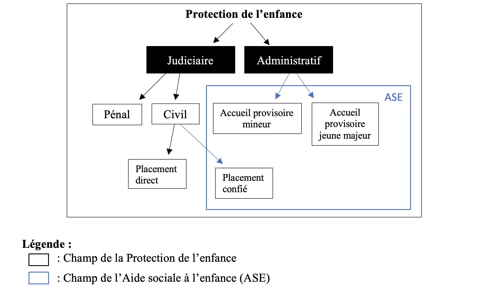
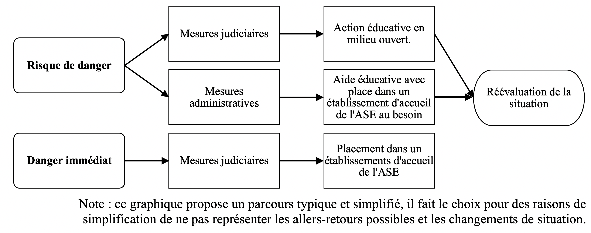

\pagestyle{fancy}
```{r setup c1, include=FALSE}
knitr::opts_chunk$set(echo=FALSE, warning=FALSE, message=FALSE,fig.align = 'center')
```

# Placer un enfant à la Protection de l'enfance : enjeux et fonctionnement

|               Avant de nous plonger au cœur même de notre problématique et ainsi de réfléchir à la répartition entre hébergement des enfants placés, il convient de présenter comment fonctionne la Protection de l'enfance. On verra ainsi que cette dernière par sa construction même et son évolution en lien avec la société et les représentations de l'enfance et de la famille qu'elle porte, produit déjà une base aux stratégies de répartition des professionnels du secteur. Suivant la même réflexion, nous présenterons ensuite le cas plus particulier des Maisons d'enfants à caractère social (MECS) et ce que signifie un placement dans ce type de structure. Nous verrons ainsi que les professionnels des MECS du fait de l'évolution de ce type d'institution ont développé leur méthode d'accueil et de répartition qui répond aussi à des enjeux sociétaux et des objectifs de désinstitutionnalisation.

## La Protection de l'enfance en France : évolutions et fonctionnement

### Qu'est-ce que la Protection de l'enfance ?

> *La Protection de l'enfance, fonctionnement général*

L'actuelle Protection de l'enfance a été organisée à la fin de la Seconde Guerre mondiale, afin de remplir par sa fonction un droit fondamental stipulé par l'article 11 du Préambule de la Constitution de 1946 garantissant « à tous, notamment à l'enfant, à la mère et aux vieux travailleurs la protection de la santé, la sécurité matérielle, le repos et les loisirs. »\footnote{\url{https://www.conseil-constitutionnel.fr/les-constitutions-dans-l-histoire/constitution-de-1946-ive-republique}, consulté le 01/06/2022.}. Ainsi, si on la replace dans le paysage de l'aide sociale en France, elle entre dans le cadre des systèmes de solidarité, s'appliquant à toutes personnes présente sur le sol français\footnote{Ceci contrairement au système de prévoyance qui ne s'applique qu'aux personnes y ayant cotisé.}. La Protection de l'enfance est par conséquent une aide subsidiaire, qui n'intervient qu'en cas de défaillance ou déficience de la famille, puis du droit commun[@verdierAideSocialeEnfance2013].

Sa réorganisation à la fin de la Seconde Guerre mondiale a mis en place deux branches : la branche judiciaire et la branche administrative (voir Figure \ref{fig:orga}). La protection judiciaire s'occupe de deux catégories d'enfants : les enfants délinquants et les enfants en danger mineurs ou jeunes majeurs. La protection administrative, prise en charge par l'Aide sociale à l'enfance, s'occupe des enfants mineurs ou majeurs de moins de 21 ans en risque de danger ou en danger. Ces deux branches ne divisent pas pour autant strictement en deux groupes les enfants qui y sont protégés, puisque parfois, elles s'occupent des mêmes enfants. Ce qui les différencie principalement, c'est l'adhésion ou non du parent à la mesure de protection ou mesure éducative qui a été décidée.

```{r orga, out.width = "90%",fig.cap="L'organisation de la Protection de l'enfance en France"}

```

> *La protection judiciaire*

La protection judiciaire s'occupe ainsi à la fois des enfants délinquants et des enfants en danger mineurs ou jeunes majeurs. Dans les deux cas, c'est le Tribunal pour enfants représenté par le Juge pour enfants qui décide de la mesure éducative qui sera prise.

Pour les mineurs délinquants, la mesure prise peut être un placement chez ses parents ou son tuteur, tout comme un placement sous liberté surveillée (le mineur sera suivi par un éducateur dépendant directement du tribunal) et/ou un placement dans une institution ou un établissement public ou privé d'éducation ou de formation professionnelle habilité. La mesure ne peut excéder l'âge de 18 ans.

Dans le cas des enfants en dangers mineurs ou jeunes majeurs, le juge des enfants peut décider de mesures éducatives. En la matière, c'est l'ordonnance de 1958 relative à la protection de l'enfance et de l'adolescence en danger qui spécifie le champ et l'objectif de l'action du juge des enfants. Elle indique ainsi que le champ d'action du juge des enfants dépasse désormais le domaine du pénal et s'applique aussi à celui du civil\footnote{\url{http://www.textes.justice.gouv.fr/textes-fondamentaux-10086/justice-des-mineurs-10088/lordonnance-du-23-decembre-1958-10132.html}, consulté le 20/05/2022}.
}. Ainsi, ce dernier doit vérifier qu'il s'agit bien d'un cas d'enfant en danger ou en risque de danger. Une fois cette première étape remplie, il peut orienter l'enfant en protection administrative ou déterminer l'absence de danger et se retirer du dossier. N'existant pas de définition claire d'enfant en situation de danger, ce point est laissé à l'appréciation personnelle du juge des enfants. Ce point ouvre à l'accueil d'enfants ayant vécu des situations très diverses. Dans le cas d'un choix d'action de la part du juge, ce dernier peut choisir de la faire appliquer avec ou sans l'accord des parents ou des tuteurs légaux. Il doit néanmoins par la loi chercher le plus possible l'adhésion de la famille. Ce point pose la question de la prise en compte de ces derniers dans la décision de protection du juge et sur la place qu'ils occuperont par la suite dans le parcours de protection de leur enfant. Les enfants de la protection judiciaire peuvent être pris en charge jusqu'à l'âge de 21 ans.

> *La protection administrative*

Concernant, la branche administrative de la Protection de l'enfance, cette dernière est gérée par l'Aide sociale à l'enfance (ASE), anciennement appelée assistance publique. Elle a autant un rôle préventif que protecteur[@martin-blachaisStructurationProtectionEnfance2017]. Pour appliquer une mesure, elle doit impérativement obtenir le consentement des parents ou du/des tuteurs légaux. Le rapport avec les parents ou les tuteurs légaux est ainsi profondément différent dans la branche administrative.

Deux ensembles de moyens d'action sont menés par l'ASE : les actions collectives et les prestations individuelles. Les actions collectives ont pour objectif la promotion sociale et l'insertion des enfants et des familles. Les prestations individuelles sont soit des aides à domicile, soit l'accueil de l'enfant dans des structures de l'ASE à la demande des parents ou suite à une décision judiciaire[@verdierAideSocialeEnfance2013]. C'est à ces dernières que cette étude s'intéressera particulièrement.

L'ASE a connu une suite de changements législatifs importants également depuis la fin de la Seconde Guerre mondiale, mais surtout particulièrement lors de la décentralisation au début des années 1980. En effet, depuis la loi du 22 juillet 1983, l'ASE est devenue un service départemental. L'État laisse ainsi à la charge de chaque département d'organiser ce service d'aide sociale obligatoire. L'objectif de l'ASE est d'apporter un soutien matériel, éducatif et psychologique aux mineurs et jeunes majeurs, à leur famille ou à leurs responsables légaux qui seraient confrontés à des difficultés mettant ou risquant de mettre en danger la sécurité, la santé, la moralité, l'éducation, le développement physique affectif, intellectuel et social, des mineurs ou jeunes majeurs. Le public concerné est aussi vaste que la mission de l'ASE. Elle accueille ainsi les mineurs émancipés, les majeurs de moins de 21 ans, les mineurs isolés, les femmes seules avec enfants de moins de 3 ans.

> *Des critiques et des évolutions*

La question de la protection de l'enfance est un sujet sensible dans notre société, et ce, particulièrement depuis qu'elle fait l'objet d'une politique publique claire. Ainsi, les critiques envers ce service d'aide sociale ont été depuis longtemps virulentes, particulièrement envers le fonctionnement de l'ASE. Elles dépeignent un service d'accueil violent, qui agirait plus à l'encontre des familles qu'en leur faveur \footnote{En témoigne cet ensemble non-exhaustif d'ouvrage cherchant à dénoncer les pratiques de l'Aide sociale à l'enfance et ce dès les années 1970 : Claude Liscia, Familles hors la loi (Maspero, 1978) ;Philippe Meyer, L'Enfant et la raison d'État (Le Seuil, 1977) ;Mireille Debard, L'Enfant au tribunal (Éditions Libres Halliers,1979) ; Pierre Leuliette, Les Enfants martyrs (Le Seuil, 1978) ; Jacques Donzelot, La Police des familles (Minuit, 1977) ; Claude Reboul, L'Enfant de la fugue (Stock 2, 1979) ; Aisha, Décharge publique (Maspero, 1980) ; Françoise Dolto, Danièle Rapoport et Bernard This,  Enfants en souffrance  (Stock, 1981) ; Pierre Verdier, L'Enfant en miettes (Privat-Dunod, 1982, 1986, 1992 et 1999) ; Lyès Louffok et Sophie Blandinières,  Dans l'enfer des foyers  (J'ai lu, 2016) ; Françoise Laborde et Michèle Créoff,  Le Massacre des innocents, les oubliés de la République  (2018) ;Marie Vaton , Enfants placés : il était une fois un naufrage  (Flammarion, 2021).}. Pour y répondre, l'ASE a dû évoluer autant dans sa manière de penser la protection de l'enfance que dans ses actions concrètes, c'est-à-dire dans ses méthodes d'accueil. Ces évolutions se sont traduites dans les textes de loi.

Tout d'abord avec la loi de 2002, qui revoit le cadre d'intervention en réaffirmant les droits des usagers, qu'ils s'agissent de l'enfant (mineur ou majeur) ou des familles et en assurant leur participation dans la vie des établissements.

La réforme de la protection de l'enfance de mars 2007 confirme quant à elle l'ensemble des dernières évolutions législatives et institue les Conseils Généraux comme en charge du plan départemental. Elle pose aussi trois axes prioritaires pour l'avenir de la Protection de l'enfance : renforcer les actions de prévention sur les territoires, organiser le recueil des signalements des situations de danger sur les départements, et diversifier les modes de prises en charge pour les adapter aux besoins de chaque enfant en danger ou en risque de danger.

Cette loi sera enfin complétée par celle du 14 mars 2016 qui inscrit notamment dans les missions de l'ASE de veiller à la stabilité du parcours de l'enfant. Outre des réformes sur certains points légaux de l'adoption, cette loi réécrit aussi l'article du code de l'action sociale et des familles relatif au projet pour l'enfant (PPE) afin qu'il serve l'intérêt supérieur de l'enfant. Enfin, un autre développement majeur porté par la loi de 2016, est l'ajout aux missions des observatoires départementaux de la protection de l'enfance d'une mission pour la formation continue des professionnels de la PE\footnote{\url{https://www.vie-publique.fr/loi/20945-loi-du-14-mars-2016-relative-la-protection-de-lenfant}, consulté le 26/05/2022}.

### Un développement en lien avec l'évolution de la notion de famille et de la perception de l'enfance

> *Les évolutions de la famille contemporaine et l'intervention croissante de l'état*

Ces lois ont été inspirées par les évolutions de perception de la famille et de l'enfance par la société. Ainsi, pour comprendre l'institution qu'est la Protection de l'enfance et son champ professionnel, il faut saisir l'arrière-fond des connaissances, des savoirs, des normes sociales, voire des prescriptions, en matière de famille et d'enfance, puisque cet arrière-fond sous-tend leur action. Nous nous concentrerons d'abord sur la famille avant de porter notre regard sur l'enfance.

Bien qu'il serait pertinent d'effectuer un retour historique, déjà mainte fois réalisé, sur la famille au travers des sociétés médiévales et modernes[@ariesEnfantVieFamiliale2014], tant il éclaire la forme actuelle de la famille contemporaine, nous nous attarderons sur les évolutions récentes de l'institution familiale depuis le début du XX^e^ siècle. En effet, durant ce siècle, la famille a connu des changements majeurs qui peuvent être résumés dans des facteurs démographiques : la baisse du taux de mortalité infantile et du taux de natalité, la diffusion des méthodes modernes de contraception, la légalisation de l'avortement, la réduction de la taille de la famille. Parallèlement à ces éléments, l'émergence de l'État providence a poussé à une plus forte implication de l'État dans les sujets sociaux[@esping-andersenTroisMondesEtatprovidence2007]. Ainsi, en France, dans l'exemple des politiques concernant la jeunesse, ces dernières suivent une logique « sociale-démocrate » et tendent à atténuer la dépendance du jeune à sa famille avec des aides directes de l'État[@veldeSoutenirAutonomieJeunes2012] [@marquetEnfantsProtegesFrance2013]. Un cadre législatif et de nombreuses réformes ont été mises en place et ont fait évoluer la forme et l'action de la Protection de l'Enfance, et ce, particulièrement depuis la fin de la Seconde Guerre mondiale. Ces évolutions aboutissent à la mise en place de la contemporaine, pour reprendre les réflexions de François de Singly. Ce dernier démontre le phénomène d'intervention croissante de l'État dans la famille qui se fait en parallèle avec une privatisation de cette dernière[@singlySociologieFamilleContemporaine2017]. C'est dans ce double mouvement que la Protection de l'enfance s'inscrit en ce faisant un outil de l'intervention étatique au sein de l'institution familiale. Émile Durkheim percevait déjà la famille comme à la fois privée et publique : privée, car il constatait son autonomisation vis-à-vis des voisins, publique, parce que sa dépendance à l'État ne cessait de croître[@durkheimFamilleConjugale1921]. Pour F. de Singly, plus qu'un rôle d'aide, l'État encadre, voire étend son contrôle sur les familles, il se fait ainsi le régulateur des relations familiales. Ce contrôle croissant de la parentalité se fait en parallèle de nombreuses réformes sociales qui garantissent l'autonomisation de l'homme et de la femme en tant que conjoints[@singlySociologieFamilleContemporaine2017].

On peut ainsi s'interroger sur les effets que produit cette intervention croissante de l'État dans une perspective critique. Si ces évolutions peuvent s'apparenter à un développement positif des libertés individuelles et du respect des droits de l'Homme avec une protection légale renforcée des enfants, il existe un versant négatif à cette intervention. En effet, comme Franz Schultheis l'a souligné, elle augmenterait les risques socioéconomiques pour les familles en facilitant la séparation conjugale. Ce risque selon lui dépend du sexe, de la situation familiale ou encore du statut socioéconomique. Il s'appuie sur l'exemple des mères célibataires qui font face à de lourdes difficultés économiques. Ce risque rejaillit sur l'enfant et nécessite pour l'équilibrer une intervention de l'État[@schultheisAffairesFamilleRaison1997]. Ici, de nouveau, la Protection de l'enfance tendrait à pallier ce déséquilibre.

Outre ces points, la société chercherait dès lors à responsabiliser d'autant plus les parents vis-à-vis de leur·s enfant·s. En effet, en contrepartie d'un gain de liberté individuelle par une plus grande facilité de se séparer de son.sa conjoint·e, les deux parents doivent assurer une continuité parentale auprès de leur·s enfant·s. C'est ce que souligne particulièrement Irène Thery, pour qui dès lors le bien le plus précieux de la famille est l'enfant qui devient le socle familial[@theryDemariage1993]. Ainsi, les attentes envers l'éducation des enfants augmentent, justifiant d'autant plus une intervention de la Protection de l'enfance afin d'assurer une égalité de traitement dans les cas où ces attentes ne seraient pas remplies.

Du fait de ces évolutions sociétales, le droit a dès lors poussé les États-providence à agir en matière de protection de l'enfant. La Convention internationale de l'enfant de 1989 (CIDE)\footnote{\url{https://www.unicef.fr/sites/default/files/convention-des-droits-de-lenfant.pdf}, site consulté le 11/05/2022.}, pour ne citer qu'elle, parachève un ensemble de textes internationaux qui visent à garantir les droits en tant que citoyen de l'enfant. Ceci s'explique par une notion mise en avant par la CIDE de 1989 ratifié par la France en 1990 qui est celle de l'« intérêt de l'enfant ». Dans le droit français, cette notion apparaît déjà avec la loi de 1904 portant sur l'organisation de l'Assistance publique, future Aide sociale à l'enfance. Ce principe est devenu rapidement un leitmotiv des politiques publiques. Il apparaît dans les textes de loi et fonde plusieurs de ses principes d'action et définit les objectifs de prise en charge de l'enfant.

> *Les représentations de l'enfance et leurs effets sur les pratiques professionnelles*

L'ensemble de ces réflexions nous amène à nous concentrer plus particulièrement sur l'enfant et les représentations de l'enfance. Ces dernières changent et évoluent d'une culture à une autre. La dimension historique dans le cas français le met clairement en évidence[@ariesEnfantVieFamiliale2014], notamment dans l'évolution qu'a connu l'âge du passage à la majorité et donc de la fin du statut d'enfant. L'enfance est ainsi une catégorie sociale, qui par rapport aux autres catégories sociales a la particularité d'être vécue par tout le monde une fois dans leur vie. Pour aller plus loin dans cette définition de l'enfance, on peut reprendre les réflexions de Virginie Vinel et Francesca Zaltron, pour qui l'enfant est un individu qui appartient à une strate sociale relative à la société et à une époque donnée[@vinelEnfantsActeursEnfants2020].

Ce sont donc les adultes qui fondent les représentations de l'enfance et créé les contours de cette catégorie. Il est intéressant de noter ici, que depuis la fin du XIX^e^ siècle et durant tout le XX^e^ siècle jusqu'à nos jours, l'enfant est défini aux yeux de la société par un ensemble de savoirs psychologiques et médicaux qui dressent des stades de développement aboutissant à l'adulte, pour reprendre la réflexion de André Turmel[@andreSociologieHistoriqueEnfance2013]. Ces derniers régularisent et standardisent les phases physiques et psychologiques de l'enfant. Ils permettent aussi de définir les besoins vitaux tant en termes physiques qu'émotionnels de l'enfant en fonction de son âge, des besoins auxquels la famille se doit de répondre, et à défaut d'elle, auquel l'État doit suppléer. C'est sur ces connaissances transmises dans le cadre de leur formation que les professionnels encadrants les mineurs s'appuient et qui définit leur mode d'action.

Ces évolutions de la perception de l'enfance ont été étudiées par les sociologues notamment avec les childhood studies dans lesquelles deux visions s'affrontent : soit observer les enfants comme des adultes en formation, soit étudier les enfants en tant qu'être présents, en lien avec la notion d' agency [@lignierSocialDifferentiationChildren2012]. Il est intéressant de voir dès lors des études cherchant à souligner l'effet des différents regards portés sur les enfants dans la recherche, les institutions, les sociétés et comment ces différents regards se diffusent et questionnent les acteurs des champs qui encadrent les mineurs[@vinelEnfantsActeursEnfants2020]. En effet, le travail des professionnels du secteur de la protection de l'enfance témoigne de l'évolution de ces visions de la société. Pour reprendre les mots de Jérôme Delfortie : «  L'édifice Protection de l'Enfance a évolué au gré des différentes lectures de l'enfance par le prisme social.  »[@delfortrieProtectionEnfanceProtection2017].

Ainsi, bien que l'on parle d'enfance en générale, les professionnels font dorénavant des distinctions entre enfance, adolescence et jeune adulte. Des distinctions que l'on retrouve par ailleurs dans les sciences sociales et qui permettent de mieux appréhender des réalités sociales très différentes entre ces différentes périodes de vie[@gallandAdolescencePostadolescenceJeunesse2001].

Les relations entre adultes et enfants ont du fait de ces savoirs sur l'enfance évolué, que cela soit dans le champ familial ou professionnel. L'État a augmenté aussi sonintervention, ce qui a conduit à judiciariser les rapports avec enfant, pour reprendre les termes de Alain Renaut. Un point qui a eu pour effet sa libération de l'autorité traditionnelle[@renautLiberationEnfantsContribution2002]. C'est cette libération qui a court depuis le XIX^e^ siècle et est même datée par certains à la loi du 24 juillet 1889 où l'État instaure la déchéance des droits de la puissance paternelle, qui rend possible l'intervention de la Protection de l'Enfance en la matière. En effet, l'État devient dès lors le protecteur des enfants en situation de danger ou risque de danger[@martin-blachaisStructurationProtectionEnfance2017].

### L'organisation concrète du placement

> *Parcours type en Protection de l'enfance*

Jusqu'à présent, nous avons vu l'organisation globale de la Protection de l'enfance, les types d'enfants dont elle s'occupait et les évolutions de la société dans la perception de l'enfance et de la famille qui explique son mode d'action. Dans tout cela, le parcours en soi de placement n'a pas été abordé. Ce dernier suit un déroulement typique qui va du signalement et de l'évaluation de la situation à sa réévaluation avant la sortie de placement ou la mise en place d'une nouvelle mesure (voir Figure \ref{fig:fig_par}).

```{r fig_par, out.width="90%", fig.cap="Schéma du parcous type de placement en Protection de l'enfance"}

```

Ainsi, après un signalement, la Cellule de recueil des informations préoccupantes (Crip) enquête sur la situation de l'enfant. Cette première étape consiste à une visite d'une assistante sociale au domicile de l'enfant, elle tente alors de déterminer s'il y a risque de danger ou danger immédiat. Mais aussi, elle cherche à savoir si les parents sont enclins à accepter une aide. Suite à cette visite, l'assistante sociale fait remonter en cas de risque de danger ou danger immédiat l'information, afin qu'une aide soit mise en place.

S'il y a selon elle danger immédiat, l'affaire est envoyée au juge des enfants qui jauge la situation et tente de mettre en place une mesure de commun accord avec les parents ou tuteurs légaux. Dans le cas du danger immédiat, c'est néanmoins le juge des enfants qui a le dernier mot en la matière, il n'a donc pas besoin de recueillir l'aval des parents ou tuteurs légaux. Une mesure judiciaire va être prise qui débouche sur un placement en famille d'accueil, Maison d'enfant à caractère sociale, pouponnières ou villages d'enfants.

S'il y a risque de danger, une assistance éducative va être proposée par le département et être appliquée généralement sous la forme d'une aide éducative à domicile si les parents sont d'accord. Si les parents refusent ou que l'aide éducative à domicile échoue, l'affaire peut être transférée au juge des enfants qui peut dès lors prendre une mesure sans l'aval des parents. Généralement, une mesure d'action éducative en milieu ouvert, couramment appelée AEMO, est mise en place.

La situation de l'enfant est à la fin réévaluée. Si le risque de danger persiste ou que l'AEMO est un échec, l'affaire est renvoyée devant le juge des enfants qui reconduit la mesure ou décide d'un placement.

Le processus de placement suit ainsi un parcours type qu'Émilie Potin s'est attachée à décrire d'un point de vue sociologique prenant en compte l'expérience de l'enfant. Elle décrit ainsi le parcours de placement comme traversé par trois phases principales : « la désignation du danger (processus d'étiquetage) », puis le « déplacement d'un lieu à l'autre et d'un milieu social à l'autre (processus d'apprentissage, d'adaptation et de socialisation) » et enfin : « l'intégration dans le quotidien du placement (phase de routinisation) »[@potinEnfantsDangerEnfants2009]. Le processus d'étiquetage appelle par la suite à un déplacement dans une structure. À l'aide de l'étiquette attribuée à la situation de l'enfant, l'ASE appelle ensuite les structures qu'elle juge adaptées à accueillir l'enfant afin d'appliquer la décision de protection. Les structures elles-mêmes acceptent ou non d'accueillir l'enfant en fonction de leur jugement en leur capacité d'accueillir l'enfant, leurs places disponibles et le public déjà accueilli. Elles orientent alors l'enfant dans un type d'hébergement.

> *Les catégories juridiques des enfants accueillis*

De ce système de protection résulte sept catégories juridiques d'enfants protégés divisé en deux catégories en fonction des deux branches de la Protection de l'enfance : les mesures judiciaires et les mesures administratives (voir Table 1.1.1). Pour la recherche scientifique, ces catégories juridiques font l'objet de réflexion, puisqu'on les retrouve dans les données produites sur le sujet. Ainsi, la question de leur utilisation et de leur signification sociologique se pose comme le souligne I. Frechon[@frechonImpossibleObservationEnfance2002]. Le problème majeur de ces catégories est qu'elles concentrent des enfants aux situations très diverses dans les mêmes groupes. Ce point rend difficile de les utiliser pour définir les enfants pris en charge, néanmoins, il rend utile de tels variables afin de porter son regard sur les pratiques des professionnels et surtout les différences entre pratiques du secteur judiciaire et du secteur administratif.

```{=tex}
\begin{small}
```

| **Type de mesure** | **Catégorie juridique**                                                                     | **Définition**                                                                                                                                                                                                                                                                                                                                                              |
|-------------------|--------------------|---------------------------------|
| **Judiciaire**     | Les mineurs délinquants pris en charge directement par le juge (Ord. de 1945 du code pénal) | Prise en charge décidée, suivie et financée par la justice, pour une mesure qui peut être soit un hébergement physique en secteur public ou associatif habilité, ou une liberté surveillée                                                                                                                                                                                  |
|                    | Les enfants confiés à l'ASE par le juge                                                     | Prise en charge sera décidée par le juge des enfants mais une fois confié, c'est l'ASE qui orientera l'enfant, financera et suivra la prise en charge. Cette catégorie réunis les enfants en danger (Art. 375 et suiv. du code civil) et les mineurs délinquants (Ord. de 1945 du code pénal). Placement en établissement ou famille d'accueil.                             |
|                    | Les enfants placés directement par le juge des enfants                                      | Concerne uniquement les enfants en danger (Art. 375 et suiv. du Code civil) dont la décision et le suivi éducatif de prise charge sont assurés par le juge des enfants. L'enfant est alors orienté soit en secteur public PJJ ou en secteur associatif habilité. Dans ce dernier cas, c'est l'ASE qui financera, contrôlera et suivra l'enfant.                             |
|                    | Les jeunes majeurs PJJ (Décret du 18 février 1975)                                          | Âgés entre 18 et 21 ans, ils ont fait la demande de protection auprès du juge des enfants qui a la charge dans son ensemble de la prise en charge (décision, suivi et financement).                                                                                                                                                                                         |
| **Administrative** | Les pupilles de l'État                                                                      | Enfants orphelins, ou dont aucun de leurs deux parents n'exerce d'autorité parentale, ni même un tiers digne de confiance. Le préfet est alors tuteur des pupilles de l'Etat et le président du conseil généralen est le gardien. Il délègue ainsi sa fonction à l'ASE. Les décisions de prise en charge, le suivi et le financement reviennent donc intégralement à l'ASE. |
|                    | Les accueils provisoires de mineurs                                                         | Il s'agit des enfants « en risque de danger », la décision (avec l'accord des parents) d'une prise en charge, le suivi et le financement reviennent intégralement à l'ASE.                                                                                                                                                                                                  |
|                    | Les accueils provisoires de jeunes majeurs (Décret du 2 décembre 1975)                      | De même que pour les jeunes majeurs PJJ, il s'agit de jeunes de 18 à 21 ans qui font la demande à l'ASE d'être protégé. La décision d'une prise en charge, le suivi et le financement sera assuré par l'ASE.                                                                                                                                                                |

: Les catégories juridiques des enfants accueillis
```{=tex}
\end{small}
```

Il est à noter que quand bien même un enfant entre à la Protection de l'enfance dans une catégorie juridique, cette dernière n'est pas immuable. Il peut ainsi, au moment de la réévaluation de sa situation, se retrouver dans une autre catégorie pour pouvoir poursuivre sa prise en charge à la Protection de l'enfance dans les meilleures conditions.

> *Définitions des différents types d'établissements et d'hébergements*

Nous venons brièvement de l'évoquer dans le parcours type de placement, mais il existe différents lieux d'accueil qui sont destinés à accueillir les enfants en fonction de leurs besoins individuels, c'est-à-dire en fonction de leur âge, de leur motif de placement et d'éventuelles particularités dans leur situation : mineurs non accompagnés, situation de handicap.

Si on structure ce tour d'horizon des types d'établissements de placement de l'ASE par âge, il convient de débuter avec les pouponnières. Ces dernières sont spécialisées dans l'accueil des enfants de 0 à 3 ans, ce sont des structures de taille moyenne avec comme capacité autorisée en 2017 une moyenne de 23 places, n'excédant pas les 30 places dans 75% des cas en 2017.

Ensuite, les villages d'enfants sont peu nombreux sur le territoire, 37 structures en tout. Ils sont spécialisés dans l'accueil des enfants sur le long terme. Ce sont de grands lieux d'accueil avec une capacité moyenne de 57 enfants par structure répartis en unité de vie, ce qui permet de proposer néanmoins un accueil personnalisé et une stabilité dans le placement.

Les lieux de vie et d'accueil proposent quant à eux un accueil individualisé des enfants dans de petites structures ayant en moyenne 6 places et qui ne peuvent accueillir plus de 7 enfants. Ils accueillent les enfants avec des problèmes psychologiques ou ceux que l'on considère comme des « incasables », c'est-à-dire qu'ils multiplient les types de placement, sans qu'aucun ne semble parvenir à s'adapter à leurs besoins.

Les Foyers de l'enfance sont des hébergements d'urgence et courts qui accueillent surtout avant réorientation les enfants vers un type d'accueil plus pérennes. Ce sont des structures de taille variable avec une capacité moyenne de 58 enfants. 25% de ses structures ne dépassent pas les 12 enfants en capacité d'accueil autorisée et 25% dépassent à l'inverse les 63 enfants en capacité d'accueil autorisée.

Enfin, les Maisons d'enfant à caractère social (MECS), proposent un accueil temporaire d'enfant lié à un problème familial ou comportemental. Ils accueillent aussi les mineurs non accompagnés. Ils ont une capacité moyenne d'accueil de 41 enfants avec aussi une grande variabilité en 2017 dans la taille des structures : un premier quart de structures ne dépassant pas 18 places en capacité autorisée, la moitié les 35 places et enfin les trois-quarts les 56 places.

Le premier type d'hébergement le plus courant et proposant le plus de places est l'internat collectif. C'est un hébergement au sein de la structure qui peut proposer plusieurs unités de vie, c'est le cas notamment dans les villages d'enfant. On le retrouve dans tous les types d'établissements.

Les assistants familiaux sont le deuxième type d'hébergement proposé. Ces derniers sont des professionnels de la protection de l'enfance formés par l'État à l'accueil de mineurs ou jeunes majeurs protégés. Ils accueillent directement chez eux les jeunes majeurs ou mineurs. Ils restent rattachés dans certains cas à des établissements qui gèrent le placement de l'enfant et on les retrouve aussi dans tous les types d'établissements.

Le placement à domicile est une mesure d'assistance éducative décidée par un juge pour enfant. Concrètement, le jeune majeur ou le mineur continue de vivre dans sa famille, mais bénéficie d'une solution de repli dans un établissement de l'ASE. C'est un type d'hébergement que l'on retrouve dans tous les types d'établissements, sauf en lieux de vie et d'accueil.

Enfin, le logement autonome ou hébergement éclaté recoupe plusieurs réalités. Il s'agit de place d'hébergement physiquement en dehors de la structure d'accueil, soit dans un ensemble de logements, soit en chambres dispersées dans le logement ordinaire ou l'habitat social, voire en hôtel. C'est un type d'hébergement qui n'est logiquement pas proposé par les pouponnières à caractère social et est peu présent dans les villages pour enfants.

## Les Maisons d'enfant à caractère social (MECS), un type de placement aux enjeux particuliers

### Que sont les MECS ?

> *La définition progressive de l'action des MECS*

L'acronyme MECS désignant les Maisons d'enfant à caractère social existe depuis 1957, mais l'institution d'aide à l'enfance qu'il désigne n'a cessé d'évoluer depuis. Les MECS se sont construites sur un héritage asilaire et à partir des hôpitaux, orphelinats et encore des maisons de correction[@chenutMECSAuCoeur2018].

De manière générale, les missions des MECS sont les suivantes :

-   Mission de protection physique et psychologique.

-   Mission d'éducation, d'accès à une autonomie progressive.

-   Mission d'accompagnement social et d'insertion professionnelle.

-   Mission de régulation, restauration des relations intrafamiliales.

L'ensemble de ces missions indique une volonté que l'accueil en MECS soit le plus possible temporaire en cherchant à préserver ou à restaurer les liens familiaux. À terme, ceux-ci devraient permettent de réunir les conditions affectives, psychologiques, sociales et matérielles nécessaires au retour du mineur dans sa famille. Les MECS poursuivent aussi une mission de prévention ou de lutte contre diverses formes de marginalité, telle que la délinquance ou l'exclusion sociale. Il s'agit ainsi de rétablir une place « ordinaire » dans la société pour les mineurs et leurs familles en difficultés.

Pour saisir d'où proviennent les missions et compétences confiées aux MECS aujourd'hui, il faut revenir quelque peu sur les différentes évolutions que cette institution a connu depuis que son acronyme existe. Les MECS des années 1960 sont d'abord des instituts d'accueils d'enfants dit « cas social », c'est-à-dire des enfants dont les parents ne peuvent s'en occuper pour de multiples raisons : parents séparés, malades, famille trop nombreuse, problèmes économiques... Les enfants qui se retrouvent dans ces instituts bénéficient alors d'un accueil de type internat collectif pour une durée variable allant de quelques mois à des années.

Dans un mémoire dédié au MECS, Martine Tourret souligne justement que dès 1960, les rares et vagues textes qui réglementent les MECS intègrent à la définition du type d'enfant accueilli la question du lien familial qui se doit d'être préservé le plus possible[@tourretMaisonsEnfantCaractere2014]. En témoigne jusqu'à présent le pourcentage qui reste faible d'enfants orphelins accueillis, ces derniers étant plutôt orientés vers des placements en assistants familiaux ou familles d'accueil.

Dans les années 1970, la définition des enfants accueillis en MECS, fait l'objet d'âpres débats. Elle est perçue comme trop floue, englobant un nombre incalculable de situations diverses et incomparables rendant difficile leur prise en charge. Le rapport Dupont-Fauville est le fer de lance de ces critiques et dresse un constat clair sur le sujet\footnote{Rapport Dupont-Fauville, Pour une réforme de l'Aide Sociale à l'Enfance, Paris, ESF, 1973. Ce même rapport propose un ensemble de mesures dont un aménagement autour de 3 mots-clés : continuité, prévention et action globale déconcentrée.}. Le terme « cas social » a dès lors été revisité, participant à faire évoluer le nom des MECS de « maison d'enfant à cas social » à « maison d'enfant à caractère social ». Une évolution qui n'enlève pas en soi le côté flou d'une telle désignation.

Les MECS sont souvent désignées par les acteurs de la profession comme le « parent pauvre » des structures de la Protection de l'enfance[@batifoulierIntroduction2012]. En effet, ces institutions ont été directement touchées par les évolutions des politiques publiques en matière de protection de l'enfance, telle que la départementalisation de la Protection de l'enfance ou encore l'ouverture des maisons d'enfants 365 jours par an. De plus, elles sont régulièrement au cœur des tensions budgétaires. Outre ces défis techniques et pratiques, s'ajoutent des difficultés liées au public accueilli. Ce dernier ne cesse d'évoluer, souvent plus vite que les structures elles-mêmes. Ainsi, l'incertitude de la durée de la prise en charge, l'impossibilité récurrente de proposer en interne des soins nécessaires face à l'évolution importante des troubles des enfants et adolescents reçus, la hausse continue de la part de mineurs isolés étrangers ou mineurs non-accompagnés, majoritairement pris en charge en MECS[@batifoulierIntroduction2012].

> *Le cas des mineurs non accompagnés (MNA) ou mineurs isolés étranger (MIE)*

Parmi toutes ces situations engendrant une prise en charge par la Protection de l'Enfance, le cas des Mineurs isolés étrangers ou mineurs non-accompagnés reste à part. Il s'agit d'enfants supposés mineurs, arrivés sur le territoire français sans leurs parents ou tuteurs légaux. Ils sont pris en charge en France par la Protection de l'enfance et/ou ils entrent dans le système des demandeurs d'asile. La prise en charge des MNA par la Protection de l'enfance a bouleversé les pratiques des professionnels. En effet, l'action publique semble se perdre en la matière entre politique d'immigration et politique de Protection de l'enfance qui dans le cas présent ont des logiques contradictoires.

En effet, depuis 1990, selon Clémence Helfter, la France se retrouve confrontée à l'arrivée sur son territoire de ce type de migration[@helfterPriseChargeMineurs2010]. Leur nombre ne faisant qu'augmenter, le débat public s'est emparé du sujet particulièrement à partir de 2010. À partir de cette même période, de nombreuses circulaires et textes de loi concernant la Protection de l'enfance se modifient afin d'adapter les types de prise en charge à cette population en constante augmentation. Ce sont les services de l'Aide sociale à l'enfance qui ont été chargés de leur protection. Mais pour que les MNA accèdent à cette prise en charge, encore faut-il qu'ils soient reconnus comme tel, ce qui en l'absence de document justifiant de leur âge représente souvent un obstacle insurmontable.

L'accueil des MNA a particulièrement reposé sur les MECS, qui proposent un accueil temporaire en collectif ou en logement autonome. Mais les professionnels ont vivement déploré une prise en charge particulièrement difficile de ce nouveau public du fait de la question de l'obtention ou non de papiers ou encore d'une attitude dissimulatrice de la part de ces jeunes tant sur leur âge sur lequel repose de nombreux enjeux, que sur leur situation familiale et leur histoire[@helfterPriseChargeMineurs2010]. Il s'agit aussi (et surtout) d'un nouveau public qu'ils sont encore peu formés à accueillir.

Comme le relève I. Frechon, le parcours de protection des MNA est « fortement standardisé »[@frechonMineursIsolesEtrangers2017]. Ainsi, ils sont généralement placés en premier en foyer de type collectif avant de passer à un type d'hébergement autonome. L'objectif principal est ainsi l'accompagnement à la formation ou à un retour à la scolarisation, ce qui passe souvent en priorité par un apprentissage de la langue française. En effet, les jeunes MNA entrés sur le sol français avant leurs 18 ans peuvent demander un titre de séjour pour poursuivre leurs études ou travailler et une fois arrivés à leur majorité, il leur faut un titre de séjour pour pouvoir rester sur le sol français. Dans les deux cas, pour l'obtention du titre, il faut qu'ils prouvent leur situation d'isolement et qu'ils ont un projet d'insertion professionnelle. Arrivés à leurs 18 ans, les MNA demandent généralement la prolongation de leur protection avec un contrat jeune majeur. Ce dernier rallonge la prise en charge jusqu'au 21^e^ anniversaire. Il s'agit souvent de leur solution de repli à la sortie du placement étant donné qu'ils ne bénéficient pas de soutien familial pour les aider à leur insertion.

De cette nécessité de l'obtention du titre de séjour est née cette prise en charge standardisée des MNA qui a pour effet de prioriser la formation et l'insertion professionnelle. Mais comme le souligne I. Frechon qui s'appuie sur les travaux de Daniel Turcotte et Martin Goyette, qu'en est-il dans ce cas du traitement de la fragilité psychologique et tout autre travail éducatif qui permettrait de les considérer non plus comme des sujets à part, mais bien comme des sujets inscrits dans leur communauté et interdépendants avec cette dernière ?[@goyetteTransitionVersVie2004a]. De plus, l'augmentation constante de ce type de population engendre une tension en termes de places dédiées disponibles et donc une plus grande répartition sur le territoire français des MNA. Cette politique tend ainsi à engendrer un isolement communautaire important dont les conséquences sont encore peu étudiées, étant donné que l'isolement est censé être l'attribut du MNA[@frechonMineursIsolesEtrangers2017].

Du fait de la hausse des MNA\footnote{Il convient de noter que les chiffres concernant la présence des mineurs non accompagnés dans les établissements de placement de l'Aide sociale à l'enfance sont encore très parcellaires. L'enquête auprès des établissements sociaux de la protection de l'enfance n'a commencé à les comptabiliser qu'avec l'édition 2017. Auparavant on peut s'appuyer depuis 2013 sur d'autres sources et notamment le Ministère de la Justice (voir sur ce point : L'aide et l'action sociales en France -- édition 2019 ; Ministère de la Justice, Mission mineurs non accompagnés 2018) qui démontrent l'augmentation annuelle de leur nombre en protection de l'enfance.} et des multiples situations familiales ayant nécessité un placement, les professionnels du secteur s'interrogent activement depuis les années 2000 et particulièrement les années 2010 sur leurs pratiques qui ont dès lors considérablement évolué. Dans quel sens et pour quelles conséquences sur l'accueil des enfants et jeunes majeurs en MECS ?

### Des pratiques au cœur des questionnements

> *Des pratiques au cœur des interrogations et des évolutions*

Du fait du public accueilli et des évolutions récentes de ce dernier, les MECS ont dû directement adapter leurs pratiques. La loi de 2007 prévoyait des changements dans les actions éducatives avec notamment la diversification des types de prise en charge et la sortie à terme du simple choix entre interventions à domicile et placement en institution[@fabletExperimentationsInnovationsProtection2009]. Bien que ces changements aient été inspirés par des dispositifs déjà expérimentés par des professionnels, leur mise en place soulève de nombreux défis pour les professionnels du secteur[@breugnotInnovationsDansChamp2012]. L'objectif principal de ces politiques est de maintenir le lien avec la famille, en lui conférant une place concrète dans le placement de l'enfant[@afquirEvolutionPriseCharge2008]. En effet, de nombreuses études sur la Protection de l'enfance ont démontrél'importance du maintien du lien avec la famille comme ressources pour le futur jeune en sortie de placement[@frechonProtectionEnfanceLorsque2017].

Ce sont directement les travailleurs sociaux qui sont touchés par ces évolutions. Ces professionnels du secteur peuvent être divisés en trois groupes en fonction de leurs tâches et ainsi de leur position éducative, toutes ces activités sont touchées par ces évolutions :

-   Assurer une fonction éducative en complément de l'action éducative familiale (AED) : les personnels exerçant dans les différents modes d'accueil éducatif de la petite enfance, les enseignants et personnels chargés de la vie scolaire à l'école puis au collège, les animateurs qui développent des activités de loisirs, etc.

-   Aider les parents ou la famille à accomplir leurs tâches éducatives : les intervenants dans le cadre d'Actions éducatives en milieu ouvert (AEMO)

-   Et enfin, assurer à défaut des parents ou représentants légaux à titre temporaire les activités d'éducation dans le cadre d'un placement[@breugnotInnovationsDansChamp2012].

On observe ainsi la généralisation de nouveaux modes d'accueil, tel que les placements à domicile ou l'accueil séquentiel. Le placement à domicile peut être de deux types : soit une intervention intensive au domicile de la famille, soit dans le cadre d'une mesure de placement dans un établissement qui autorise un hébergement à domicile. L'accueil séquentiel est le placement de l'enfant dans un établissement d'accueil de l'Aide sociale à l'enfance sur des plages de temps définies, cela peut aller de quelques jours à un week-end. Ce mode d'accueil permet la réimplication du parent ou du tuteur l'égal dans l'éducation de l'enfant et part du postulat qu'on ne peut pas toujours être à temps plein parent. Ces nouveaux types d'accueil ne sont pas des nouveautés, mais étaient déjà testées localement depuis parfois de nombreuses années dans certains établissements[@breugnotInnovationsDansChamp2012].

Ces dispositifs sont donc issus de l'innovation de travailleurs sociaux afin de proposer un meilleur accueil de leur public. Elles sont apparues sur le temps long, par exemple l'AEMO se développe réellement depuis les années 1980, bien qu'elle existe depuis les années 1950. La normalisation de ces pratiques induites par la loi de 2007 renforcée par celle de 2012, oblige les professionnels du secteur à appliquer ces nouveaux dispositifs le plus rapidement possible. Et ce, au détriment, de ce que Pascale Breugnot appelle le « temps nécessaire » de la mise en place et de l'innovation. Ceci a pu conduire à la mise en place de nouveaux types d'accueil dans des locaux non-adaptés, avec un manque de soutien pédagogique et des moyens financiers en baisse[@breugnotInnovationsSocioeducativesDispositifs2011a][@fabletExperimentationsInnovationsProtection2009][@touyaTravaillerMECS2020]. Ce sont donc des difficultés concrètes qui peuvent avoir des répercussions sur l'accueil de l'enfant et sur le bien-être des professionnels du secteur.

> *L'exemple de l'enquête de l'ANMECS*

L'association nationale des maisons d'enfants à caractère social (ANMECS) qui a pour objectif d'« affirmer l'intérêt des Maisons d'enfants dans leur diversité sur le territoire national et promouvoir leurs professionnalités en Protection de l'enfance, fait régulièrement part des inquiétudes des professionnels du secteur face à ces évolutions »\footnote{\url{https://www.anmecs.fr/prn-sentation-du-projet-a502.html}, consulté le 25/05/2022}. En témoigne l'enquête qu'ils ont réalisée en 2020 intitulé : « 10 ans d'activité des MECS, enjeux et perspectives » \footnote{https://www.anmecs.fr/pub/Enquete%20ASKORIA.PDF, consulté le 25/05/2022}. Comme son titre l'indique, l'objectif était de recueillir l'opinion des professionnels du secteur sur l'évolution des publics, des professionnalités, des pratiques professionnelles et des politiques publiques. L'enquête interroge 321 professionnels des MECS en grande majorité des travailleurs sociaux/professionnels de terrain. Les répondants sont issus en majorité de Bretagne/Loire Atlantique et les trois-quarts d'entre eux sont en exercice depuis plus de 5 ans. Elle n'est donc pas représentative des professionnels de ce secteur et ses résultats sont à prendre avec précaution. Néanmoins, elle a le mérite de renseigner sur la perception qu'ont les professionnels du secteur sur les évolutions de leur métier. Ces résultats ont été relayés et mis en avant par l'association dédiée aux MECS, notamment au cours de leur rencontre nationale des professionnels des MECS et sont ainsi devenus un appui de réflexion pour les professionnels du secteur.

Ainsi, d'après les répondants, l'évolution des publics en MECS tend vers une hausse des enfants concernés par des problèmes de santé et/ou troubles psychiques ou du comportement. Ces publics nécessitent une prise en charge particulière individualisée du fait de leur problématique individuelle. Face à ce type de public, l'adaptation des professionnels interrogés est souvent difficile, par manque de formation et de temps pour une prise en charge adaptée. Ceci aurait dès lors selon eux une incidence sur leur pratique et leur organisation. Ces derniers pour les trois-quarts souhaiteraient être mieux formés envers les enfants ayant des troubles psychiques ou leurs parents.

Enfin, l'ensemble des résultats tend à témoigner de la mise en place des mesures prises par les différentes lois de 2002, 2007 et 2016, notamment concernant la diversification des modes d'accueil et des partenaires. De nombreux commentaires souligneraient ainsi tout l'intérêt du développement du mode d'accueil séquentiel qui propose l'alternance de la présence de l'enfant dans la famille et en MECS qui permet de pleinement maintenir le lien avec la famille et de préparer l'après placement.

\vspace{.5cm}

```{=tex}
\begin{large}

\textbf{Conclusion de chapitre}

\end{large}
```
|               Nous venons de le voir, l'organisation globale de la Protection de l'enfance est complexe et a évolué en fonction de la perception de la société de la parentalité et de l'enfance. Les professionnels du secteur mettent en œuvre ces évolutions en fonction de leurs propres connaissances issues des sciences sociales, de la psychologie et des sciences de l'éducation. Le cas des MECS les illustre et rend particulièrement pertinente une étude dédiée à ce type d'établissement. Dans leur cas, l'arrivée progressive des mineurs non accompagnés, la question de la gestion des enfants concernés par une situation de handicap ou par une maladie psychologique, la gestion du lien familial, sont autant de préoccupations concrètes pour ces acteurs qui pèsent sur les choix faits en matière d'orientation entre les différents hébergements. Les connaissances sur les besoins individuels de ces types d'enfant rencontrent alors les logiques gestionnaires. On peut ainsi se demander comment s'articule ces deux impératifs : accueillir à la hauteur des attentes les enfants placés sous leur protection et les répartir correctement en fonction des places existantes. Des données nous permettent d'étudier ces questions et particulièrement celles de l'enquête établissements sociaux de la Protection de l'enfance (ES-PE) édition 2017, que nous allons maintenant introduire dans son contexte de production avant de présenter les populations qu'elle étudie.
