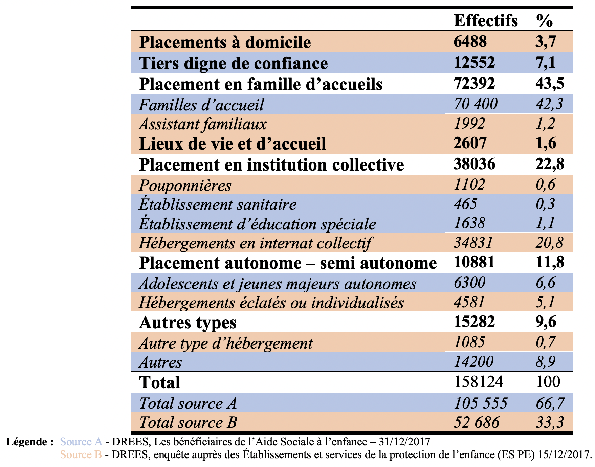
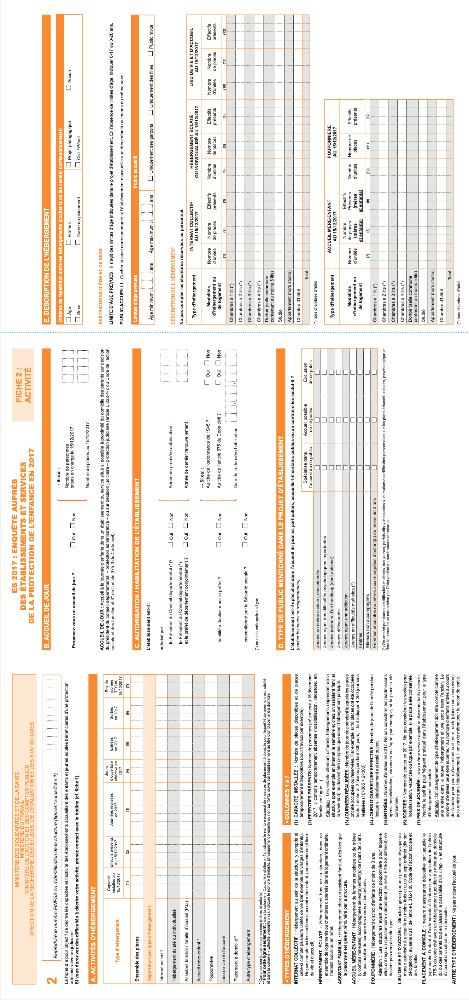

```{r setup c2, include=FALSE}
knitr::opts_chunk$set(echo=FALSE, warning=FALSE, message=FALSE,fig.align = 'center')
options(kableExtra.latex.load_packages = FALSE)
library(pacman)
p_load(tidyverse, questionr, FactoMineR, Factoshiny, survey, missMDA, knitr, 
      survey, magrittr,GGally,wesanderson,
       MetBrewer, extrafont, 
      flextable, gtsummary)
theme_gtsummary_language("fr", decimal.mark = ",", big.mark = " ")
source("R/Recodage.R")
source("R/Fonctions.R")
```

# Des sources de données fragmentées héritées de l'organisation de la Protection de l'enfance

|               Cette organisation de la Protection de l'enfance a eu des effets concrets sur la production de données sur le sujet, et ainsi sur l'état des connaissances scientifiques sur la population des enfants protégés. C'est l'objet de ce nouveau chapitre. L'objectif est de rendre compte des difficultés qu'ont les différents services de la Protection de l'enfance à différentes échelles (locale, départementale et nationale) à organiser un dispositif de collecte de données efficaces qui permettrait de remplir des objectifs autant gestionnaires que scientifiques de connaissance de la population des enfants protégés. L'enjeu est donc de présenter un champ de production de données fragmenté en fonction des producteurs de ces données et des enfants concernés par ces enquêtes. Aujourd'hui, à part l'enquête auprès des établissements et services de la protection de l’enfance (ES-PE) de 2017, peu de source de données permettent d'étudier scientifiquement les enfants protégés, particulièrement les enfants placés en établissement et surtout pas à l'échelle nationale. Néanmoins, cette source souffre des limites de sa double visée : à la fois gestionnaire et scientifique, induisant des informations collectées parfois imprécises ou incomplètes. Elle souligne aussi la difficulté de construire des enquêtes sur une population aussi hétérogène, qui sera présentée à la fin de ce raisonnement.

## L'impossible comptabilisation des enfants placés ? Un enjeu de gestion et de recherche

### Les effets de la départementalisation sur la production de données

> *Une organisation héritée de la décentralisation*

Pour comprendre dans quel contexte l'enquête ES-PE 2017 a été mise au
point, il convient d'effectuer un retour historique depuis les années
1980 sur la Protection de l'enfance. La Protection de l'enfance étant
une politique publique, ce sont les administrations la gérant qui ont
pour mission la production de données sur leur activité. Or, les lois de
décentralisation de 1983 et 1984 ont départementalisé cette tâche,
complexifiant dès lors la production de données. En effet, ces lois ont
transféré la compétence « d'aide aux enfants confrontés à des
difficultés sociales susceptibles de compromettre gravement leur
équilibre » (CASF, Article L221-1) aux présidents des Conseils généraux
et ont précisé les contours de l'autorité judiciaire et de l'autorité
administrative. Dès lors, la branche judiciaire intervient dans le cas
où les mineurs victimes de mauvais traitements verraient leur famille
refuser l'intervention du service de l'Aide sociale à l'enfance. Le
président du Conseil général voit ses missions en la matière spécifiées
: il définit la politique départementale de l'aide sociale à l'enfance,
crée et autorise les établissements sociaux et arrête leur tarification,
et enfin, il prononce l'admission à toute mesure d'aide sociale à
l'enfance[@verdierAideSocialeEnfance2013].

Cette décentralisation a eu des effets concrets sur la production de
statistiques sur le sujet. En effet, historiquement, les statistiques
sont liées à l'État et particulièrement à l'État-providence. Au cours du
XXe siècle, cette dernière s'est aidée de ces outils afin d'estimer la
capacité et les besoins d'une population pour bâtir ses politiques
sociales et les piloter à long terme. Pour A. Desrosières, le modèle
français serait un mélange d'une tradition administrative centralisée et
d'un rationalisme, en témoigne l'exemple des ingénieurs
administrateurs[@desrosieresPolitiqueGrandsNombres2010]. À
contre-courant de cela, la décentralisation de l'aide sociale a rendu
particulièrement difficile la production de statistiques globale sur la
Protection de l'enfance, en plus de créer des disparités départementales
en matière de politique de l'aide sociale. Cette situation a créé de
l'ignorance qui a des conséquences gestionnaires et politiques, mais
aussi sur l'état de la recherche scientifique en limitant les
connaissances sur la population des enfants protégés.

Pourtant, la visée statistique était bien présente dans la loi de 1989.
Elle prévoyait la remontée de données en chargeant les présidents du
Conseil général de mettre en place un dispositif de recueil
d'informations. Dès 1991, une première étude de faisabilité réalisée par
l'Institut de l'enfance et de la famille dresse l'état des lieux de la
collecte de statistiques sur le sujet en France et ébauche un dispositif
de recueil. Il faut pourtant attendre 1997 avec l'Observatoire national
de l'action sociale décentralisée (ODAS) pour qu'une méthodologie
d'observation à l'échelle nationale soit élaborée avec le concours des
départements. C'est ainsi qu'est né le recensement annuel des
signalements transmis aux départements, premier jalon d'une statistique
nationale sur le sujet. Ceci malgré l'existence de données produites par
la DREES qui ne s'intéresse elle depuis 1982 qu'aux établissements
sociaux. Cette enquête de la DREES n'était pas dédiée à la Protection de
l'enfance puisqu'elle portait alors sur des établissements dédiés à
l'accueil de trois types de public :

-   les établissements et services pour personnes handicapées,
-   les établissements pour personnes en difficulté sociale,
-   et les établissements de la Protection de l'enfance.

> *La création de l'ONPE*

Dès lors, dans les années 2000, l'État cherche à organiser des
structures à l'échelle nationale à même de produire des connaissances
sur la Protection de l'enfance et de rationaliser la collecte de
données. L'observatoire national de la Protection de l'enfance (ONPE)
est créé dans cette optique en 2004. Les lois de 2004 et 2007
établissent ses principales missions qui sont les suivantes : «
Améliorer la connaissance sur les questions de mise en danger et de
protection des mineurs à travers le recensement et le développement des
données chiffrées d'une part, des études et recherches d'autre part ;
recenser, analyser et diffuser les pratiques de prévention et
d'intervention en protection de l'enfance ; soutenir les acteurs de la
protection de l'enfance. » (CASF, art L 226-6). Avec la loi du 7 février
2022, la définition de son rôle est renforcée et il devient un « centre
national de ressources, chargé de recenser les bonnes pratiques et de
répertorier ou de concourir à l'élaboration d'outils et de référentiels
» (CASF, art L 226-6).

Depuis sa création, la production principale de l'ONPE est l'estimation
annuelle du nombre d'enfants protégés. Ce chiffre est le résultat du
croisement des données de deux principales sources : de la Direction de
la recherche, des études, de l'évaluation et des statistiques (DREES) et
de la Direction de la protection judiciaire de la jeunesse (DPJJ).
Ainsi, en 2015, le nombre de mineurs bénéficiant d'au moins une mesure
de protection de l'enfance est estimé à 295 357 sur la France entière,
soit 20,1 ‰ \footnote{= sur mille individus.} des moins de 18
ans[@onpeEstimationPopulationEnfants2017].

> *Les observatoires départementaux*

En appui de l'ONPE, la loi de 2007 cherche à compléter le dispositif de
remontée des données départementales sur la Protection de l'enfance en
créant des observatoires départementaux de la protection de l'enfance
(ODPE). C'est le président du Conseil général qui est chargé de leur
mise en place et de leur animation en association avec les acteurs
locaux. Pourtant, la mise en place de ces observatoires a fait l'objet
de nombreuses difficultés, tant et si bien qu'encore en 2020, l'ONPE
continue de produire des documents dressant des états des lieux de la
mise en place des ODPE sur le territoire. En effet, l'ONPE suit
attentivement depuis 2009 le développement de ces observatoires à l'aide
d'une enquête bisannuelle qui les interroge sur leur fonctionnement
autant que sur leurs attentes, besoins et difficultés. En 2020, 83
observatoires départementaux sont installés et 10 sont en construction,
sur les 100 départements existants en France métropolitaine et DROM,
hors Mayotte. 4 départements font encore figure d'exception en n'ayant
pas prévu la construction d'ODPE. En 2018, 17 ODPE étaient construction
et 74 déjà en place. L'absence d'ODPE ne signifie pas pour autant une
absence de production de statistiques sur le sujet. En effet, sur 14
départements encore non-dotés d'observatoire, 11 d'entre eux ont tout de
même mis en place un dispositif ou des instances permettant de
recueillir des données quantitatives et/ou qualitatives.

Les ODPE font face aujourd'hui à des difficultés d'ordre technique et
réclament autant des formations qu'un soutien technique de la part de
l'ONPE pour les aider dans la gestion et la production de
données[@onpeEtatLieuxMise2021]. Les départements apparaissent ainsi en
demande de soutien pour bâtir des systèmes de collecte statistiques
efficaces leur permettant de mieux connaître la portée sur leur
territoire de leur politique départementale d'aide sociale.

```{=tex}
\mdfsetup{%
middlelinewidth=2pt,
backgroundcolor=gray!10,
roundcorner=10pt}
\begin{mdframed}[frametitle=Exemple d’une rencontre avec un chargé de mission de la direction enfance et famille et de l’ODPE du département de l’Hérault]

À la fin de l’année 2021, j’ai participé à une rencontre avec le chargé de mission de la direction enfant et famille et directeur de l’ODPE du département de l’Hérault. Le département de l’Hérault cherchait alors à financer un projet de thèse en contrat CIFRE sur les données de l’aide sociale à l’enfance dans leur département. Plus précisément, le projet avait pour visée de construire des outils d’observation des effets de leur politique en matière de protection de l’enfance et à formuler des recommandations afin d’améliorer leur base de données. À titre indicatif, selon le chargé d’études et directeur de l’ODPE de l’Hérault, la direction enfance et famille de ce département traite 2 500 informations préoccupantes, suit 2 700 enfants à domicile dans leurs familles et accueille près de 2 800 enfants et jeunes majeurs en foyers et en famille d’accueil en 2021.

Cette rencontre a mis en lumière les difficultés concrètes rencontrées par les départements dans la production de données sur leur politique d’aide sociale à l’enfance. Le chargé d’études et directeur de l’ODPE de l’Hérault a ainsi témoigné de leur besoin de visibilité sur leurs disponibilités d’accueil, les contours de leur accueil familial et sur les usages des dispositifs. En particulier, ils ont besoin qu’un travail soit mené sur les mesures administratives et judiciaires et leurs différentes déclinaisons. Mais aussi sur les mesures de prévention, puisqu’actuellement, ils peinent à avoir des données qui leur permettent de justifier de l’intérêt des politiques de prévention sur celles d’accueil. Ce sont des questions certes techniques, mais qui cachent aussi des enjeux financiers importants pour le département.

Au niveau de leurs données, comme de nombreux autres départements, ils disposent de peu d’informations sur le profil socio-économique de l’enfant accueilli et de sa famille. Ce point rend l’analyse sociologique difficile et les rend ignorant sur la portée réelle de leurs actions. Le département chercherait ainsi à améliorer leur base de données, afin de la rendre plus effective pour qu’elle réponde aux questions de politiques publics qu’ils se posent. Cette recherche se serait faite avec les données regroupées suite à une compilation manuelle de l’ODPE de l’Hérault \footnote{Cette dernière est une instance partenariale regroupant le Département de l’Hérault, des MECS (maisons d’enfant à caractère social) et lieux de vie, des assistants familiaux, l’éducation nationale, l’école des travailleurs sociaux et des associations œuvrant pour la protection de l’enfance. Elle a été créée récemment puisque leur première séance plénière s’est tenue en 2019.
}. Cette remontée des données prend appui sur des assistantes administratives qui remplissent les bases. Ceci peut donner lieu à des erreurs, puisque le personnel n’est pas formé pour accomplir cette tâche. 

Ce point allié à d’autres difficultés techniques fait qu’à l’heure actuelle le département lui-même a du mal à dire où il y a des places disponibles dans les lieux d’accueil et d’hébergement. Le chargé de mission et directeur de l’ODPE de l’Hérault suppose ainsi que l’orientation des enfants dans tel ou tel type d’hébergement dépend essentiellement de l’offre et de la demande.

\end{mdframed}
```
Ainsi, la mise en place de structures adaptées semble difficile au
niveau départemental pour ces raisons, mais aussi parce qu'ils
rencontrent des obstacles au niveau local, celui des structures
d'accueil. En effet, ces dernières sont logiquement chargées de
communiquer des informations sur le public accueilli et les places
disponibles, mais cette remontée est rendue difficile d'une part du fait
d'un manque de formation du personnel en charge de remplir ces bases et
d'autre part du fait d'une crainte que l'utilisation de ces données ne
mène à une baisse de la subvention de ces lieux d'accueil. Ces
difficultés concernent dès lors autant les enquêtes menées par l'ONPE,
que celles menées par la DREES qui s'adresse directement aux structures
d'accueil.

### Panorama des sources statistiques actuelles

Du fait des difficultés de construction d'un dispositif national de
collecte de données, plusieurs sources de données sur les enfants placés
en Protection de l'enfance en France existent, mais elles ne portent pas
toutes sur les mêmes populations, n'utilisent pas les mêmes méthodes et
ne reprennent pas les mêmes catégories ou
formulations[@onpeEnfantsRisqueDanger2016]. Cette situation ne
s'explique pas seulement du fait de l'évolution historique de la
Protection de l'enfance en France et des effets donc de la
départementalisation, mais est aussi une conséquence de l'hétérogénéité
de la population étudiée et du nombre d'institutions impliquées à
différentes échelles. Nous proposons ainsi de réaliser un bref panorama
de ces différentes sources qui permettra de mieux situer les données que
nous utiliserons pour notre étude et de mieux en comprendre le champ. De
manière générale, ces sources se divisent en deux grands groupes :
celles issues des ministères de la Justice et de l'Intérieur qui
concernent une partie de la population des enfants placés et sont à une
visée strictement gestionnaire et celles de l'ONPE - avec le dispositif
OLINPE - et de la DREES qui permettent des analyses plus poussées. Il
existe aussi une autre catégorie de sources de données, celles des
enquêtes menées par la statistique publique. À part l'enquête ELAP, ces
dernières correspondent plutôt à des enquêtes de victimation et sont
souvent rétrospectives, nous ne les inclurons donc pas à ce
panorama\footnote{Nous faisons référence ici particulièrement aux enquêtes : Contexte de la sexualité en France (CSF), Évènements de vie et santé (EVS), Enveff et Virage. Mais aussi à l'enquête Étude longitudinale française depuis l'enfance (Elfe) suivant des enfants de la naissance à l'âge adulte, qui ne contient pas à proprement parler de variables sur les violences et la négligence, mais contient certaines variables sur les dispositifs de la PE. Ces enquêtes sont présentées en lien avec les connaissances qu'elles apportent sur les enfants placés dans le rapport de 2016 de l'ONEP : \url{https://www.onpe.gouv.fr/system/files/publication/ragp_2016_-_version_finale_2_leger.pdf}}.

> *Les données produites par les ministères de la Justice et de l'Intérieur*

Les ministères de la Justice et de l'Intérieur produisent des
statistiques sur les enfants placés. Ces dernières ont néanmoins la
limite d'être à visée gestionnaire et donc s'intéresse plus à un
événement ou à une situation qu'à l'enfant concerné par la mesure en
lui-même. Il s'agit de remontées annuelles des différents services qui
sont par la suite agrégées. Le ministère de la Justice propose ainsi
deux types de données : d'une part les tableaux de bord des tribunaux
pour enfants recensant les saisines et décisions de prise en charge en
assistance éducative, et d'autre part, les chiffres de la Direction de
la protection judiciaire de la jeunesse (DPJJ). Ces statistiques
concernent ainsi exclusivement les enfants ayant des mesures judiciaires
(pénales ou civiles).

Le ministère de l'Intérieur produit des données avec le Service
statistique ministériel de la sécurité intérieure (SSMSI). Ces dernières
portent sur les crimes et délits enregistrés par les services de police
ou de gendarmerie. Dans celles-ci, on peut retrouver des informations
sur les victimes mineures de violences et négligences et notamment grâce
à la variable « Natinf » ou « nature de l'infraction » créées en 1978. À
partir de cette variable, l'ONPE a bâti deux indicateurs qu'il présente
dans son rapport 2016 : celui sur les « violences physiques » contre les
personnes et celui sur les « violences sexuelles ». C'est dans le second
que l'on retrouve des informations sur des enfants victimes d'abus.
Toutes ces données restent très parcellaires puisqu'elles ne concernent
que les faits qui ont été portés à l'attention de la police et de la
gendarmerie en France métropolitaine. De plus, elles ne permettent pas
de réels croisements et d'études avancées.

> *Les données produites par l'ONPE et particulièrement le dispositif OLINPE*

Nous l'avons vu une des missions de l'ONPE est le recueil et l'analyse
des données produites par les départements concernant l'Aide sociale à
l'enfance. En outre, l'Observatoire produit aussi ses propres études
telles qu'une enquête portant sur les informations préoccupantes
réalisées en 2011 et reconduite en 2016-2017. Elle analyse aussi les
données produites par le Service national d'accueil téléphonique de
l'enfance en danger (SNATED) qui fait partie du même groupe d'intérêt
public Enfance en danger. Enfin, l'observatoire produit aussi une
enquête annuelle sur les pupilles d'État\footnote{On peut retrouver l'ensemble de leurs productions à cette page :
https://www.onpe.gouv.fr/production-donnees-chiffrees, consulté le 30/05/2022}.

Néanmoins, la mission actuellement la plus importante de l'ONPE en tant
que producteur de données, reste la mise en place d'un système de
collecte des données départementales via le dispositif d'observation
longitudinale individuelle et nationale en protection de l'enfance
(Olinpe). Les départements sont dans l'obligation légale de transmettre
ces données via la loi de 2016. Une liste du type de variables qu'ils
doivent transmettre a été mise au point. On retrouve ainsi dans les
données :

-   Les caractéristiques du mineur ou du jeune majeur (ses
    caractéristiques sociodémographiques, sa situation scolaire, sa
    situation de handicap) ;

-   les caractéristiques de l'information initiale sur la situation de
    danger ou de risque de danger ; le cadre de vie social et familial
    (les caractéristiques du ménage au sein de la résidence principale,
    l'exercice de l'autorité parentale, les caractéristiques
    sociodémographiques des parents et/ou des adultes qui s'occupent
    principalement du mineur dans sa résidence principale, la situation
    du jeune majeur, les ressources du ménage au sein de la résidence
    principale) ;

-   les informations recueillies au titre de l'évaluation de la
    situation (les caractéristiques de l'évaluation, les problématiques
    familiales observées) ;

-   les informations sur la nature du danger ou du risque de danger
    justifiant une prise en charge du mineur en protection de l'enfance
    (la nature du danger ou du risque de danger, la situation du mineur
    qui a permis de considérer qu'il était en (risque de) danger) ;

-   les informations sur les décisions, mesures et prestations en
    protection de l'enfance, qu'il s'agisse d'un début de mesure,
    d'unrenouvellement ou d'une fin de mesure ou prestation

À la lecture de l'ensemble des variables recueillies, on constate que
ces données vont être très précieuses afin d'affiner les connaissances
sur la Protection de l'enfance et les parcours des enfants en son sein.
Le dispositif permet ainsi de produire une base de données plus large
que celle déjà mise en place par l'Ined avec l'enquête ELAP -- Étude
Longitudinale sur l'accès à l'Autonomie après le Placement -- de l'INED,
réalisée entre 2013 et 2019 et qui se concentre sur la fin de parcours
des enfants placés. L'ELAP concerne seulement quelques départements. Le
dispositif OLINPE propose ainsi la mise en place d'une véritable base de
données qui n'est pas uniquement à visée gestionnaire et qui permettra
donc les analyses scientifiques afin d'approfondir les connaissances sur
cette population.

En date de janvier 2022, le dispositif OLINPE a commencé à produire ses
premières analyses, dix ans après la parution du décret du 28 février
2011 qui formalisent sa création et son fonctionnement. Depuis 2012,
seuls 46 départements ont été en mesure de transmettre un fichier annuel
de données à l'ONPE. Entre 2018 et 2020, l'observatoire a ainsi renforcé
ses efforts d'accompagnement des départements, mais pour reprendre les
mots du rapport 2022 de l'ONPE sur le dispositif OLINPE : « Le contexte
sanitaire et de réforme de la protection de l'enfance des années
2020-2021 a ralenti la réalisation de certaines actions
»[@onpeDeuxiemeRapportDedie2022]. Lorsque le dispositif sera pleinement
effectif, il permettra des études essentielles sur le parcours de
placement des enfants protégés.

> *Les données de la DREES*

Enfin, les enquêtes mises en place par la DREES ont progressivement
porté leur regard sur les établissements d'accueil de l'Aide sociale à
l'enfance à l'échelle nationale. Ces données sont précieuses puisqu'au
fil des années, le questionnaire a été développé afin de dépasser la
simple visée gestionnaire. En effet, bien qu'existant depuis 1982,
l'enquête ES de la DREES s'est divisée en deux volets en 2001 : ES «
personnes handicapées » et ES « difficulté sociale ». Le deuxième volet
mené en 2004 à un rythme d'une tous les quatre ans, permet déjà une
meilleure collecte de données sur les établissements d'accueil de l'Aide
sociale à l'enfance. En effet, son questionnaire se spécialise pour
recueillir des données sur ce type de structures. En 2016, après la
dernière vague de 2012, un autre pas est franchi. L'enquête ES «
difficulté sociale » est rénovée afin de dissocier les établissements et
services en faveur des adultes et familles en difficulté sociale
(ES-DS), des établissements et services de la protection de l'enfance
(ES-PE). Elle recense dès lors des données sur les enfants et jeunes
majeurs accueillis, le personnel en fonction et l'activité des
établissements. Son questionnaire se voit élargi avec l'ajout de séries
de questions, tout en préservant celles issues des éditions précédentes,
ce qui permet donc des comparaisons avec les vagues de 2008 et 2012.

Aujourd'hui, c'est en tout deux enquêtes de la DREES qui fournissent des
données sur les enfants placés en Protection de l'enfance : l'enquête
ES-PE et l'enquête sur les bénéficiaires de l'aide sociale
départementale issues de l'enquête Aide sociale. Cette dernière est
réalisée annuellement auprès des conseils départementaux et a une visée
gestionnaire\footnote{https://www.data.gouv.fr/fr/datasets/les-beneficiaires-de-laide-sociale-departementale/, consulté le 30/05/2022.}. Elle collecte ainsi des données agrégées sur les
bénéficiaires et les dépenses des prestations d'aide sociale relevant de
la compétence des départements. Cette seconde enquête permet de mieux
saisir le champ de l'enquête ES-PE, en témoigne ce tableau pour les
données 2017 (Voir Table \ref{fig:champs}).

```{r champs, out.width="80%", fig.cap="Les champs de l'enquête sur les bénéficiaires de l'Aide sociale à l'enfance et de l'enquête ES-PE"}

```

On observe ainsi que seuls 33,3% des enfants placés en Protection de
l'enfance sont présents dans l'enquête ES-PE. En effet, les familles
d'accueil représentent plus de 40% des placements, or elles ne sont pas
présentes dans les données de l'enquête ES-PE 2017. Néanmoins, on saisit
mieux à l'aube de ces informations la portée de l'enquête ES-PE et son
positionnement dans le champ des enquêtes sur la Protection de
l'enfance, ce qui permet de comprendre tout son intérêt. En effet, cette
enquête est la seule source qui apporte autant d'informations sur ces
33,3% d'enfants placés. Elle est aussi la seule enquête qui produit des
données à l'échelle nationale sur les établissements d'accueil de l'Aide
sociale à l'enfance et donc qui collecte des informations autant sur les
professionnels de ce secteur, que sur les enfants qui y sont protégés.

Ainsi, l'enquête ES-PE s'inscrit dans un champ de production de données
sur la Protection de l'enfance fragmenté, qui offre le plus souvent des
informations parcellaires sur différents types d'enfants et qui le plus
souvent produit essentiellement des données à visée gestionnaire rendant
difficile leur utilisation pour la production de connaissance sur ce
type de population. Cette source apparaît ainsi d'autant plus pertinente
dans toutes les informations qu'elle récolte puisqu'elles permettent
l'étude scientifique, et ce surtout en attente des données du dispositif
OLINPE. Il convient néanmoins de bien spécifier le champ que couvre
cette enquête et ses limites qui nous le verront entrave tout de même
grandement la recherche scientifique.

### L'enquête ES-PE : présentation et limites

> *Une enquête dédiée aux établissements sociaux*

L'enquête ES-PE sur laquelle se concentre cette étude a été administrée
via un questionnaire en ligne au premier semestre 2018 et porte sur
l'année 2017. Plus précisément, l'activité et les enfants présents sont
ceux au 15 décembre 2017, alors que le personnel est celui en date du 31
décembre 2017 et que les enfants sortis sont ceux au cours de l'année
2017. Le champ de l'enquête est celui des établissements de placement
civil et pénal dans lesquels on retrouve des enfants placés par le juge
ou l'aide sociale à l'enfance (ASE) ou suivis par la protection
judiciaire de la jeunesse (PJJ). L'enquête est menée à l'échelle de la
France métropolitaine et des DOM-TOM, hors Mayotte.

```{=tex}
\mdfsetup{%
middlelinewidth=2pt,
backgroundcolor=gray!10,
roundcorner=10pt}
\begin{mdframed}[frametitle=Le champ retenu pour notre étude]

Pour notre étude, du fait de l’hétérogénéité des publics accueillis et bien que notre regard se porte particulièrement sur les maisons d’enfants à caractère social, nous avons plus globalement choisi de nous restreindre aux établissements relevant de l’Aide sociale à l’enfance pour d’éventuelles comparaisons : les pouponnières à caractère social, les foyers de l’enfance, les lieux de vie et d’accueil, les villages d’enfants. En effet, les autres types d’établissements présents dans l’enquête ES-PE 2017, relèvent de la protection judiciaire de la jeunesse (PJJ) et les centres associatifs de placement familial socio-éducatif et concernent un type encore différent de population. Les informations portant sur les mesures d’action éducative (AED et AEMO) et sur les clubs de prévention spécialisée ont été aussi écartées, étant donné que nous nous concentrons sur les jeunes étant accueillis en hébergement dans un établissement. L’accueil mères-enfants a aussi été écarté, bien qu’il n’apparaisse que dans les données concernant l’activité des établissements. Les enfants ou jeunes accueillis chez un assistant familial et dont le placement est géré et rémunéré par un établissement sont inclus dans notre champ. 

\end{mdframed}
```
Pour réaliser son enquête, la DREES a utilisé le Fichier national des
établissements sanitaires (FINESS) qui répertorie toutes les structures
des domaines sanitaire, médico-social et social comme fichier de
référence. Ainsi, on y trouve l'ensemble des établissements civil
d'accueil de l'Aide sociale à l'enfance, donc les pouponnières, les
lieux de vie et d'accueil, les foyers de l'enfance, les MECS ou encore
les villages pour enfants. Le répertoire FINESS a permis à la DREES de
contacter l'ensemble de ces établissements afin qu'ils répondent à leur
enquête. En tout, 62 % des établissements répertoriés ont répondu\footnote{Un taux de réponse totale en baisse par rapport à 2012 où ils affichaient alors un taux de réponse totale de 74\% pour les établissements de l'aide sociale à l'enfance.}.

```{r rep, out.width="80%",fig.cap="Taux de réponse des différents types d'établissements de l'Aide sociale à l'enfance à l'enquête ES-PE 2017"}
obs$CATEG_rec2 <- add_n(obs$CATEG_rec)
g1 <- ggplot(na.omit(obs)) +
  aes(x = CATEG_rec, fill = STATUT_REP, by = CATEG_rec, label = f(after_stat(prop))) +
  geom_bar(position = "fill") +
  geom_text(stat = "prop", position = position_fill(.5), colour = "white", size = 3.5) +
  scale_fill_manual(values = wes_palette("Darjeeling1")) +
  xlab("Type d'établissement") +
  ylab("") +
  scale_y_continuous(labels = function(x) paste0(x * 100, '%')) +
  coord_flip() +
  theme_bw() +
  theme(legend.position = "top") +
  labs(caption = "Source : ES-PE 2017, DREES. \n
Champ : France entière, hors Mayotte, établissements inscrits au fichier FINESS en 2017. \n
Lecture : Parmi les établissements présents sur le fichier FINESS, on observe qu'en tout 71% des \n Maisons d'enfant à caractère social (MECS) ont répondu à l'enquête ES-PE 2017.", fill = "Statut de réponse :") +
  labs(fill = "Statut de réponse :")
g1 + theme(text = element_text(family = "Times"), plot.caption = element_text(face = "italic"))
```

Tous les types d'établissements ne présentent pas le même taux de
réponse à l'enquête (voir Figure \ref{fig:rep}). Ainsi, les lieux de vie et d'accueil sont les
structures qui ont le moins répondu à l'enquête ES-PE 2017, avec 57%
d'établissements répondants\footnote{Étant donné leur faible nombre, nous ne commentons pas le taux de
réponses des villages pour enfants et des pouponnières à caractère
social.}. Ainsi, le type d'établissement ayant le
plus haut taux de réponses est les foyers de l'enfance à 82%. Dans cet
ensemble, les MECS affichent comparativement un bon taux de réponse avec
71%, ce qui permet leur bonne représentativité dans l'enquête.

La non-réponse totale a en effet été un enjeu particulier pour la DREES
avec seulement 62% des établissements qui ont répondu. Il est en ce sens
rassurant d'observer un bon taux de réponse pour le type d'établissement
qui occupe particulièrement notre étude. La non-réponse totale a été
gérée par la DREES à l'aide d'une pondération que nous emploierons dans
nos analyses, afin de limiter d'autant plus ce biais.

```{=tex}
\mdfsetup{%
middlelinewidth=2pt,
backgroundcolor=gray!10,
roundcorner=10pt}
\begin{mdframed}[frametitle=La pondération dans l’enquête ES-PE 2017]

La pondération de l’enquête ES-PE 2017 a été calculée pour répondre à deux objectifs\footnote{À noter que la pondération a été calculée avec la macro Calmar sur SAS.}: augmenter la représentativité de l’échantillon et réduire le biais de non-réponse. En ce sens, ils ont construit deux pondérations en utilisant la méthode du calage sur marge. Le calage sur marge vise à redresser un échantillon en utilisant une information auxiliaire de référence. C’est-à-dire qu’on donne un poids à chaque individu pour que dans les variables catégorielles choisies, leurs effectifs soient égaux à un effectif de référence qui correspond généralement à ce qu’on observe en population totale\footnote{Olivier Sautory, « Les méthodes de calage », 2018.}. Avant de réaliser un calage sur marge prenant appui sur le répertoire FINESS, on peut choisir une des deux méthodes de gestion de la non-réponse par repondération soit avec le calage dit « direct » qui postule à partir d’un modèle de régression linéaire que le fait d’être répondant dépend des variables de calage utilisées\footnote{Thomas Deroyon, « La correction de la non-réponse par repondération », 2017.}, soit un calage après correction de la non-réponse qui vise à repondérer en première étape et se servir des poids de cette repondération pour effectuer un calage classique par la suite. Dans cette seconde méthode, on estime un modèle de régression portant sur la non-réponse et c’est à partir des probabilités de réponse estimées qu’on réalise une première pondération. C’est cette seconde méthode qui a été employée par la DREES.

À partir de ces méthodes, plusieurs pondérations ont été construites correspondant aux différentes tables de données. Comme nous travaillons sur les tables ACT, ENF et SOR, nous présentons ici leur pondération : une pour la table ACT et une autre pour les tables ENF et SOR. La première étape de gestion de la non-réponse est la même pour toutes les tables : deux régressions logistiques modélisent la non-réponse totale le premier portant sur les établissements de l’ASE avec les variables suivantes : la région, la catégorie d'établissements et la présence d'un mail dans le fichier de gestion, le second sur les établissements de la PJJ avec les variables suivantes : la catégorie d'établissements et la présence d'un mail dans le fichier de gestion.

Pour la pondération de la table ACT, le calage sur marge a été réalisé à l’aide du répertoire FINESS qui offrait par région et par catégorie d’établissements, le nombre d’établissements et les capacités d’accueil (celles déclarées pour les établissements ayant répondu, celles installées pour les non-répondants issus du répertoire FINESS). Vu que certains types d’établissements, tels que les pouponnières, les villages pour enfants ou encore les lieux de vie et d’accueil, ne sont pas assez nombreux sur le territoire, ces derniers avaient pour marges le nombre d'établissements et les capacités, par catégorie d'établissements à l’échelle nationale.

Pour la pondération des tables ENF et SOR, les marges sont les effectifs d'enfants présents dans l'établissement (déclarés dans ACT), par région, et par catégorie d'établissements pour les Foyers de l’enfance et les MECS. Pour les autres types d’établissements, le calage est le même, mais à l’échelle nationale.
\end{mdframed}
```
Chaque fiche du questionnaire a donné lieu à une base de données, il y
en a en tout 7, mais nous ne retenons ici que celles employées dans
notre étude : soit celle pour l'activité des établissements (ACT), celle
pour les enfants présents au 15/12/2017 (ENF) et enfin, celle pour les
enfants sortis en 2017 (SOR). Leur mise en page est dense et rappelle
les formulaires de l'administration publique (voir Figure \ref{fig:formu}). Il est à noter que les
professionnels chargés de les renseigner sont de professions variées et
sont non formés à leur remplissage. Ceci implique de probables
inégalités dans la qualité des réponses envoyées, quand bien même le
formulaire comporte de nombreuses indications afin d'aider et
d'accompagner à son remplissage.

\newpage

```{r formu, out.width="100%", fig.cap="Exemple d’une fiche du questionnaire de l'enquête ES-PE 2017"}

```

> *Les limites des données de l'enquête ES-PE 2017*

Ces données comportent de nombreuses limites qu'il convient d'évoquer
avant de les utiliser dans la suite de cette étude. Avec la refonte de
leur enquête, la DREES cherchait à la fois à recueillir des données
permettant des analyses plus approfondies pour faire avancer l'état de
la connaissance sur la Protection de l'enfance, et à conserver leur
visée initiale qui est gestionnaire. Ainsi, de nombreuses séries de
questions ont été ajoutées. Pour autant, leur formulation, l'absence de
certaines questions ou le retrait d'autres afin de respecter le
règlement général sur la protection des données (RGPD), rend
particulièrement difficile la construction d'une étude. Nous proposons
ici un rapide tour des limites principales qui ont entravé notre
travail, elles sont de deux types : absence de données et données
incomplètes.

La première limite est celle de l'absence de la variable indiquant la
région de l'établissement. Nous l'avons vu avec la départementalisation,
les départements gèrent leur propre service d'aide sociale à l'enfance.
Ils appliquent ainsi des politiques différentes qui ont un effet direct
sur le type d'établissements présents sur leur territoire, leur nombre,
le type de public visé... La prise en charge est pourtant dépendante en
partie des moyens d'interventions disponibles dans les
départements[@marquetEnfantsProtegesFrance2013]. Il existe bien une
variable géographique dans les données transmises, mais elle porte sur
le département du domicile du mineur ou jeune majeur. Une information
floue donc puisqu'elle ne permet que de localiser où les parents ou
tuteurs légaux vivent, sans pouvoir retracer le département qui a mis en
place la mesure administrative ou qui doit s'occuper de l'application
d'une mesure judiciaire. Lorsque l'on se reporte sur les données de la
DREES et notamment sur l'enquête concernant les bénéficiaires de l'aide
sociale à l'enfance, on observe pourtant de véritables différences entre
les différents départements en 2017. À titre d'exemple, on voit que
certains départements tels que l'Ain ou les Hautes-Alpes placent les
enfants sous leur protection que dans un type d'établissement, et dans
le cas présent qu'en MECS. L'ONPE s'est elle aussi intéressée récemment
aux disparités départementales en matière de politique sociale de la
protection de l'enfance en liant les données de la DREES sur les
bénéficiaires de l'aide sociale à l'enfance et celles du ministère de la
Justice[@onpePopulationEnfantsSuivis2020]. Ils ont particulièrement
étudié le taux de prise en charge par département qui correspond à la
part de mineurs ou jeunes majeurs concernés par une prestation ou mesure
de protection de l'enfance par rapport au nombre total de mineurs ou
jeunes majeurs par département. Ils constatent une importante variation
de ce taux entre les départements qui s'accentue depuis 2009. Ainsi, au
31 décembre 2018, les taux de prise en charge varient selon les
départements de 10,9 ‰\footnote{= sur 1000 individus.} à 44,8 ‰ concernant les mineurs et de 0,1 ‰ à
21 ‰ en ce qui concerne les jeunes
majeurs[@onpePopulationEnfantsSuivis2020]. Le fait que cette variable
soit non comprise dans nos données produit une ignorance sur un
phénomène qui gagnerait à être pris en compte dans notre étude.

La deuxième limite majeure de ces données est qu'elles sont incomplètes
soit parce que des questions n'ont pas été posées aux structures, soit
parce que les modalités de réponses sont floues. En témoigne le cas
concret qui est au cœur de notre étude des questions posées sur les
types d'hébergements avant et après avoir été placé dans l'établissement
observé en 2017 dans le cas des enfants sortis au cours de l'année 2017 (voir Table 2.1.1).
Ces variables auraient pu permettre de reconstruire des trajectoires de
placement en s'intéressant particulièrement au type d'hébergement.
Néanmoins, une telle analyse est rendue impossible par l'absence de
date. En effet, la date d'entrée dans le type d'hébergement avant
l'arrivée dans l'établissement observée n'est pas demandée dans
l'enquête ES-PE. Nous avons donc l'information sur trois événements,
dont deux seulement sont datés, sachant que la fin du troisième
événement est inconnue.

+---------------+---------------+---------------+---------------+
|               | **Temps -- 1  | **Temps 0 :** | **Temps +1    |
|               | :**           |               | :**           |
|               |               | observation   |               |
|               | juste avant   | enquête ES-PE | à la sortie   |
|               | l'entrée dans | 2017          | de l '        |
|               | l '           |               | établissement |
|               | établissement |               | observé       |
|               | d'observation |               |               |
+===============+===============+===============+===============+
| **Variable    | ARES          | HEBE          | SRES          |
| sur le type   |               |               |               |
| d'héb         |               |               |               |
| ergement**    |               |               |               |
+---------------+---------------+---------------+---------------+
| **Élément     | Sans date     | Avec date     | Avec date de  |
| manquant**    | d'entrée      | d'entrée      | sortie, mais  |
|               |               |               | sans date de  |
|               |               |               | fin           |
+---------------+---------------+---------------+---------------+

: Les trois événements du parcours de placement présents dans l'enquête
ES-PE 2017

\rightline{\small{~Source : Enquête ES-PE 2017, DREES.}}

À ceci s'ajoute, le fait que nous avons bien la date du premier
placement de l'enfant qui peut donc correspondre ou non au type
d'hébergement avant l'entrée dans l'établissement d'observation (Temps
-1), mais aucune information complémentaire nous permettra de nous en
assurer, ou au type d'hébergement dans l'établissement d'observation
(Temps 0). Même en réduisant l'échantillon aux seuls enfants qui ont la
même date de premier placement et d'entrée dans l'établissement, cela
réduit fortement l'intérêt d'une analyse de trajectoire, puisque seuls
deux événements seront alors utilisés dont le dernier qui est le type
d'hébergement à la sortie de l'établissement d'observation (temps + 1)
qui n'a pas de date de fin.

Tout ceci est renforcé par le flou des modalités des variables ARES et
SRES qui invitent à la prudence quant à l'utilisation de ces variables
dans une analyse (Voir Table 2.1.2).

+--------+-------------------------------------------------------------+
|        | **Modalités des variables ARES et SRES**                    |
+========+=============================================================+
| 1      | Chez les parents                                            |
+--------+-------------------------------------------------------------+
| 2      | Chez de la famille, des amis, un tiers digne de confiance   |
|        | judiciaire ou un tiers administratif                        |
+--------+-------------------------------------------------------------+
| 3      | Dans un logement personnel, hors logement accompagné, En    |
|        | logement accompagné (FJT, résidence sociale...), En centre  |
|        | d'hébergement (CHRS, CADA, hébergement d'urgence...),       |
|        | Hébergement de fortune (baraque, squat...), hébergement     |
|        | mobile (caravane, péniche...), à la rue                     |
+--------+-------------------------------------------------------------+
| 4      | En établissement de placement relevant du civil (MECS,      |
|        | foyer de l'enfance...)                                      |
+--------+-------------------------------------------------------------+
| 5      | En établissement de placement relevant du pénal (centre     |
|        | éducatif fermé/renforcé, établissement de placement         |
|        | éducatif...), En établissement pénitentiaire                |
+--------+-------------------------------------------------------------+
| 6      | Chez un assistant familial                                  |
+--------+-------------------------------------------------------------+
| 7      | En établissement médico-social (y compris handicap), En     |
|        | établissement hospitalier                                   |
+--------+-------------------------------------------------------------+
| 8      | Autre, Internat scolaire                                    |
+--------+-------------------------------------------------------------+
| 9      | Inconnu, NA                                                 |
+--------+-------------------------------------------------------------+

: Les modalités des variables sur le type d'hébergement avant et après
le placement dans l'établissement observé (ARES et SRES)

\rightline{\small{~Source : Enquête ES-PE 2017, DREES.}}

Par exemple, les modalités « chez les parents » ou « chez de la famille,
des amis, un tiers digne de confiance judiciaire ou un tiers
administratif » ne permettent pas de savoir si l'enfant est sorti de la
Protection de l'enfance ou s'il bénéficiait ou bénéficie encore d'une
mesure. Mais aussi, la modalité regroupant l'ensemble des types de
logements accompagnés ou non produit de l'incertitude du fait du nombre
important de situations différentes qu'elle regroupe.

Maintenant que l'enquête a été présentée et que ses limites principales
ont été évoquées, nous pouvons plus précisément étudier les populations
auxquelles elle s'intéresse. Nous l'avons dit à plusieurs reprises, le
public concerné par la protection de l'enfance est hétérogène autant
dans les situations qui conduisent au placement qu'en termes de
caractéristiques individuelles. Un autre point a aussi été évoqué, le
fait que notre enquête propose des données sur deux types principaux
d'enfants placés : les enfants présents au 15 décembre 2017 et les
enfants sortis au cours de 2017. Outre l'hétérogénéité de ces publics
qu'il convient de préciser, on peut ainsi se demander également si les
enfants présents et ceux sortis sont les mêmes où s'ils relèvent de
caractéristiques bien particulières.

## Le type de public accueilli en MECS en 2017

### Les enfants présents en MECS au 15 décembre 2017

Pour présenter le public accueilli en MECS, nous allons nous servir des
données aussi disponibles dans l'enquête ES-PE 2017 sur les autres types
d'établissement de placement de l'aide sociale à l'enfance. Ces derniers
vont nous servir de point de comparaison, afin de spécifier
particulièrement la population présente en MECS.

> *Une présence importante d'adolescents et jeunes majeurs en MECS*

\begin{singlespace}
```{r ind, results='asis'}
enf$CATEG_rec <- enf$CATEG_rec %>% fct_relevel("MECS", "Foyers", "Lieux de vie", "Villages", "Pouponnières")

enfw <- svydesign(ids = ~1, data = enf, weights = ~ enf$poids2)


set_flextable_defaults(
  font.size = 10, font.family = "Times",
  font.color = "black",
  line_spacing = 1)

enfw %>% tbl_svysummary(include = c(CATEG_rec,SEX, age_ed, MNA,HAND),
                    by = CATEG_rec,
                    percent = "col", 
                    statistic = list(all_categorical() ~ "{p}"),
                    missing = "no",
                    label = list(SEX ~ "Sexe",
                                 age_ed ~ "Âge à l'entrée",
                                 HAND ~ "Situation reconnue de handicap")) %>%   
  modify_header(label = "") %>% 
  modify_footnote(update = all_stat_cols() ~ NA) %>% 
  modify_header(all_stat_cols() ~ "**{level}**, N = {n_unweighted}") %>% 
  as_flex_table() %>% 
  add_footer_lines("Source : ES-PE 2017, DREES.
                   Champ : France entière, hors Mayotte, enfants sortis de l’établissement d’observation au cours de 2017 (hors sections d'accueil mère-enfant).
                   Lecture : Parmi les enfants sortis au cours de 2017 de MECS, on observe que 13% d’entre eux ont 18 ans à plus, contre seulement 5% des enfants sortis des foyers de l’enfance") %>% 
  fontsize(size = 9, part = "footer") %>% 
  set_caption(caption = "Les caractéristiques individuelles des enfants sortis au cours de 2017 par catégorie d'établissement (% pondérés)") %>% 
  color(color = "black", part = "all") %>% 
  width(width = 1) %>% 
  height_all(height = 0.5) %>%
  align(part = "all", align = "center")%>%
  align(part = "footer", align = "right")%>% 
  bold(bold = TRUE, part = "header")
```
\end{singlespace}

Ainsi, la principale caractéristique des enfants présents en MECS en
2017 est l'âge\footnote{L'âge à l'entrée dans l'établissement a été recodé en tranche
d'âge pour permettre des analyses. Les tranches d'âge choisies sont
celles déjà employées dans la littérature sur ces données et surtout
sur l'étude menée par Élisa Abassi : « 61 000 enfants, adolescents
et jeunes majeurs hébergés fin 2017 dans les établissements de
l'aide sociale à l'enfance », art cit.}(voir Table 2.2.1). Ce type d'établissement semble particulièrement
tourné vers l'accueil d'un public à partir de 7 ans et adolescent ou
jeune majeurs à partir de 15 à 17 ans et 18 ans à plus. Cette
caractéristique de l'âge les distingue d'autres types d'établissement
tels que les villages pour enfants ou les Pouponnières. À ceci, s'ajoute
un public plus masculin en MECS (à 61%) que dans ces deux autres types
d'établissement (respectivement à 49% et 54% de garçons).

Le fait que le public soit plus âgé en MECS est aussi à mettre en
perspective avec la présence assez importante de mineurs non accompagnés
à 18% qui ont tendance à demander systématiquement l'accès à un contrat
jeune majeur afin de poursuivre leur
protection[@frechonMineursIsolesEtrangers2017]. Ces derniers ont en
moyenne en âge d'entrée en MECS 16 ans\footnote{Avec un écart-type de 1.4, ce qui confirme bien qu'ils sont
surtout adolescents à l'entrée en MECS.}. Leur présence explique
aussi le déséquilibre en termes de répartition des sexes en MECS,
puisque les MNA sont à 90% des garçons. Ainsi, on retire les mineurs non
accompagnés, la part de filles en MECS augmente à 46%, contre 39% avec
les mineurs non accompagnés.

Les enfants protégés ayant un handicap reconnu représentent enfin 13%
des enfants présents en MECS. Un chiffre similaire avec d'autres types
d'établissements tels que les Foyers de l'enfance (12%) et les villages
pour enfants (11%). Du fait du type d'accueil très personnalisé proposé
par les lieux de vie et d'accueil, il est ainsi cohérent de retrouver
particulièrement plus d'enfants en situation de handicap dans ce type
d'accueil (28%). La population présente en MECS est ainsi plutôt
hétérogène et se caractérise surtout par l'âge avec une présence
particulière d'adolescent et de jeunes majeurs, à expliquer en partie
par la présence de mineurs non accompagnés.

> *Des mesures principales reflétant cette caractéristique de l'âge*

Concernant les types de mesures, on observe des différences
significatives entre les différents types d'établissements qui
confirment l'hétérogénéité du public protégé en MECS (voir Table 2.2.2).

```{=tex}
\mdfsetup{%
middlelinewidth=2pt,
backgroundcolor=gray!10,
roundcorner=10pt}
\begin{mdframed}[frametitle=Le recodage de la variable du type de mesures (MES)]

La variable MES proposait à l’origine 19 modalités qui ont été regroupées en 7 : 
-   mesure administrative de mineur comprenant : l’accueil provisoire de mineurs (AP)
-   mesure administrative de jeune majeur comprenant : mesure de jeunes majeures (dont accueil provisoire de jeunes)
-   judiciaire confié comprenant : placement à l’ASE par le juge des enfants
-   judiciaire direct juge comprenant : Placement direct par le juge au sein d'un établissement ou d'un service au titre de l’enfance en danger ou au sein d'un établissement ou d'un service au titre de la protection des jeunes ou auprès d'un tiers digne de confiance et le placement post et pré-sentenciel
-   milieu ouvert comprenant : l’AEMO, l’AED et les mesures pénales de milieu ouvert
-   mesure touchant la responsabilité parentale comprenant : l’accueil d’urgence, la délégation de l’autorité parentale à l’ASE, à un particulier ou à un établissement, la tutelle déférée à l’ASE et enfin le retrait partiel de l’autorité parentale 
-   Autre comprenant : autre mesure et aucune mesure.

\end{mdframed}
```

\begin{singlespace}
```{r mes, results='asis'}
## Recodage de enf$MES_rec1
enf$MES_rec <- enf$MES_rec %>%
  fct_recode(
    "NULL" = "NA")
enfw <- svydesign(ids = ~1, data = enf, weights = ~ enf$poids2)

enfw %>% tbl_svysummary(include = c(MES_rec, CATEG_rec),
                    by = CATEG_rec,
                    percent = "col", 
                    statistic = list(all_categorical() ~ "{p}"),
                    missing = "no",
                    label = list(MES_rec ~ "Mesure principale de placement")) %>% 
  modify_header(label = "") %>% 
  bold_labels() %>% 
  modify_footnote(update = all_stat_cols() ~ NA) %>% 
  modify_header(all_stat_cols() ~ "**{level}**, N = {n_unweighted}") %>% 
  as_flex_table() %>% 
  add_footer_lines("Source : ES-PE 2017, DREES.
                   Champ : France entière, hors Mayotte, enfants présents dans l’établissement d’observation au 15/12/2017 (hors sections d'accueil mère-enfant).
                   Lecture : Parmi les enfants présents au 15/12/2017 en MECS, on observe que 8,9% d’entre eux sont concernés par une mesure administrative jeune majeur.") %>% 
  fontsize(size = 9, part = "footer") %>% 
  set_caption(caption = "Les types de mesures principales de placement en fonction des types d'établissements (% pondérés)") %>% 
  color(color = "black", part = "all") %>% 
  width(width = 1) %>% 
  height_all(height = 0.5) %>%
  align(part = "all", align = "center")%>%
  align(part = "footer", align = "right")%>% 
  bold(bold = TRUE, part = "header")
```
\end{singlespace}

En effet, confirmant l'âge plus avancé des enfants présents en MECS du
fait de la présence notamment de mineurs non accompagnés, on retrouve un
fort taux par rapport aux autres types d'établissement de mesures
principales administratives dédiées aux jeunes majeurs (8.9%). Les MECS
accueillent aussi fortement les mesures administratives dédiées aux
mineurs (ou accueils provisoires de mineurs) à 8%. La mesure concernant
le plus d'enfants présents en MECS reste le judiciaire confié à 67% qui
correspond à la décision d'un juge de placer un enfant au titre de
l'enfance en danger. Il ne s'agit pas du taux le plus haut en
comparaison avec les autres types d'établissement, mais il reste
néanmoins conséquent. Ceci est de plus à mettre en lien avec le nombre
de mesures touchant la responsabilité familiale qui délègue la tutelle
partielle ou non de l'enfant à l'ASE ou à un tuteur légal, et comprend
aussi les pupilles d'État\footnote{Les pupilles de l'État représentent 12.7\% des mesures touchant la
responsabilité familiale.}.

Connaître le type de mesures les plus présentes en MECS nous renseignent
néanmoins assez peu sur la population qui y est
présente[@frechonImpossibleObservationEnfance2002], mais permet de
mettre en perspective les enjeux autour du maintien du lien avec la
famille. En effet, les mesures judiciaires sont imposées à la famille et
arrivent même parfois en dernier recours lorsque cette dernière a refusé
la mesure administrative. Parfois même, le juge décide du retrait
partiel ou non de l'autorité parentale ce qui constitue une étape
supplémentaire dans la protection de l'enfant. Dans ce cadre-là, la
question du maintien du lien avec la famille prend une teneur
particulière à la vue du nombre d'enfants présents en MECS concernés par
ce type de mesures. Il s'agit pourtant d'une préoccupation pour les
professionnels en MECS. Leur rôle devient dès lors incontournable pour
tenter de réinvestir le parent dans la vie de l'enfant ou de maintenir
les liens avec la famille tout en étant eux-mêmes les appliquant d'une
mesure imposée.

> *L'ancienneté des enfants présents en MECS*

Concernant l'ancienneté des enfants présents au 15/12/2017 dans
l'établissement d'observation, on observe des différences importantes
entre les différents types d'établissements (voir Table 2.2.3). L'ancienneté moyenne en
MECS est de 20 mois, sachant que 25% des enfants présents y sont depuis
5 mois ou moins et 25% depuis 26 mois ou plus. Ces durées se comprennent
en lien avec le type d'accueil proposé par les différents
établissements.

\begin{singlespace}
```{r anc}
enfw %>% tbl_svysummary(include = c(dur_dpla, CATEG_rec),
                    by = CATEG_rec,
                    percent = "col", 
                    statistic = list(all_continuous() ~ "Q1 : {p25}, \n Médiane : {median}, \n Moyenne : {mean}, \n Q3 : {p75}"),
                    missing = "no",
                    label = list(dur_dpla ~ "Durée de placement")) %>%   
  modify_header(label = "") %>% 
  bold_labels() %>% 
  modify_footnote(update = all_stat_cols() ~ NA) %>% 
  modify_header(all_stat_cols() ~ "**{level}**, N = {n_unweighted}") %>% 
  as_flex_table() %>% 
  add_footer_lines("Source : ES-PE 2017, DREES.
                   Champ : France entière, hors Mayotte, enfants présents dans l’établissement d’observation au 15/12/2017 (hors sections d'accueil mère-enfant).
                   Lecture : L’ancienneté moyenne en MECS des enfants présents en 2017 est de 20 mois, sachant que 25% d’entre eux y sont depuis 5 mois ou moins et 25% depuis 26 mois ou plus.") %>% 
  fontsize(size = 9, part = "footer") %>% 
  set_caption(caption = "Ancienneté (en mois) des enfants présents fin 2017 dans l'établissement d'observation par type d'établissement") %>% 
  color(color = "black", part = "all") %>% 
  width(width = 1) %>% 
  height_all(height = 0.5) %>%
  align(part = "all", align = "center")%>%
  align(part = "footer", align = "right")%>% 
  bold(bold = TRUE, part = "header")
```
\end{singlespace}

En effet, les foyers de l'enfance sont plus destinés à un accueil
d'urgence ou avant réorientation vers un placement plus pérenne dans un
autre type d'hébergement. Ceci peut expliquer pourquoi ils ont une
moyenne basse d'ancienneté avec 10 mois et une dispersion moindre du
temps passé dans ce type d'établissement. Il en va de même pour les
pouponnières à caractère social qui sont destinées à l'accueil d'un
public allant de 0 à 3 ans. Les villages pour enfants quant à eux
accueillent sur le long terme expliquant la moyenne à 33 mois. Les
enfants présents en lieux d'accueil et de vie à l'inverse ont une
ancienneté similaire bien que supérieur à celle des enfants présents en
MECS.

### Les enfants sortis de MECS au cours de l'année 2017

La population des enfants sortis au cours de l'année 2017 est similaire
à celle des enfants présents au 15/12/2017, mais avec de légères
différences qui sont à souligner. En termes d'effectifs totaux dans
l'enquête ES-PE 2017, les enfants sortis sont légèrement moins nombreux
que ceux présents (30 412 contre 34 963 enfants présents sur l'ensemble
des types d'établissements de l'Aide sociale à l'enfance interrogés). Il
est à noter que quand bien même nous parlons d'enfants sortis, cela ne
veut pas dire qu'ils ne sont plus protégés par la protection de
l'enfance, mais seulement qu'ils ont quitté l'établissement
d'observation de l'enquête ES-PE au cours de 2017.

> *Un effet de l'âge qui joue dans les différences entre enfants présents et enfants sortis de MECS*

Les principales différences entre ces deux populations découlent de
l'effet de l'âge : les enfants sortis correspondent à une population
plus âgée (en moyenne à l'entrée dans l'établissement d'observation, les
enfants sortis ont 14 ans, tandis que les enfants présents 13 ans). Cet
effet est logique, puisque généralement les enfants placés quittent
l'établissement une fois leur majorité acquise. Cet effet se retrouve
ainsi si on regarde par tranche d'âge d'entrée dans l'établissement
d'observation en MECS où par rapport aux enfants présents, les enfants
sortis sont plus nombreux dans les tranches d'âges les plus âgées (voir
Table 2.2.4).

\newpage
\begin{singlespace}
```{r indsor}
sor$CATEG_rec <- sor$CATEG_rec %>% fct_relevel("MECS", "Foyers", "Lieux de vie", "Villages", "Pouponnières")
sorw <- svydesign(ids = ~1, data = sor, weights = ~ sor$poids2)

sorw %>% tbl_svysummary(include = c(CATEG_rec,SEX, age_ed, MNA,HAND),
                    by = CATEG_rec,
                    percent = "col", 
                    statistic = list(all_categorical() ~ "{p}"),
                    missing = "no",
                    label = list(SEX ~ "Sexe",
                    age_ed ~ "Âge d'entrée",
                    HAND ~ "Situation reconnue d'handicap")) %>%   
  modify_header(label = "") %>% 
  bold_labels() %>% 
  modify_footnote(update = all_stat_cols() ~ NA) %>% 
  modify_header(all_stat_cols() ~ "**{level}**, N = {n_unweighted}") %>% 
  as_flex_table() %>% 
  add_footer_lines("Source : ES-PE 2017, DREES.
                   Champ : France entière, hors Mayotte, enfants sortis de l’établissement d’observation au cours de 2017 (hors sections d'accueil mère-enfant).
                   Lecture : Parmi les enfants sortis au cours de 2017 de MECS, on observe que 13% d’entre eux ont 18 ans à plus, contre seulement 5% des enfants sortis des foyers de l’enfance.") %>% 
  fontsize(size = 9, part = "footer") %>% 
  set_caption(caption = "Les caractéristiques individuelles des enfants sortis au cours de 2017 par catégorie d'établissement (% pondérés)") %>% 
  color(color = "black", part = "all") %>% 
  width(width = 1) %>% 
  height_all(height = 0.5) %>%
  align(part = "all", align = "center")%>%
  align(part = "footer", align = "right")%>% 
  bold(bold = TRUE, part = "header")
```
\end{singlespace}

La différence majeure par rapport aux enfants présents est la part de
mineurs non accompagnés, qui est légèrement plus importante chez les
enfants sortis en MECS (22%) que chez les enfants présents (18%). Ceci
de nouveau peut s'expliquer par l'âge des mineurs non accompagnés plus
avancés que d'autres types de population.

Logiquement, lorsque l'on porte notre regard sur les mesures de
placement des enfants sortis, on observe peu de différences avec celles
des enfants présents, si ce n'est une plus grande part de mesure
administrative concernant les jeunes majeurs en MECS. Un résultat qui
fait écho à l'âge plus avancé de cette population (voir Table 2.2.5).

\begin{singlespace}
```{r mes2, results='asis'}
## Recodage de sor$MES_rec
sor$MES_rec <- sor$MES_rec %>%
  fct_recode(
    "NULL" = "NA")
sorw <- svydesign(ids = ~1, data = sor, weights = ~ sor$poids2)

sorw %>% tbl_svysummary(include = c(MES_rec, CATEG_rec),
                    by = CATEG_rec,
                    percent = "col", 
                    statistic = list(all_categorical() ~ "{p}"),
                    missing = "no",
                    label = list(MES_rec ~ "Mesure principale de placement")) %>% 
  modify_header(label = "") %>% 
  bold_labels() %>% 
  modify_footnote(update = all_stat_cols() ~ NA) %>% 
  modify_header(all_stat_cols() ~ "**{level}**, N = {n_unweighted}") %>% 
  as_flex_table() %>% 
  add_footer_lines("Test du Chi2 : p-valeur = <0,001, sans les villages pour enfants et les pouponnières.
  Source : ES-PE 2017, DREES.
                   Champ : France entière, hors Mayotte, enfants sortis de l’établissement d’observation au cours de 2017 (hors sections d'accueil mère-enfant).
                   Lecture : Parmi les enfants sortis au cours de 2017 de MECS, on observe que 14% d’entre eux sont concernés par une mesure administrative jeune majeur contre seulement 0,8% des enfants sortis de Foyers de l’enfance.") %>% 
  fontsize(size = 9, part = "footer") %>% 
  set_caption(caption = "Les types de mesures principales de placement des enfants sortis en 2017 en fonction des types d'établissements (% pondérés)") %>% 
  color(color = "black", part = "all") %>% 
  width(width = 1) %>% 
  height_all(height = 0.5) %>%
  align(part = "all", align = "center")%>%
  align(part = "footer", align = "right")%>% 
  bold(bold = TRUE, part = "header")
```
\end{singlespace}

Enfin, la durée de placement est paradoxalement plus courte chez les
enfants sortis que l'ancienneté moyenne des enfants présents en MECS :
17 mois contre 20 mois (voir Table 2.2.6). Ainsi, les enfants sortis correspondraient à un
placement de courte durée, tandis que les enfants présents
présenteraient une durée de placement plus longue consécutive peut-être
de plus de difficultés familiales ou individuelles rendant difficile la
sortie de placement et justifiant une présence plus longue en protection
de l'enfance. On aurait pu s'attendre à l'effet inverse : que les
enfants sortis soient restés plus longtemps en moyenne dans
l'établissement, ils arriveraient ainsi à la fin de leur parcours de
placement et quitteraient donc logiquement l'établissement.

\begin{singlespace}
```{r dur}
sorw %>% tbl_svysummary(include = c(dur_dpla, CATEG_rec),
                    by = CATEG_rec,
                    percent = "col", 
                    statistic = list(all_continuous() ~ "Q1 : {p25}, \n Médiane : {median}, \n Moyenne : {mean}, \n Q3 : {p75}"),
                    missing = "no",
                    label = list(dur_dpla ~ "Durée de placement")) %>%   
  modify_header(label = "") %>% 
  bold_labels() %>% 
  modify_footnote(update = all_stat_cols() ~ NA) %>% 
  modify_header(all_stat_cols() ~ "**{level}**, N = {n_unweighted}") %>% 
  as_flex_table() %>% 
  add_footer_lines("Source : ES-PE 2017, DREES.
                   Champ : France entière, hors Mayotte, enfants sortis de l’établissement d’observation au cours de 2017 (hors sections d'accueil mère-enfant).
                   Lecture : La durée moyenne du placement en MECS des enfants sortis en 2017 est de 17 mois, sachant que 25% d’entre eux y sont restés 3 mois ou moins et 25% 23 mois ou plus.") %>% 
  fontsize(size = 9, part = "footer") %>% 
  set_caption(caption = "Ancienneté (en mois) des enfants présents fin 2017 dans l'établissement d'observation par type d'établissement (données pondérées)") %>% 
  color(color = "black", part = "all") %>% 
  width(width = 1) %>% 
  height_all(height = 0.5) %>%
  align(part = "all", align = "center")%>%
  align(part = "footer", align = "right")%>% 
  bold(bold = TRUE, part = "header")
```
\end{singlespace}

\vspace{.5cm}

\begin{large}
\textbf{Conclusion de chapitre}
\end{large}

|               Les lois de départementalisation ont ainsi eu pour conséquence la fragmentation de la production de données sur l'enfance protégée en France. Aujourd'hui, bien que l'ONPE produise un travail essentiel, le dispositif de collecte souffre encore de nombreuses limites à différentes échelle (locale, départementale et nationale) expliquant la longueur du processus de mise en place qui dure depuis maintenant 18 ans, si on prend pour référence l'année de création de l'ONPE. Dans ce paysage, l'enquête auprès des établissements et services de la protection de l’enfance (ES-PE) menée par la DREES s'intéresse à une population particulière que sont les enfants placés en établissement relevant de l'Aide sociale à l'enfance. Son questionnaire permet ainsi de répondre autant à des questions gestionnaires qu'à des questions scientifiques. L'horizon des possibles en termes d'analyses statistiques a été considérablement réduit par les limites de ces données alliées à l'hétérogénéité de la population observée, largement évoquée précédemment. Malgré ces difficultés, nous proposons dans les deux chapitres qui vont suivre de présenter les résultats de notre analyse qui cherche à éclairer sur les logiques de répartition entre hébergement des professionnels de l'aide sociale à l'enfance.
