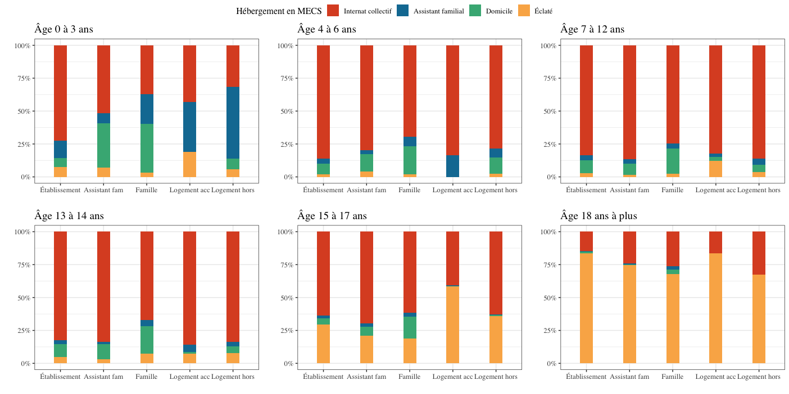
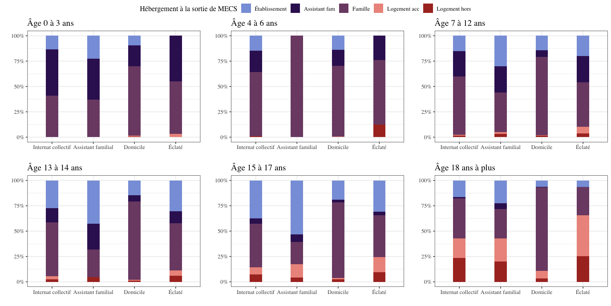

```{r setup c3, include=FALSE}
knitr::opts_chunk$set(echo=FALSE, warning=FALSE, message=FALSE,fig.align = 'center', fig.pos = "H")
options(kableExtra.latex.load_packages = FALSE)
library(pacman)
p_load(tidyverse, questionr, FactoMineR, Factoshiny, survey, missMDA, knitr, 
      survey, magrittr,GGally,wesanderson,
       MetBrewer, extrafont, 
      flextable, gtsummary)
theme_gtsummary_language("fr", decimal.mark = ",", big.mark = " ")
source("R/Recodage.R")
source("R/Fonctions.R")
set_flextable_defaults(font.size = 10, font.family = "Times", font.color = "black", line_spacing = 1)
```

# Une répartition entre hébergements en fonction de la place disponible et de l'âge des enfants placés

|               Pour les maisons d'enfant à caractère social (MECS), l'enjeu de proposer différents types d'hébergement relève de la tendance à la désinstutionalisation dans la protection de l'enfance[@calmoDesinstitutionnalisationProtectionEnfance2012] qui cherche à personnaliser les parcours de prise en charge et à maintenir le lien avec les parents. Nous l'avons déjà brièvement vu, l'organisation actuelle de la protection de l'enfance a souligné que malgré ces ambitions, les moyens concrets d'accomplir ces objectifs n'étaient pas toujours réunis, et à l'image des propos tenus par le chargé de mission de la direction enfance et famille et de l'ODPE du département de l'Hérault, on peut soupçonner que la répartition dépend plus de la place disponible que tout autre critère. Quels sont donc les critères de répartition des professionnels des MECS entre les différents types d'hébergement et comment s'allie logiques gestionnaires et critères individuels de l'enfant dans cette prise de décision ? Justement, quant à ces deux points, l'enquête ES-PE 2017 propose des données. Ainsi, nous chercherons d'abord à évaluer le poids des contraintes de places, avant d'étudier plus en avant les effets des critères individuels des enfants sur leur orientation. Nous compléterons cet ensemble en regardant les liens qu'ils existent entre type d'hébergement avant l'entrée en MECS et orientation une fois en MECS, mais aussi entre le type d'hébergement en MECS et à la sortie.

## La répartition entre les hébergements en MECS : entre critères déclarés, logiques gestionnaires et profil de l'enfant

### Les critères de répartition déclarés par les établissements

> *L'âge et le projet pédagogique comme critères principaux
> d'orientation*

En tout, 831 MECS ont répondu au questionnaire de l'enquête ES-PE 2017.
Dans le questionnaire, une série de questions s'intéresse aux critères
de répartition des établissements entre les hébergements déclarés par
les professionnels. Ces questions vont nous permettre de nous faire une
première idée des critères sur lesquels s'appuient les établissements
pour orienter les enfants qu'ils accueillent. Du fait du faible effectif
d'établissement de type Pouponnière et village pour enfant ayant
répondu\footnote{Au nombre total de 27 dans les deux cas}, nous
comparerons ici les résultats des MECS avec seulement ceux des Foyers de
l'enfance et des lieux de vie et d'accueil.

Les tendances en critères de répartition sont similaires entre les
différents types d'établissement (voir tableau 11). Bien que les MECS
utilisent surtout comme critère de répartition l'âge, il en va de même
des autres types d'établissement. L'âge des enfants semble ainsi
sous-tendre la plupart des logiques d'accueil des établissements de
l'aide sociale à l'enfance.

Le second critère qui concerne le plus de MECS est la répartition par
projet pédagogique (41% des MECS disent qu'il s'agit pour elles d'un
critère). Le projet pédagogique est édité par un établissement afin de
décrire les moyens mis en œuvre afin d'atteindre ses grands principes
éducatifs selon ses activités, pratiques et attitudes éducatives. Dès
lors, s'il y a répartition selon le projet pédagogique, on peut
comprendre que le professionnel prend en compte le profil de l'enfant
afin de l'orienter vers l'hébergement le plus à même dans ses pratiques
à l'accueillir. Ceci revient à répartir les enfants en fonction de leurs
caractéristiques individuelles et de leur parcours.

\begin{singlespace}
```{r}
act2 <- filter(act, CATEG_rec != "Villages")
act2 <- filter(act2,CATEG_rec != "Pouponnières")

act2$CATEG_rec <- act2$CATEG_rec %>%
  fct_relevel("MECS", "Foyers", "Lieux de vie")

act2$poids2<- act2$poids_act/mean(act2$poids_act)
actw <- svydesign(ids = ~1, data = act2, weights = ~ act2$poids2)

actw %>% tbl_svysummary(include = c(REPSEX, REPAGE,REPFRA,REPPED, REPDUR, REPCIV, REPAUC, CATEG_rec),
                    by = CATEG_rec,
                    missing = "no",
                    percent = "col",
                    statistic = list(all_categorical() ~ "{p}"),
                    label = list(REPSEX ~ "par sexe",
                                 REPAGE ~ "par âge",
                                 REPFRA~ "par fratries",
                                 REPPED ~ "par projet pédagogique",
                                 REPDUR ~"par durée du placement",
                                 REPCIV ~"par civil ou pénal",
                                 REPAUC ~"Aucun critère")) %>%   
  modify_header(label = "**Répartition entre les hébergements...**") %>% 
  modify_header(all_stat_cols() ~ "**{level}**, N = {n_unweighted}") %>% 
  modify_column_hide(columns = c(stat_4, stat_5)) %>% 
  bold_labels() %>% 
  modify_footnote(update = everything() ~ NA) %>% 
  as_flex_table() %>% 
  add_footer_lines("Source : ES-PE 2017, DREES.
               Champ : France entière, hors Mayotte, établissements inscrits au fichier FINESS en 2017.
                Lecture : Parmi les établissements répondants, 39% des MECS, 34% des Foyers de l’enfance et 38% des Lieux de vie et d’accueil déclarent que le sexe est pour eux un critère de répartition entre les hébergements.") %>%      
  fontsize(size = 9.5, part = "all") %>% 
  fontsize(size = 8, part = "footer") %>%
  set_caption(caption = "La répartition des enfants présents fin 2017 entre les hébergements selon le type d'établissement (% pondérés)") %>% 
  color(color = "black", part = "all") %>% 
  width(width = 1) %>% 
  height_all(height = 0.5) %>%
  align(part = "all", align = "center")%>%
  align(part = "footer", align = "right")%>% 
  bold(bold = TRUE, part = "header")
```
\end{singlespace}


> *La traduction de ces critères dans l'orientation des enfants
> présents*

Pour aller plus loin et comprendre comment ces critères sont appliqués,
nous avons sélectionné les établissements ayant répondu qu'ils
utilisaient tel ou tel critère pour les comparer à ceux ne les utilisant
pas. Étant donné que nous n'avons pas l'information de la durée prévue
de placement, du projet pédagogique et de l'existence de frères et/ou de
sœurs aussi placés, notre analyse est limitée. Néanmoins, on peut tenter
de vérifier l'application des critères de répartition par sexe, âge ou
mesure de placement (si elle est civile ou pénale).

En MECS, le fait d'être un établissement déclarant ou non de répartir
par sexe entre les hébergements ne change pas la part de sexe dans les
différents types d'hébergement. Les effets concrets de critères de
répartition par sexe ne sont pas visibles par ce moyen et peut-être très
faible de manière générale \footnote{Voir : Annexe - Table 4.2.2.}. Si
on regarde le critère d'âge, on observe de légers effets, mais qui ne
s'expriment pas dans une tendance générale claire\footnote{Voir :
Annexe - Table 4.2.3.}. Le critère de répartition entre mesures civiles
ou pénales n'est pas plus parlant non plus, étant donné le trop faible
effectif de mesures pénales dans le champ choisi pour cette
étude\footnote{n = 20 en MECS. Voir : Annexe - Table 4.2.4.}.

Les résultats sont ainsi peu parlants et ne permettent pas de déterminer
les éventuels effets de ces critères de répartition. Nous ne sommes pas
non plus en mesure de dire s'ils sont peu déterminants du fait d'une
absence d'effets ou en lien avec les données limitées que nous avons à
notre disposition. Néanmoins, étant donné que le critère le plus répandu
de l'âge ne donne que peu d'effets sur la répartition, on peut
s'interroger si en réalité il n'est pas qu'un critère parmi d'autres et
que celui de la place disponible ne prime pas.

### Une répartition en lien avec l'offre

> *Les places installées : un indicateur possible de la répartition*

Afin d'observer l'effet des logiques gestionnaires sur la répartition
entre les différents types d'hébergements, nous avons tout d'abord
regardé la répartition des places installées dans les différents types
d'hébergement selon les types d'établissement, en nous inspirant ici de
l'étude de A. Abassi[@abassi61000Enfants2020].

\begin{singlespace}
```{r}
t1 <- tibble::tribble(~Places, ~MECS,  ~Foyers, ~Lieux,
  "Internat collectif", 63,	56,	4,
  "Éclaté", 19, 17, 2,
  "Domicile",11, 7, 0,
  "Assistant familial", 3, 7, 0,
  "Lieux de vie",1, 1, 91,
  "Accueil mère-enfant", 1, 5, 2,
  "Pouponnières", 0, 5, 0,
  "Autres", 2, 1, 1)

flextable(t1)%>% 
  add_footer_lines("Source : ES-PE 2017, DREES.
               Champ : France entière, hors Mayotte, établissements inscrits au fichier FINESS en 2017, hors pouponnières et des villages pour enfant.
                Lecture : Parmi les MECS répondantes, 63% des places installées sont en internat collectif.") %>%      
  fontsize(size = 9.5, part = "all") %>% 
  fontsize(size = 8, part = "footer") %>%
  set_caption(caption = "Les places installées des hébergements selon les types d'établissements (% pondérés)") %>% 
  color(color = "black", part = "all") %>% 
  width(width = 1) %>% 
  height_all(height = 0.5) %>%
  align(part = "all", align = "center")%>%
  align(part = "footer", align = "right")%>% 
  bold(bold = TRUE, part = "header")
```
\end{singlespace}

Dans le cas des MECS, l'offre de place est plus importante dans les
internats collectifs (63%) que dans tout autre types d'hébergements
(voir tableau 12). Il faut néanmoins prendre en considération le fait
que les MECS ne sont pas dédiés à proposer des places d'hébergements en
lieux de vie, accueil mère-enfant ou encore en pouponnières. D'autres
types d'établissements sont spécialisées dans ces types d'accueil. Ceci
explique donc le peu de places proposer par les MECS dans ces types
d'hébergements.

En cohérence avec le type de population accueillie, on observe que le
taux d'hébergement éclaté ou individualisé est le plus fort en MECS à
19%, contre 17% pour les Foyers de l'enfance, et moins de 3% pour les
autres types d'établissement. L'hébergement à domicile est aussi
particulièrement présent en MECS puisqu'il représente 11% des places.
Ces résultats représentent bien la volonté affichée par les MECS de
diversifier leur offre et de proposer un type d'hébergement plus tourné
vers la famille\footnote{Le type de public accueilli mentionné dans le
projet de l'établissement a aussi été observé (voir Annexes -- Table
4.2.5.). On aperçoit avec ces résultats que les enfants en situation de
handicap représentent un public pour lesquels les MECS sont le moins
destinées à l'accueil, voir au contraire elles excluent ce type de
public de leurs établissements.}.

Les MECS proposent ainsi principalement des places dans trois types
d'hébergements : en internat collectif, en logement éclaté ou
individualisé et à domicile. Lorsque l'on porte notre regarde sur la
population des enfants présents au 15 décembre 2017, c'est logiquement
dans ces trois types d'hébergement que l'on retrouve le plus d'enfants
placés (voir tableau 13)[^1].

[^1]:Concernant la variable HEBE portant sur le type d'hébergement en MECS, nous avons procédés au recodage suivant : « Collectif » correspond à l'internat collectif et aux pouponnières ; « Éclaté » à hébergement éclaté ou individualisé hors chambre d'hôtel, chambre d'hôtel, autre ; « Assistant familial » regroupe : Assistant familial ou famille d'accueil (PJJ), Lieu de vie et d'accueil ; et enfin, « Domicile » reprend seulement la modalité « Placement à domicile ».

```{r, include = FALSE}
e_mecs <- subset(enf, CATEG_rec == "MECS")

e_mecs$HEBE_rec3 <- e_mecs$HEBE_rec3 %>%fct_relevel("Collect", "Assfam", "Domicile", "Autonomautre")
e_mecs$HEBE_rec3 <- e_mecs$HEBE_rec3 %>%
  fct_recode("Internat collectif" = "Collect",
    "Éclaté" = "Autonomautre",
    "Assistant familial" = "Assfam")

e_mecs$poids2<- e_mecs$poids_enf/mean(e_mecs$poids_enf)
e_mecsw <- svydesign(ids = ~1, data = e_mecs, weights = ~ e_mecs$poids2)

freq(wtd.table(e_mecs$HEBE_rec3, weights = e_mecs$poids2))[,-3]
```

\begin{singlespace}
```{r}
t1 <- tibble::tribble(~HEBE, ~Effectifs,  ~Pourcentages,
  "Internat collectif", 16230,  64,
  "Assistant familial", 1024, 4,
  "Domicile",3055, 12.2,
  "Éclaté", 4768, 19.0)

flextable(t1)%>% 
  add_footer_lines("Source : ES-PE 2017, DREES.
               Champ : France entière, hors Mayotte, enfants présents dans l’établissement d’observation au 15/12/2017 (hors sections d'accueil mère-enfant).
                Lecture : Parmi les enfants présents en MECS au 15/12/2017, 63.6% sont hébergés en internat collectif.") %>%      
  fontsize(size = 9.5, part = "all") %>% 
  fontsize(size = 8, part = "footer") %>%
  set_caption(caption = "Le type d’hébergement en MECS des enfants présents en 2017 (% pondérés)") %>% 
  color(color = "black", part = "all") %>% 
  width(width = 1) %>% 
  height_all(height = 0.5) %>%
  align(part = "all", align = "center")%>%
  align(part = "footer", align = "right")%>% 
  bold(bold = TRUE, part = "header")
```
\end{singlespace}

On observe donc concrètement ce que les MECS cherchent à mettre en œuvre
depuis les années 2010 avec la diversification des types d'hébergement.
Nous l'avions vu, elles cherchaient aussi à diversifier leur mode
d'accueil afin de mieux œuvrer à conserver le lien avec la famille. Ce
point est confirmé aussi dans nos données.

\begin{singlespace}
```{r}
enf$SEQ_rec <- enf$SEQ %>%
  as.character() %>%
  fct_recode(
    "Complet" = "1",
    "Séquentiel" = "2",
    "Diversifié" = "3")

enfw <- svydesign(ids = ~1, data = enf, weights = ~ enf$poids2)
enfw %>% tbl_svysummary(include = c(SEQ_rec, CATEG_rec),
                    by = CATEG_rec,
                    missing = "no",
                    statistic = list(all_categorical() ~ "{p}"),
                    label = list(SEQ_rec ~ "Type d'accueil")) %>%   
  modify_header(label = "") %>% 
  modify_header(all_stat_cols() ~ "**{level}**, N = {n_unweighted}") %>% 
  modify_column_hide(columns = c(stat_4, stat_5)) %>% 
  modify_footnote(update = everything() ~ NA) %>% 
  bold_labels() %>% 
    as_flex_table() %>% 
  add_footer_lines("Test de Chi-deux : p-value < 0.001
  Source : ES-PE 2017, DREES.
               Champ : France entière, hors Mayotte, enfants présents dans l’établissement d’observation au 15/12/2017 (hors sections d'accueil mère-enfant et hors enfants placés en pouponnières et en villages pour enfant).
                Lecture : Parmi les enfants présents en MECS au 15/12/2017, 86% bénéficient d’un accueil complet.") %>%       
  fontsize(size = 9.5, part = "all") %>% 
  fontsize(size = 8, part = "footer") %>%
  set_caption(caption = "Le type d’accueil des enfants présents fin 2017 selon les types d’établissement (% pondérés)") %>% 
  color(color = "black", part = "all") %>% 
  width(width = 1) %>% 
  height_all(height = 0.5) %>%
  align(part = "all", align = "center")%>%
  align(part = "footer", align = "right")%>% 
  bold(bold = TRUE, part = "header")
```
\end{singlespace}

```{r, include = FALSE}
t1 <- svytable(~CATEG_rec + SEQ_rec, enfw)
t1 <-  t1[-4,]
t1 <-  t1[-4,]
chisq.test(t1)
```

Les MECS sont le type d'établissement ayant la part la plus faible
d'accueil complet (86% des enfants présents) et sont le type
d'établissement ayant le plus développé l'accueil séquentiel qui
concerne 12% des enfants présents au 15 décembre 2017. Ces résultats
font écho à la volonté que nous avons vu précédemment des MECS de
développer des types d'accueil alternatifs favorisant le maintien du
lien avec la famille.

> *Une plus grande diversité d'hébergements proposés induit une plus
> grande répartition entre hébergements*

On peut donc se demander si logiquement le fait d'avoir une plus grande
diversité d'hébergements proposés induit une plus grande variété dans la
répartition des enfants entre hébergements ou non. Et surtout à quel
type d'hébergement la diversité de proposition réussit le mieux.

Lorsque l'on regarde la répartition entre hébergements en fonction du
nombre d'hébergements proposés par établissement, on observe l'effet
logique d'une augmentation de la diversité de répartition. Le plus
intéressant à noter sont les effets par type d'hébergement. Ainsi,
l'internat collectif est particulièrement avantagé dans les cas où
l'établissement ne propose des places que dans un ou deux types
d'hébergements différents. L'inverse se produit pour l'hébergement à
domicile, qui est avantagé si trois à quatre types d'hébergements
différents proposent des places. Pour les types d'hébergements en
assistant familial ou lieux de vie et d'accueil, deux situations
différentes les favorisent : les cas où les établissements proposent des
places installées dans un ou trois types d'hébergements différents.
Enfin, les types d'hébergements éclatés ou individualisés sont plus
plébiscités seulement dans les cas où les établissements proposent des
places installées dans quatre types différents
d'établissements\footnote{Voir Annexes - Table 4.2.6.}.

Dès lors on peut conclure que l'orientation en hébergement à domicile ou
en hébergement éclaté ou individualisé est rendue possible surtout par
une plus grande diversité de types d'hébergements proposés. Néanmoins,
nous l'avons vu dans les critères de répartition, bien que la logique
gestionnaire ait son poids, les critères individuels de l'enfants et son
parcours de placement aussi.

### Le profil des enfants placés selon les types d'hébergement

Tout ceci nous amène à détailler le profil des enfants que l'on retrouve
dans les différents types d'hébergement.

\begin{singlespace}
```{r}
e_mecsw %>% tbl_svysummary(include = c(SEX, age_ed, MNA,HAND),
                    by = HEBE_rec3,
                    percent = "col", 
                    statistic = list(all_categorical() ~ "{p}"),
                    missing = "no",
                    label = list(SEX ~ "Sexe",
                    age_ed ~ "Âge d'entrée",
                    HAND ~ "Situation reconnue d'handicap")) %>%   
  modify_header(label = "") %>% 
  bold_labels() %>% 
  modify_footnote(update = all_stat_cols() ~ NA) %>% 
  modify_header(all_stat_cols() ~ "**{level}**, N = {n_unweighted}") %>% 
  as_flex_table() %>% 
  add_footer_lines("Source : ES-PE 2017, DREES.
                   Champ : France entière, hors Mayotte, enfants présents en MECS au 15/12/2017 (hors sections d'accueil mère-enfant).
                   Lecture : Parmi les enfants présents en MECS au 15/12/2017, 40% des enfants hébergés en internat collectif sont des filles.") %>% 
  fontsize(size = 9, part = "footer") %>% 
  set_caption(caption = "Les caractéristiques individuelles des enfants présents en 2017 par catégorie d'établissement (% pondérés)") %>% 
  color(color = "black", part = "all") %>% 
  width(width = 1) %>% 
  height_all(height = 0.5) %>%
  align(part = "all", align = "center")%>%
  align(part = "footer", align = "right")%>% 
  bold(bold = TRUE, part = "header")
```
\end{singlespace}

Ici, le facteur de
l'âge\footnote{L'âge à l'entrée dans l'établissement a été recodé en
tranche d'âge pour permettre des analyses. Les tranches d'âge choisies
sont celles déjà employées dans la,littérature sur ces données et
surtout sur l'étude menée par Élisa Abassi : « 61 000 enfants,
adolescents et jeunes majeurs hébergés fin 2017 dans les établissements
de l'aide sociale à l'enfance », art cit.} semble encore jouer un rôle
important. Les enfants les plus jeunes se retrouverons dans des types de
placement liés à la famille, comme les assistants familiaux et les lieux
de vie ou encore le placement à domicile. Dans les internats collectifs,
à l'inverse, on retrouvera une population plutôt adolescente. Et enfin,
en hébergement éclaté ou autonome, on retrouvera surtout les adolescents
proches de la majorité et les jeunes majeurs. Ce dernier point, comme
nous l'avions vu lors de la présentation de la population des enfants
présents au 15 décembre 2017, est à mettre en lien avec la présence de
mineurs non accompagnés. Dans ce type d'hébergement, les mineurs non
accompagnés représentent jusqu'à 42% des enfants présents. C'est-à-dire
dans les internats collectifs ou chez les assistants familiaux et les
lieux de vie.

Les résultats pour les enfants sortis au cours de l'année 2017 sont
similaires, si ce n'est que les faibles effectifs en hébergement chez
l'assistant familial fait particulièrement varier les résultats dans ce
cas\footnote{Voir Annexes - Table 4.2.7.}.

Le type de mesure pourrait être aussi logiquement un aspect qui peut
jouer dans l'orientation entre hébergements de l'enfant protégé. Ainsi,
lorsque l'on croise le type d'hébergement des enfants présents en 2017 à
leur mesure de placement, le premier résultat est que les enfants
concernés par des mesures administratives de jeunes majeurs sont plus
présents en hébergement éclaté (74%). Ce point est cohérent avec ce type
d'hébergement qui est un accompagnement vers l'autonomie. À l'inverse,
les enfants concernés par des mesures administratives de mineur sont
plus présents en internat collectif.

\begin{singlespace}
```{r}
e_mecs$MES_rec <-
  fct_recode(as.character(e_mecs$MES_rec),
    NULL = "NA")

e_mecs$MES_rec <- e_mecs$MES_rec %>%
  fct_relevel(
    "Mesure touchant la responsabilité parentale", "Mesure administrative Mineur",
    "Mesure administrative Jeune Majeur", "Judiciaire confié", "Judiciaire direct juge",
    "Milieu ouvert", "Autre")
e_mecsw <- svydesign(ids = ~1, data = e_mecs, weights = ~ e_mecs$poids2)
e_mecsw %>% tbl_svysummary(include = c(MES_rec),
                    by = HEBE_rec3,
                    percent = "row", 
                    statistic = list(all_categorical() ~ "{p}"),
                    missing = "no",
                    label = list(MES_rec ~ "Type de mesure principale")) %>%   
  modify_header(label = "") %>% 
  bold_labels() %>% 
  modify_footnote(update = all_stat_cols() ~ NA) %>% 
  modify_header(all_stat_cols() ~ "**{level}**, N = {n_unweighted}") %>% 
  as_flex_table() %>% 
  add_footer_lines("Source : ES-PE 2017, DREES.
                   Champ : France entière, hors Mayotte, enfants présents en MECS au 15/12/2017 (hors sections d'accueil mère-enfant).
                   Lecture : Parmi les enfants présents en MECS au 15/12/2017, 35% de ceux hébergés en logement éclaté sont concernés par une mesure administrative jeune majeur.") %>% 
  fontsize(size = 9, part = "footer") %>% 
  set_caption(caption = "Le type d’hébergement en MECS en fonction du type de mesure de placement des enfants présents en 2017 (% en ligne pondérés)") %>% 
  color(color = "black", part = "all") %>% 
  width(width = 1) %>% 
  height_all(height = 0.5) %>%
  align(part = "all", align = "center")%>%
  align(part = "footer", align = "right")%>% 
  bold(bold = TRUE, part = "header")
```
\end{singlespace}

À la lecture de ces tableaux, on ne peut douter de l'effet des
caractéristiques individuelles des enfants dans leur orientation à
l'entrée en MECS entre les hébergements. On peut dès lors se demander
si, tout comme les caractéristiques individuelles, le passif de l'enfant
placé est aussi pris en considération lors de l'orientation. Un point
que nous pouvons vérifier en regardant les aspects de l'orientation
entre hébergement en MECS vis-à-vis du type d'hébergement précédent.

## Les effets de l'hébergement précédent l'entrée en MECS dans l'orientation

### Un lien peu évident entre le type d'hébergement précédent et l'orientation une fois en MECS

> *Premiers éléments sur le type d'hébergement avant l'entrée en MECS*

Nous l'avions déjà vu au cours du chapitre 2, l'enquête ES-PE 2017 ne
propose que des informations parcellaires sur le parcours des enfants
placés. Nous n'avons dans nos données que le type d'hébergement
précédent l'entrée en MECS pour les enfants présents, et le type
d'hébergement précédant et suivant le passage en MECS pour les enfants
sortis au cours de 2017. On peut ainsi concrètement regarder à quel
point le type d'hébergement avant l'entrée en MECS joue sur
l'orientation une fois entre hébergement en MECS.

```{=tex}
\mdfsetup{%
middlelinewidth=2pt,
backgroundcolor=gray!10,
roundcorner=10pt}
\begin{mdframed}[frametitle=Le recodage de la variable sur le type d’hébergement avant l’entrée en MECS (ARES)]

Compte tenu du nombre important de modalités que contiennent les variables portant sur le type d’hébergement avant l’entrée en MECS et une fois en MECS, nous avons dû procéder à des recodages regroupant plusieurs modalités.

Concernant la variable ARES portant sur le type d’hébergement avant l’entrée en MECS, nous avons procédés au recodage suivant :

-   « Famille » regroupe les modalités suivantes : chez les parents ; chez de la famille, des amis, un tiers digne de confiance judiciaire ou tiers administratif

-    « Logement accompagné » regroupe les modalités suivantes : logement accompagné (FJT, résidence sociale…), En centre d’hébergement (CHRS, CADA, hébergement d’urgence…) ; En établissement médico-social (y compris handicap), En établissement hospitalier ; Autre, Internat scolaire.

-   « Logement hors » regroupe les modalités suivantes : Dans un logement personnel, hors logement accompagné ; Hébergement de fortune (baraque, squat…), hébergement mobile (caravane, péniche…), à la rue.

-   « Établissement » regroupe : En établissement de placement relevant du civil (MECS, foyer de l’enfance…) ; En établissement de placement relevant du pénal (centre éducatif fermé/renforcé, établissement de placement éducatif…), En établissement pénitentiaire

-   Et enfin, « Assistant familial » contient seulement la modalité « assistant familial ».

\end{mdframed}
```
De manière générale, les enfants présents sont majoritairement avant
l'entrée en MECS hébergés chez les parents ; chez de la famille, des
amis, un tiers digne de confiance judiciaire ou tiers administratif
(40.3%) (voir tableau 14). Cette situation correspond en partie au cas
des enfants pour lesquels cette entrée en MECS correspond à leur premier
placement. Ceci est le cas pour 23.1% des enfants présents.

```{r, include = FALSE}
## Recodage de e_mecs$ARES_rec
e_mecs$ARES_rec <- e_mecs$ARES_rec %>%
  fct_recode(
    "Assistant familial" = "Assfam",
    "Logement hors" = "Logthors",
    "Logement accompagné" = "Logtacc",
    "Établissement de placement" = "EtabASEPJJ")

## Réordonnancement de e_mecs$ARES_rec
e_mecs$ARES_rec <- e_mecs$ARES_rec %>%
  fct_relevel(
    "Établissement de placement", "Assistant familial", "Famille",
    "Logement accompagné", "Logement hors")

freq(wtd.table(e_mecs$ARES_rec, weights = e_mecs$poids2))[,-3]
```

\begin{singlespace}
```{r}
t1 <- tibble::tribble(~ARES, ~Effectifs,  ~Pourcentages,
  "Établissement de placement",	5786.3,	27.7,		
"Assistant familial",	2513.3,	12.0,		
"Famille",	10281.1,	49.3,		
"Logement accompagné",	1127.4,	5.4,	
"Logement hors",	1163.3,	5.6)

flextable(t1)%>% 
  add_footer_lines("Source : ES-PE 2017, DREES.
               Champ : France entière, hors Mayotte, enfants présents en MECS au 15/12/2017 (hors sections d'accueil mère-enfant).
                Lecture : Parmi les enfants présents en MECS au 15/12/2017, 63.6% sont hébergés en internat collectif.") %>%      
  fontsize(size = 9.5, part = "all") %>% 
  fontsize(size = 8, part = "footer") %>%
  set_caption(caption = "Le type d’hébergement avant l'entrée en MECS des enfants présents en 2017 (% pondérés)") %>% 
  color(color = "black", part = "all") %>% 
  width(width = 1) %>% 
  height_all(height = 0.5) %>%
  align(part = "all", align = "center")%>%
  align(part = "footer", align = "right")%>% 
  bold(bold = TRUE, part = "header")
```
\end{singlespace}

22.7% des enfants présents fin 2017 en MECS étaient auparavant hébergés
en établissement de placement civil ou pénal. Ceci démontre que le
placement en MECS n'était pas la première mesure de ces enfants, mais
qu'elle s'inscrit plutôt dans un parcours de placement. Il en va de même
pour les 9.8% d'entre eux qui étaient auparavant hébergés en assistant
familial.

Si l'on regarde la répartition entre hébergements une fois en MECS en
fonction du fait que ce soit ou non le premier placement pour l'enfant,
on observe qu'effectivement le parcours de l'enfant est pris en
considération dans l'orientation (voir tableau 15).

\begin{singlespace}
```{r}
## Recodage de e_mecs$ppla en e_mecs$ppla2
e_mecs$ppla2 <- e_mecs$ppla %>%
  fct_recode(
    "Pas le premier placement" = "0",
    "Premier placement en MECS" = "1")
e_mecsw <- svydesign(ids = ~1, data = e_mecs, weights = ~ e_mecs$poids2)
e_mecsw %>% tbl_svysummary(include = c(HEBE_rec3),
                    by = ppla,
                    percent = "col", 
                    statistic = list(all_categorical() ~ "{p}"),
                    missing = "no",
                    label = list(HEBE_rec3 ~ "Type d'hébergement")) %>%   
  modify_header(label = "") %>% 
  bold_labels() %>% 
  modify_footnote(update = all_stat_cols() ~ NA) %>% 
  modify_header(all_stat_cols() ~ "**{level}**, N = {n_unweighted}") %>% 
  as_flex_table() %>% 
  add_footer_lines("Source : ES-PE 2017, DREES.
                   Champ : France entière, hors Mayotte, enfants présents en MECS au 15/12/2017 (hors sections d'accueil mère-enfant).
                   Lecture : Parmi les enfants présents au 15 décembre 2017, 67% des enfants pour lesquels l’entrée en MECS était le premier placement sont hébergés en internat collectif.") %>% 
  fontsize(size = 9, part = "footer") %>% 
  set_caption(caption = "Le type d’hébergement en fonction du fait qu’il s’agisse ou non du premier placement pour les enfants présents en 2017 (% pondérés)") %>% 
  color(color = "black", part = "all") %>% 
  width(width = 1) %>% 
  height_all(height = 0.5) %>%
  align(part = "all", align = "center")%>%
  align(part = "footer", align = "right")%>% 
  bold(bold = TRUE, part = "header")
```
\end{singlespace}

En effet, il existe des différences entre les enfants pour lesquels il
s'agit du premier placement ou non. Plus précisément les enfants pour
qui il s'agit du premier placement sont plus présents en internet
collectif, tandis que pour ceux pour qui ce n'est pas le cas sont plus
présents en hébergement éclaté ou autonome.

> *La répartition entre les hébergements en MECS*

Dès lors, on peut tenter de percevoir les effets du type d'hébgerment
précédent l'entrée en MECS sur l'orientation une fois en MECS (voir
Tableau 12).

\begin{singlespace}
```{r}
e_mecsw %>% tbl_svysummary(include = c(ARES_rec, HEBE_rec3),
                    by = HEBE_rec3,
                    missing = "no",
                    percent = "row",
                    statistic = list(all_categorical() ~ "{p}"),
                    label = list( ARES_rec ~ "Type d'hébergement avant l'entrée en MECS")) %>%   
  modify_header(label = "") %>% 
  bold_labels() %>% 
  modify_footnote(update = all_stat_cols() ~ NA) %>% 
  modify_header(all_stat_cols() ~ "**{level}**, N = {n_unweighted}") %>% 
  as_flex_table() %>% 
  add_footer_lines("Test de Chi-deux : p = < 2.2e-16
  Source : ES-PE 2017, DREES.
                   Champ : France entière, hors Mayotte, enfants présents en MECS au 15/12/2017 (hors sections d'accueil mère-enfant).
                   Lecture : Parmi les enfants présents en MECS au 15/12/2017, 67% des enfants précédemment hébergés en établissement de placement sont une fois en MECS hébergés en internat collectif.") %>% 
  fontsize(size = 9, part = "footer") %>% 
  set_caption(caption = "Le type d’hébergement en MECS en fonction du type d’hébergement avant l’entrée en MECS pour les enfants présents en 2017 (% pondérés)") %>% 
  color(color = "black", part = "all") %>% 
  width(width = 1) %>% 
  height_all(height = 0.5) %>%
  align(part = "all", align = "center")%>%
  align(part = "footer", align = "right")%>% 
  bold(bold = TRUE, part = "header")
```
\end{singlespace}

```{r, include = FALSE}
chisq.test(svytable(~ARES_rec +HEBE_rec3, e_mecsw)[,-4])
chisq.residuals(svytable(~ARES_rec +HEBE_rec3, e_mecsw)[,-4])
```

Ce que l'on note alors tout d'abord est l'effet de l'orientation en
internat collectif qui concerne tous les enfants issus des différents
types d'hébergement avant l'entrée en MECS. Ce résultat s'explique en
partie par l'importance de l'hébergement collectif en MECS, qui est le
type d'hébergement principal de ces structures avec le plus de places
disponibles. Il est donc logique de voir près de la moitié des enfants
présents en 2017 y être orienté peu importe leur type d'hébergement
avant l'entrée en MECS.

On observe ainsi une certaine forme de mobilité, puisque les enfants
présents en 2017 ne sont pas simplement orientés à l'entrée en MECS dans
le même type d'hégerment dans lequel ils étaient auparavant. La seule
forme de stabilité pourrait s'observer avec le type d'hébergement éclaté
ou autonome une fois en MECS, qui concerne 54% des enfants présents
auparavant en logement accompagné et 30% des enfants présents en
logement hors et autre\footnote{Compte tenu des effectifs faibles en
logement accompagné, cette modalité n'a pas été prises en compte dans le
test du Chi-deux ni dans l'analyse de ses résidus. On aurait pu faire le
choix de regrouper ensemble les deux modalités logement hors et logement
accompagné, mais ils correspondent à deux situations vraiment
différentes et l'interprétation de leurs résultats n'auraient par
conséquent pas été pertinente.}.

L'orientation semble ainsi suivre des logiques de parcours qui ne nous
sont que partiellement accessibles. En effet, nous n'avons accès qu'au
type d'hébergement juste avant l'entrée en MECS et pas à l'entièreté du
parcours de placement de l'enfant. On suspecte des raisons concrètes de
profils qui expliqueraient le changement vers tel ou tel type
d'hébergement, ce que nous allons voir dès à présent et essentiellement
un effet de l'âge.

### Un effet de l'âge qui reste incontournable

L'âge avait déjà un effet non négligeable pour expliquer l'orientation
entre hébergement en MECS, c'est donc ce critère que nous allons
regarder en premier. Logiquement, cet effet de l'âge perdure et permet
d'éclairer sur les raisons de l'enchaînement entre hébergement avant et
une fois en MECS des enfants présents. Les distinctions entre enfant,
adolescent et jeune majeur semble jouer sur l'orientation en conduisant
petit à petit vers les types d'hébergements les plus autonomes.

```{r, out.width = "70%",fig.cap="Le type d’hébergement juste avant l’entrée de MECS en fonction du type d’hébergement en MECS pour les enfants présents en 2017 par tranche d’âges (pct. pondérés)", include = FALSE, eval = FALSE}
require(srvyr)

e_mecsw2 <- e_mecs %>%
  select(HEBE_rec3, ARES_rec, age_ed, poids2)%>% 
  as_survey_design(ids = 1, weight  = poids2)

e_mecsw2 %<>% mutate(ARES_rec = fct_recode(ARES_rec,
    "Établissement" = "Établissement de placement",
    "Assistant fam" = "Assistant familial",
    "Logement acc" = "Logement accompagné"))

e_mecsw2<- e_mecsw2 %>% 
  drop_na()

g1 <- e_mecsw2 %>% subset(age_ed == "0 à 3 ans") %>% 
  ggsurvey() +
  aes(x = ARES_rec, fill = HEBE_rec3) +
  geom_bar(position = "fill", width = 0.3) +
  ylab("") +
  xlab("") +
  scale_y_continuous(labels = function(x) paste0(x * 100, '%')) +
  scale_fill_manual(values = met.brewer("Egypt")) +
  theme_bw() +
  ggtitle("Âge 0 à 3 ans")+ theme(text = element_text(family = "Times", size = 12),legend.position="none")

g2 <- e_mecsw2 %>% subset(age_ed == "4 à 6 ans") %>% 
  ggsurvey() +
  aes(x = ARES_rec, fill = HEBE_rec3) +
  geom_bar(position = "fill", width = 0.3) +
  ylab("") +
  xlab("") +
  scale_y_continuous(labels = function(x) paste0(x * 100, '%')) +
  scale_fill_manual(values = met.brewer("Egypt")) +
  theme_bw() +
  ggtitle("Âge 4 à 6 ans")+ theme(text = element_text(family = "Times", size = 12),legend.position="none")

g3 <- e_mecsw2 %>% subset(age_ed == "7 à 12 ans") %>% 
  ggsurvey() +
  aes(x = ARES_rec, fill = HEBE_rec3) +
   geom_bar(position = "fill", width = 0.3) +
  ylab("") +
  xlab("") +
  scale_y_continuous(labels = function(x) paste0(x * 100, '%')) +
  scale_fill_manual(values = met.brewer("Egypt")) +
  theme_bw() +
  ggtitle("Âge 7 à 12 ans")+ theme(text = element_text(family = "Times", size = 12),legend.position="none")

g4 <-e_mecsw2 %>% subset(age_ed == "13 à 14 ans") %>% 
  ggsurvey() +
  aes(x = ARES_rec, fill = HEBE_rec3) +
   geom_bar(position = "fill", width = 0.3) +
  ylab("") +
  xlab("") +
  scale_y_continuous(labels = function(x) paste0(x * 100, '%')) +
  scale_fill_manual(values = met.brewer("Egypt")) +
  theme_bw() +
  ggtitle("Âge 13 à 14 ans")+ theme(text = element_text(family = "Times", size = 12),legend.position="none")

g5 <-e_mecsw2 %>% subset(age_ed == "15 à 17 ans") %>% 
  ggsurvey() +
  aes(x = ARES_rec, fill = HEBE_rec3) +
   geom_bar(position = "fill", width = 0.3) +
  ylab("") +
  xlab("") +
  scale_y_continuous(labels = function(x) paste0(x * 100, '%')) +
  scale_fill_manual(values = met.brewer("Egypt")) +
  theme_bw() +
  ggtitle("Âge 15 à 17 ans")+ theme(text = element_text(family = "Times", size = 12),legend.position="none")

g6 <- e_mecsw2 %>% subset(age_ed == "18 ans à plus") %>% 
  ggsurvey() +
  aes(x = ARES_rec, fill = HEBE_rec3) +
  geom_bar(position = "fill", width = 0.3) +
  ylab("") +
  xlab("") +
  scale_y_continuous(labels = function(x) paste0(x * 100, '%')) +
  scale_fill_manual(values = met.brewer("Egypt")) +
  theme_bw() +
  labs(fill = "Hébergement en MECS") +
  ggtitle("Âge 18 ans à plus")+ theme(text = element_text(family = "Times", size = 12), legend.position = "top") 

g6_leg <- get_legend(g6)

require(ggpubr)
ggarrange(g1,g2,g3,g4,g5,g6, common.legend = T, legend.grob = g6_leg)
```

```{r, out.width = "100%",fig.cap="Le type d’hébergement juste avant l’entrée de MECS en fonction du type d’hébergement en MECS pour les enfants présents en 2017 par tranche d’âges (pct. pondérés)"}

```

```{=tex}
\begin{flushright}
\begin{singlespace}
{\scriptsize Source : Enquête ES-PE 2017, DREES.

Champ : France entière, hors Mayotte, enfants présents dans l’établissement d’observation au 15/12/2017 (hors sections d'accueil mère-enfant).

Lecture : Parmi les enfants présents en MECS au 15/12/2017, 75\% des 18 ans à plus hébergés auparavant en établissement de placement sont hébergés en MECS chez un assistant familial.}
\end{singlespace}
\end{flushright}
```
Plus précisément, pour les tranches d'âge allant jusqu'à 14 ans, bien
que l'orientation vers l'hébergement collectif soit fortement
majoritaire peu importe les types d'hébergements précédents,
l'hébergement chez l'assistant familial ou à domicile conserve une part
stable jusqu'à la tranche des 15-17 ans. À partir de là, l'hébergement
éclaté prend de l'ampleur. Par la suite, pour les jeunes majeurs, ce
type d'hébergement concerne 50% des enfants présents dans tous les types
d'hébergements précédents l'entrée en MECS. Ce résultat est en partie
lié à la présence des mineurs non accompagnés dont la part augmente à
partir de la tranche d'âge des 13-14 ans, mais si l'on regarde ces mêmes
graphiques en supprimant les mineurs non accompagnés, cet effet perdure.

On observe finalement peu de liens entre type d'hébergement avant
l'entrée en MECS et une fois en MECS. L'orientation semble plus dépendre
de logiques gestionnaires et du poids de critères individuels et ici
surtout de l'âge. Mais notre étude est globalement restreinte par
l'inaccessibilité des logiques de parcours qui ne peuvent donc être
écartées comme facteur explicatif. On peut néanmoins maintenant se
demander si l'orientation entre hébergement en MECS a des effets sur le
type d'hébergement à la sortie de MECS.

## Pour quels effets sur l'hébergement à la sortie de MECS ?

### Une stabilité dans le placement entre hébergement en MECS et à la sortie...

La variable concernant le type d'hébergement à la sortie a pour
particularité de n'informer que sur le moment immédiat du départ de
l'enfant de MECS, on ne sait donc pas combien de temps le jeune ou
l'enfant restera dans ce type d'hébergement. Contrairement à la
cohérente concentration des enfants en internat collectif en MECS, les
résultats sont bien plus épars entre les types d'hébergement à la sortie
de MECS. On note au passage qu'entre les enfants présents et sortis, il
y a peu de différences dans les répartitions entre hébergements en MECS.

```{r, include = FALSE}
s_mecs <-  subset(sor, CATEG_rec == "MECS")

## Recodage de e_mecs$ARES_rec
s_mecs$SRES_rec <- s_mecs$SRES_rec %>%
  fct_recode(
    "Assistant familial" = "Assfam",
    "Logement hors" = "Logthors",
    "Logement accompagné" = "Logtacc",
    "Établissement de placement" = "EtabASEPJJ")

## Réordonnancement de e_mecs$ARES_rec
s_mecs$SRES_rec <- s_mecs$SRES_rec %>%
  fct_relevel("Établissement de placement", "Assistant familial", "Famille",
    "Logement accompagné", "Logement hors")

s_mecs$HEBE_rec3 <- s_mecs$HEBE_rec3 %>%fct_relevel("Collect", "Assfam", "Domicile", "Autonomautre")
s_mecs$HEBE_rec3 <- s_mecs$HEBE_rec3 %>%
  fct_recode("Internat collectif" = "Collect",
    "Éclaté" = "Autonomautre",
    "Assistant familial" = "Assfam")

s_mecs$poids2<- s_mecs$poids_sor/mean(s_mecs$poids_sor)
s_mecsw <- svydesign(ids = ~1, data = s_mecs, weights = ~ s_mecs$poids2)

freq(wtd.table(s_mecs$SRES_rec, weights = s_mecs$poids2, useNA = "ifany"), na.last = T)[,-3]
freq(wtd.table(s_mecs$HEBE_rec3, weights = s_mecs$poids2, useNA = "ifany"))[,-3]
```

\begin{singlespace}
```{r}
t1 <- tibble::tribble(~Modalités, ~Effectifs,  ~Pourcentages,
                      "Internat collectif", 10180.1,	65.6,
                      "Assistant familial", 455.3,	2.9,
                      "Domicile", 1918.7,	12.4,
                      "Éclaté", 2968.8,	19.1,
                      "NA", 254.1, 1.6)
t2 <- tibble::tribble(~Modalités, ~Effectifs,  ~Pourcentages,
                      "Établissement de placement",	2773.1,	22.1,		
                      "Assistant familial",	927.4,	7.4,		
                      "Famille",	5877.8,	46.9,		
                      "Logement accompagné",	1598.7,	12.8,	
                      "Logement hors",	1357.4,	10.8,
                      "NA", 3242.6, 20.6)

t3 <- bind_rows(t1, t2) 


essai <- c("HEBE","HEBE","HEBE","HEBE", "HEBE","SRES","SRES","SRES","SRES","SRES","SRES")

t3 <- add_column(t3, Variables = essai, .before = "Modalités")

flextable(t3)%>% 
  hline(i = c(5), border = fp_border_default(), part = "body") %>% 
  merge_at( i = 1:5, j = 1 ) %>% 
  merge_at( i = 6:11, j = 1 ) %>% 
  compose(i = 1, j = 1, as_paragraph(as_chunk("En MECS"))) %>% 
  compose(i = 6, j = 1, as_paragraph(as_chunk("À la sortie"))) %>% 
  add_footer_lines("Source : ES-PE 2017, DREES.
               Champ : France entière, hors Mayotte, enfants sortis de l’établissement d’observation au cours de 2017 (hors sections d'accueil mère-enfant).
                Lecture : Parmi les enfants sortis de MECS au cours de 2017, 37.3% sont hébergés à la sortie de MECS chez de la famille ou un tuteur légal.") %>%      
  fontsize(size = 9.5, part = "all") %>% 
  fontsize(size = 8, part = "footer") %>%
  set_caption(caption = "Répartition entre les types d’hébergements en MECS et à la sortie de MECS pour les enfants sortis au cours de 2017 (% pondérés)") %>% 
  color(color = "black", part = "all") %>% 
  width(width = 1) %>% 
  height_all(height = 0.5) %>%
  align(part = "all", align = "center")%>%
  align(part = "footer", align = "right")%>% 
  bold(bold = TRUE, part = "header")
```
\end{singlespace}

Ainsi le principal type d'hébergement à la sortie est la famille (à
37.3%), ce qui invite à penser à une sortie de placement et un retour en
milieu familial. Cette modalité regroupe aussi les cas de figure où
l'enfant est finalement placé chez un autre tuteur légal que ses
parents, tels que de la famille proche ou éloignée, mais ceci ne
correspond qu'à 2.3% des cas. Le deuxième type d'hébergement concerne
les établissements de placement civil ou pénal (à 17.6%) ce qui
correspond plutôt à un hébergement en collectif et donc à la poursuite
d'un parcours de placement dans le cadre de la protection de l'enfance
administrative ou judiciaire. Enfin, le troisième type d'hébergement
principal à la sortie est le logement accompagné (à 10.1%), ce qui
relève de l'accompagnement des jeunes majeurs à l'autonomie. Les
non-réponses ont une part non négligeable dans les types d'hébergement à
la sortie ce qui invite à la précaution, puisqu'ils concernent 20% des
enfants sortis en 2017.

\begin{singlespace}
```{r}
s_mecsw %>% tbl_svysummary(include = c(HEBE_rec3),
                    by = SRES_rec,
                    missing = "no",
                    percent = "row",
                    statistic = list(all_categorical() ~ "{p}"),
                    label = list( HEBE_rec3 ~ "Type d'hébergement en MECS")) %>%   
  modify_header(label = "") %>% 
  bold_labels() %>% 
  modify_footnote(update = all_stat_cols() ~ NA) %>% 
  modify_header(all_stat_cols() ~ "**{level}**, N = {n_unweighted}") %>% 
  as_flex_table() %>% 
  add_footer_lines("Test de Chi-deux : p = < 2.2e-16.
  Source : ES-PE 2017, DREES.
                   Champ : France entière, hors Mayotte, enfants sortis de l’établissement d’observation au cours de 2017 (hors sections d'accueil mère-enfant).
                   Lecture : Parmi les enfants sortis de MECS au cours de 2017, 76% de ceux hébergés en domicile en MECS sont hébergés à la sortie de MECS en famille ou chez leur tuteur légal.") %>% 
  fontsize(size = 9, part = "footer") %>% 
  set_caption(caption = "Le type d’hébergement juste à la sortie de MECS en fonction du type d’hébergement en MECS pour les enfants sortis en 2017 (% pondérés)") %>% 
  color(color = "black", part = "all") %>% 
  width(width = 1) %>% 
  height_all(height = 0.5) %>%
  align(part = "all", align = "center")%>%
  align(part = "footer", align = "right")%>% 
  bold(bold = TRUE, part = "header")
```
\end{singlespace}

Lorsque l'on regarde dans quels types d'hébergement les enfants sortis
de MECS vont, on observe, contrairement aux résultats sur le lien entre
hébergement précédent l'entrée en MECS et hébergement une fois en MECS,
une plus grande stabilité. Il existe une continuité dans le placement
pour les enfants sortis concernés par les hébergements à domicile ou
éclaté. Ces derniers se retrouvent à la sortie respectivement en
hébergement chez la famille ou en logement accompagné. Ces deux
modalités ressemblent fortement dans les situations qu'elles regroupent
à celles des deux hébergements de MECS.

La deuxième tendance est celle du retour auprès de la famille après un
placement dans un type d'hébergement collectif ou la pérennisation du
placement par sa poursuite en assistant familial. Ici, on cherche par ce
type d'orientation à maintenir l'enfant protégé dans un contexte
familial\footnote{Compte tenu des effectifs faibles en logement
accompagné, cette modalité n'a pas été prises en compte dans le test du
Chi-deux ni dans l'analyse de ses résidus. On aurait pu faire le choix
de regrouper ensemble les deux modalités logement hors et logement
accompagné, mais ils correspondent à deux situations vraiment
différentes et l'interprétation de leurs résultats n'auraient par
conséquent pas été pertinente.}.

Ces premiers éléments permettent de décrire des stratégies
d'orientation, qui gagneraient à être précisées. En effet, le maintien
d'un ancrage familial ou la pérennité de placement peuvent correspondre
à une stratégie plus globale de répartition par l'âge tout comme c'était
le cas pour l'orientation à l'entrée en MECS.

### Relative à l'âge des enfants sortis

De la même façon que l'âge à l'entrée en MECS semble agir sur la
répartition entre hébergements, dans le cas de l'hébergement à la
sortie, il convient de regarder l'âge à la sortie de l'établissement
d'observation en 2017. On remarque dès lors l'apparition croissante avec
l'âge des types d'hébergement à la sortie en logement accompagné et en
logement hors qui témoigne d'un accompagnement des adolescents et jeunes
majeurs à l'autonomie. En effet, ce type d'hébergement leur donne accès
à des logements où ils seront plus autonomes tout en continuant d'être
accompagnés (voir figure 6)\footnote{À noter que la question du
logement à la sortie de placement et notamment le recours à des
logements accompagnés a fait l'objet d'études, voir notamment : Isabelle
Frechon et Maryse Marpsat, « Placement dans l'enfance et précarité de la
situation de logement », Économie et statistique, 1 septembre 2016,
vol. 2016, p. 37‑68.}.

```{r, out.width= "70%", fig.cap="Le type d’hébergement à la sortie de MECS en fonction du type d’hébergement en MECS pour les enfants sortis en 2017 par tranche d’âges de sortie de MECS (pct. pondérés)", eval=FALSE, include=FALSE}
require(srvyr)
s_mecsw2 <- s_mecs %>%
  select(HEBE_rec3, SRES_rec, age_sd, poids2)%>% 
  as_survey_design(ids = 1, weight  = poids2)

s_mecsw2 %<>% mutate(SRES_rec = fct_recode(SRES_rec,
    "Établissement" = "Établissement de placement",
    "Assistant fam" = "Assistant familial",
    "Logement acc" = "Logement accompagné"))

s_mecsw2 %<>% drop_na()

g1 <- s_mecsw2 %>% subset(age_sd == "0 à 3 ans") %>% 
  ggsurvey() +
  aes(x = HEBE_rec3, fill = SRES_rec) +
  geom_bar(position = "fill", width = 0.3) +
  ylab("") +
  xlab("") +
  scale_y_continuous(labels = function(x) paste0(x * 100, '%')) +
  scale_fill_manual(values = met.brewer("Archambault")) +
  theme_bw() +
  ggtitle("Âge 0 à 3 ans")+ theme(text = element_text(family = "Times", size = 12),legend.position="none")

g2 <- s_mecsw2 %>% subset(age_sd == "4 à 6 ans") %>% 
  ggsurvey() +
  aes(x = HEBE_rec3, fill = SRES_rec) +
  geom_bar(position = "fill", width = 0.3) +
  ylab("") +
  xlab("") +
  scale_y_continuous(labels = function(x) paste0(x * 100, '%')) +
  scale_fill_manual(values = met.brewer("Archambault")) +
  theme_bw() +
  ggtitle("Âge 4 à 6 ans")+ theme(text = element_text(family = "Times", size = 12),legend.position="none")

g3 <- s_mecsw2 %>% subset(age_sd == "7 à 12 ans") %>% 
  ggsurvey() +
  aes(x = HEBE_rec3, fill = SRES_rec) +
   geom_bar(position = "fill", width = 0.3) +
  ylab("") +
  xlab("") +
  scale_y_continuous(labels = function(x) paste0(x * 100, '%')) +
  scale_fill_manual(values = met.brewer("Archambault")) +
  theme_bw() +
  ggtitle("Âge 7 à 12 ans")+ theme(text = element_text(family = "Times", size = 12),legend.position="none")

g4 <-s_mecsw2 %>% subset(age_sd == "13 à 14 ans") %>% 
  ggsurvey() +
  aes(x = HEBE_rec3, fill = SRES_rec) +
   geom_bar(position = "fill", width = 0.3) +
  ylab("") +
  xlab("") +
  scale_y_continuous(labels = function(x) paste0(x * 100, '%')) +
  scale_fill_manual(values = met.brewer("Archambault")) +
  theme_bw() +
  ggtitle("Âge 13 à 14 ans")+ theme(text = element_text(family = "Times", size = 12),legend.position="none")

g5 <-s_mecsw2 %>% subset(age_sd == "15 à 17 ans") %>% 
  ggsurvey() +
  aes(x = HEBE_rec3, fill = SRES_rec) +
   geom_bar(position = "fill", width = 0.3) +
  ylab("") +
  xlab("") +
  scale_y_continuous(labels = function(x) paste0(x * 100, '%')) +
  scale_fill_manual(values = met.brewer("Archambault")) +
  theme_bw() +
  ggtitle("Âge 15 à 17 ans")+ theme(text = element_text(family = "Times", size = 12),legend.position="none")

g6 <-s_mecsw2 %>% subset(age_sd == "18 ans à plus") %>% 
  ggsurvey() +
  aes(x = HEBE_rec3, fill = SRES_rec) +
   geom_bar(position = "fill", width = 0.3) +
  ylab("") +
  xlab("") +
  scale_y_continuous(labels = function(x) paste0(x * 100, '%')) +
  scale_fill_manual(values = met.brewer("Archambault")) +
  theme_bw() +
  labs(fill = "Hébergement à la sortie de MECS") +
  ggtitle("Âge 18 ans à plus")+ theme(text = element_text(family = "Times", size = 12), legend.position = "top") 

g6_leg <- get_legend(g6)

require(ggpubr)
ggarrange(g1,g2,g3,g4,g5,g6, common.legend = T, legend.grob = g6_leg)
```

```{r, out.width = "100%",fig.cap="Le type d’hébergement à la sortie de MECS en fonction du type d’hébergement en MECS pour les enfants sortis en 2017 par tranche d’âges de sortie de MECS (pct. pondérés)"}

```

```{=tex}
\begin{flushright}
\begin{singlespace}
{\scriptsize Source : Enquête ES-PE 2017, DREES.

Champ : France entière, hors Mayotte, enfants sortis de l’établissement d’observation au cours de 2017 (hors sections d'accueil mère-enfant).

Lecture : Parmi les enfants sortis de MECS au cours de 2017 et ayant entre 13 et 14 ans, 77\% de ceux ayant été hébergés en MECS à domicile sont, à leur sortie, hébergés en famille ou chez leur tuteur légal.}
\end{singlespace}
\end{flushright}
```
À l'inverse, on voit bien que chez les plus jeunes la sortie en
assistant familial ou le retour chez la famille est la situation qui
concerne le plus les enfants sortis en cours de 2017. C'est à partir de
la tranche d'âge de 7 à 12 ans correspondant à la préadolescence que la
part des enfants sortis allant en établissement de placement augmente.

\vspace{.5cm}

```{=tex}
\begin{large}
\textbf{Conclusion de chapitre}
\end{large}
```
Tout au long de ces analyses, nous avons rencontré des limites dans nos
données et surtout des absences de variables qui auraient pu nous
permettre de mieux comprendre les logiques à l'œuvre dans l'orientation
des enfants placés. Nous avons néanmoins pu voir, que quand bien même
les logiques gestionnaires pèsent sur l'orientation en favorisant
indéniablement l'internat collectif, les critères individuels des
enfants et surtout l'âge jouent un rôle important. Du fait de ce poids
de l'âge et globalement des caractéristiques individuelles, nous en
avons déduit que le parcours précédent de l'enfant pouvait aussi peser.
Mais ici, nous avons constaté qu'il n'y avait pas de lien évident entre
type d'hébergement avant l'entrée en MECS et orientation une fois en
MECS. Du fait d'une absence de données sur le parcours de l'enfant,
allié à la méthode employée pour l'observer, ces effets sont tout de
même susceptibles d'être existants, mais de nous avoir échappé. Dès
lors, notre regard s'est porté sur le lien entre hébergement en MECS et
à la sortie de MECS. Ici, nous avons constaté une volonté de stabilité
dans le placement qui était relative à l'âge de l'enfant sorti.
Concrètement, on observe plus de situation où le type d'hébergement en
MECS et à la sortie sont les mêmes ou très proches ou des situations où
l'on cherche à pérenniser le placement avec le recours notamment aux
assistants familiaux pour les plus jeunes. Nous nous demandons dès lors,
si à l'aide d'une méthode prenant mieux en compte le parcours, nous
serions à même de détecter des logiques de répartition qui permettrait
d'approfondir l'explication de l'orientation en MECS entre hébergement.
C'est ce que nous allons réaliser dans le chapitre suivant.
