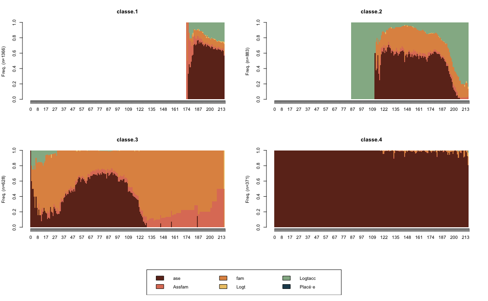
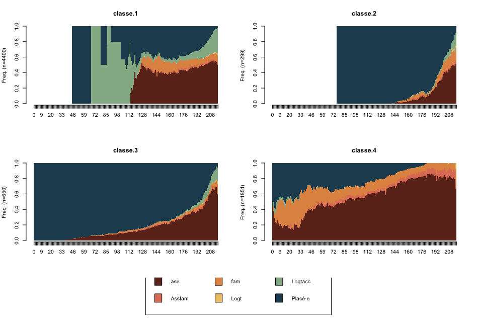

```{r setup2, include=FALSE}
knitr::opts_chunk$set(echo=FALSE, warning=FALSE, message=FALSE,fig.align = 'center', fig.pos = "H")

library(pacman)
p_load(DiagrammeR, extrafont,MetBrewer,RColorBrewer,ggplot2,#visualisation
       huxtable, gtsummary, #tableaux
       TraMineR,TraMineRextras,cluster,WeightedCluster,FactoMineR,seqhandbook, #OM et classification
       ade4,questionr,GDAtools,purrr, nnet, magrittr, tidyverse, lubridate,rstatix) #manipulation et calcul
theme_gtsummary_language("fr", decimal.mark = ",", big.mark = " ")
source("R/Recodage.R")
```

\vspace{.5cm}

````{=tex}
\begin{center}

\bf Analyse de trajectoires sur les enfants sortis au cours de 2017

\end{center}
````
|       Au cours du chapitre 4 de ce mémoire, nous souhaitions replacer l'orientation en MECS dans le cadre plus large du parcours de placement au sein de la Protection de l'enfance. Pour ce faire, nous disposions de deux options techniques : réaliser une analyse des trajectoires à l'aide de l'Optimal matching à partir de laquelle construire une classification ascendante hiérarchique (CAH), ou réaliser une analyse des correspondances multiples sur laquelle la CAH se serait bâtie. Ces deux méthodes auraient employé les mêmes variables : le type d'hébergement avant, une fois en MECS et à la sortie de MECS. L'analyse des trajectoires aurait eu comme avantage la prise en compte de l'âge auquel les différents placements ont lieu et la durée de ces derniers. Ce que ne peut faire une ACM. Mais pour ce faire, l'analyse des trajectoires aurait eu besoin de dates précises pour chaque événement (qui ici aurait été les hébergements à ces trois moments : avant l'entrée en MECS, une fois en MECS et à la sortie de MECS), or, nous n'avons ni la date de fin du temps passé dans le type d'hébergement à la sortie, ni la date d'entrée dans le type d'hébergement précédent le passage en MECS. Nous avons donc présenté dans ce mémoire les résultats issus de la deuxième technique.

Néanmoins, nous tenions à présenter ici les résultats de deux analyses de trajectoires. La première propose à partir d'une population réduite de contourner cette limite des dates des événements. En effet, si nous réduisons la population des enfants sortis au cours de 2017 à ceux pour lequel le premier placement en Protection de l'enfance était leur entrée en MECS, nous réglons la question de la date de l'entrée dans l'hébergement précédent. Cette dernière est de fait censée être celle de la naissance, puisque l'enfant était alors sous la garde de ses parents ou tuteurs légaux. Pour nous en assurer, nous avons aussi réduit la population à seulement les enfants étant hébergés avant l'entrée en MECS chez leur famille ou tuteur légal. Nous n'avons pour autant pas présenté ces résultats dans notre mémoire, puisqu'ils ne règlent pas la question de la date de fin de l'hébergement à la sortie, ni le flou des modalités des variables d'hébergement avant et à la sortie de MECS.

Nous présentons aussi à la suite de ces résultats, les graphiques de l'analyse de trajectoires sur l'ensemble de la population sortie au cours de 2017. Ceci nous permet de présenter visuellement la limite du manque des dates d'entrée dans le type d'hébergement précédent la MECS et ses conséquences sur les résultats produits.

Pour mener ces analyses, nous avons réduit la population aux moins de 18 ans et nous avons construit 6 catégories de placement :

| **Étiquettes** | **Modalités variable HEBE** | **Modalités variables ARES et SRES** |
|------------|-------------------------|----------------------------------|
| ASE        | Collect                 | EtabASEPJJ                       |
| Assfam     | Assfam                  | Assfam                           |
| Fam        | Domicile                | Famille                          |
| Logt       | Autonom                 | Logt hors                        |
| Logtacc    | Autonom                 | Logt acc                         |

: Les étiquettes retenues pour l'Optimal matching et leurs correspondances avec les modalités des variables d'hébergement

````{=tex}
\mdfsetup{%
middlelinewidth=2pt,
backgroundcolor=gray!10,
roundcorner=10pt}
\begin{mdframed}[frametitle=Paramètres de l'Optimal Matching :]

Coût substitution = 2, coût indel = 1.1. Repris de l'article de I. Frechon et N. Robette sur les trajectoires des enfants placés \footnote{Frechon Isabelle et Robette Nicolas, « Les trajectoires de prise en charge par l’Aide sociale à l’enfance de jeunes ayant vécu un placement », Revue francaise des affaires sociales, 31 juillet 2013, no 1, p. 122‑143.}. Ce choix permet de mettre en valeur les événements importants de la trajectoire en donnant plus de poids aux opérations d'insertion et de suppression.

\end{mdframed}
````

> **Analyse des trajectoires sur les enfants sortis en 2017 dont le premier placement était en MECS**

```{r,include=FALSE}
s_mecs <- subset(sor, CATEG_rec == "MECS")
s_mecs$ppla <- case_when(s_mecs$d_anpp == s_mecs$d_ane ~ "Oui",
                         T ~"Non")

s_mecs$id <- rownames(s_mecs)
#Recodages pour créer la bdd 
class <- s_mecs %>% 
  subset(ppla == "Oui") %>% 
  select("id","SEX", "age","ANN", "ANPP", "AMES", "ARES_rec","ANE", "MES", "HEBE_rec3", "CATEG_rec","SMES","SRES_rec","MNA", "MOPP", "MOE", "MOS", "d_ann", "d_ans", "d_anpp", "d_ane") %>%
  mutate(ageANS = (2017 - ANN))%>% 
  subset(ageANS <= 18)

class %>% subset(ARES_rec == "Famille")

class %<>% mutate(mois_s = as.numeric(as.period(interval(start = d_ann, end = d_ans)), "months"),
                 mois_pp = as.numeric(as.period(interval(d_ann, d_anpp)), "months"),
                 mois_e = as.numeric(as.period(interval(d_ann, d_ane)), "months"))

class %<>% mutate(mois = paste(0:216, collapse = ", ")) %>% 
  separate_rows(mois, sep = ",")
class$mois <- as.numeric(class$mois)

# Création de la variable de statut
class %<>% mutate(statut = case_when(mois >= mois_pp & mois < mois_e ~ "Placé·e",
                            mois >= mois_e & mois < mois_s & HEBE_rec3 == "Collect" ~ "ase",
                            mois >= mois_e & mois < mois_s & HEBE_rec3 == "Autonomautre" ~ "Logtacc",
                            mois >= mois_e & mois < mois_s & HEBE_rec3 == "Assfam" ~ "Assfam",
                            mois >= mois_e & mois < mois_s & HEBE_rec3 == "Domicile" ~ "fam",
                            mois == mois_s & SRES_rec == "Famille" ~ "fam",
                            mois == mois_s & SRES_rec == "Assfam" ~ "Assfam",
                            mois == mois_s & SRES_rec == "Autres" ~ "Logtacc",
                            mois == mois_s & SRES_rec == "Logtacc" ~ "Logtacc",
                            mois == mois_s & SRES_rec == "Logthors" ~ "Logt",
                            mois == mois_s & SRES_rec == "EtabASEPJJ" ~ "ase",
                            T ~ "NA")) 

class %<>% subset(statut != "NA") 
#On prend la décision d'enlever les MNA pour la suite de l'analyse

## tests de NA avant suppression ####
require(rstatix)
#On test les NA : pas de NA dans mois_s
chisq.test(table(class$mois_s, class$SEX, useNA = "always"))
chisq.test(table(class$mois_s, class$SEX))
chisq.residuals(table(class$mois_s, class$SEX, useNA = "always"))
#ça ne change pas la significativité

#On test les NA : pas de NA dans mois_pp
chisq.test(table(class$mois_pp, class$SEX, useNA = "always"))
chisq.test(table(class$mois_pp, class$SEX))
chisq.residuals(table(class$mois_pp, class$SEX, useNA = "always"))
#ne change pas la significativité

#On test les NA : pas de NA dans mois_e
chisq.test(table(class$mois_e, class$SEX, useNA = "always"))
chisq.test(table(class$mois_e, class$SEX))
chisq.residuals(table(class$mois_e, class$SEX, useNA = "always"))
#ne change pas la significativité

#On les supprime
vars <- c("mois_s", "mois_pp", "mois_e")
class %<>% 
  drop_na(any_of(vars))
```

```{r graphique, out.width= "70%", fig.cap="Chronogramme des différents parcours de placements à l'ASE"}
n <- class %>%
  filter(mois %in% (0:217*12)) %>%
  group_by(mois) %>%
  count() %>%
  pluck("n")
etiquettes <- paste0("M", 0:217*12, "\n(n=", n, ")")

g1 <- ggplot(class) +
  aes(x = mois, fill = statut) +
  theme(legend.position = "bottom") + 
  scale_y_continuous(labels = function(x) paste0(x * 100, '%')) +
  scale_fill_manual(values=met.brewer("Hokusai1", 6, direction = 1)) +
  geom_bar(position = "fill")+
  ggtitle("") +
  ylab("") +
  xlab("Âge") +
  scale_x_continuous(breaks = 0:217*12, labels = etiquettes) +
  labs(caption = "Source : ES-PE 2017, DREES. \n
Champ : France entière, hors Mayotte, enfants sortis de l'établissement d'observation au cours de 2017 \n (hors sections d'accueil mères-enfants). \n
Lecture : 50% des enfants sortis au cours de 2017 en premier placement en MECS et étant placés à leurs 3 ans (M36) sont hébergés chez leur famille ou tuteurs légaux.", fill = "Catégorie :") +
  theme_bw() +
  theme(legend.position = "top")
g1 + theme(text = element_text(family = "Times"), plot.title = element_text(face = "bold"))
```

Le choix a été de retenir quatre classes de la classification qui permettent de distinguer quatre groupe de trajectoires de placement en Protection de l'enfance.

```{r OM1, echo=FALSE, message=FALSE, warning=FALSE, eval = FALSE}
seq <- class %>% select("id","mois", "statut") %>% 
  pivot_wider(id_cols = id, names_from = mois, values_from = statut) %>% 
  select(order(as.numeric(colnames(.))))
seq$id <- rownames(seq)

seq_all <- seqdef(
  seq %>% dplyr::select(0:217),
  id = seq$id,
  alphabet = c("ase","Assfam","fam", "Logt", "Logtacc", "Placé·e"),
  cpal = met.brewer("Hokusai1", 6, direction = 1))

#Optimal matching ----
couts <- seqsubm(seq_all, method = "CONSTANT", with.missing = T, cval = 2)
seq.om <- seqdist(seq_all, method = "OM", indel = 1.1, sm = couts, with.missing = T)

# Classification ----
seq.dist <- hclust(as.dist(seq.om), method = "ward.D2")
```

```{r OM2, out.width="20%", include = FALSE, eval = FALSE}
par(mfrow = c(1, 2))
plot(as.dendrogram(seq.dist), leaflab = "none")
plot(sort(seq.dist$height, decreasing = TRUE)[1:20], type = "s", ylab = "inertie")
```

```{r OM3, out.width="80%", fig.cap="Chronogramme des différents parcours de placements à l'ASE", results='hold', include=FALSE, eval = FALSE}
nbcl <- 4
seq.part <- cutree(seq.dist, nbcl)
seq.part <- factor(seq.part, labels = paste("classe", 1:nbcl, sep = "."))
seqdplot(seq_all, group = seq.part, xtlab = 0:217, border = NA)
```

```{r, out.width="80%", fig.cap="Chronogramme des différents parcours de placements à l'ASE"}

```
\begin{flushright}
\small{Source : Enquête ES-PE 2017, DREES.
Champ : France entière, hors Mayotte, enfants sortis de l’établissement d’observation au cours de 2017 (hors sections d’accueil mères-enfants).}
\end{flushright}

```{r, out.width="80%", include = FALSE, eval = FALSE}
seqHtplot(seq_all, group = seq.part, xtlab = 0:217)
```

```{r, include=FALSE, eval = FALSE}
doublons <- which(duplicated(class$id))
class2 <- class[-doublons,] %>% data.frame

essai<- as.data.frame(seq.part)
class2$grp <- essai$seq.part

class2$age2 <- (2017 - class2$ANN)
```

```{r, include=FALSE, eval = FALSE}
class2 %>% tbl_summary(include = c("grp", "SEX", "HEBE_rec3",  "ARES_rec", "SRES_rec", "age2"), 
              by = grp, 
              missing = "no",
              statistic = list(all_categorical() ~ "{p}% ({n})",
                               all_continuous() ~ "{mean}"))
```

```{r, include=FALSE, eval = FALSE}
chisq_test(class2$grp, class2$SEX)
chisq.residuals(table(class2$grp, class2$SEX))

chisq_test(class2$grp, class2$ARES)
chisq.residuals(table(class2$grp, class2$ARES))

chisq_test(class2$grp, class2$HEBE)
chisq.residuals(table(class2$grp, class2$HEBE))

chisq_test(class2$grp, class2$SRES)
chisq.residuals(table(class2$grp, class2$SRES))
```

Ainsi, quatre classes se détachent de la CAH qui est réalisée à l'aide des résultats de l'Optimal Matching. La première regroupe les adolescents placés et est celle d'un placement temporaire avant la majorité, caractérisée par un fort recours à l'internat collectif, et dans une moindre mesure au logement autonome ou accompagné. La deuxième classe semble s'apparenter à celle du placement autonome détecté dans notre chapitre 4. Avec un recours au logement accompagné ou autonome au début et à la fin de prise en charge. Avec une fois en MECS, une forte importance de l'orientation en internat collectif. Les deux dernières classes rassemblent des enfants connaissant un long parcours en protection de l'enfance. La troisième classe est celle du maintien du lien familial sous le contrôle des professionnels de la protection de l'enfance avec le recours important au placement à domicile. La quatrième classe est celle d'un long parcours en établissement de placement et internat collectif.

> **Optimal matching sur tous les enfants sortis en 2017**

Voici maintenant les résultats de l'analyse des trajectoires réalisée sur l'ensemble des enfants sortis en 2017 avant ou à leurs 18 ans. On observe la forte part de l'étiquette "placé·e" correspondant à la situation où nous savons que ces enfants sont placés, mais pas dans quel type d'hébergement. On observe que la classe 3 obtenue par la CAH est complètement occupée par les enfants sur lesquels nous n'avons pas d'informations sur les types de placement précédents.

```{r ,include=FALSE}
s_mecs <- subset(sor, CATEG_rec == "MECS")
s_mecs$id <- rownames(s_mecs)
#Recodages pour créer la bdd 
class <- s_mecs %>%
  select("id","SEX", "age","ANN", "ANPP", "AMES", "ARES_rec","ANE", "MES", "HEBE_rec3", "CATEG_rec","SMES","SRES_rec","MNA", "MOPP", "MOE", "MOS", "d_ann", "d_ans", "d_anpp", "d_ane") %>%
  mutate(ageANS = (2017 - ANN))%>% 
  subset(ageANS <= 18)

class %<>% mutate(mois_s = as.numeric(as.period(interval(start = d_ann, end = d_ans)), "months"),
                 mois_pp = as.numeric(as.period(interval(d_ann, d_anpp)), "months"),
                 mois_e = as.numeric(as.period(interval(d_ann, d_ane)), "months"))

class %<>% mutate(mois = paste(0:216, collapse = ", ")) %>% 
  separate_rows(mois, sep = ",")
class$mois <- as.numeric(class$mois)

# Création de la variable de statut
class %<>% mutate(statut = case_when(mois >= mois_pp & mois < mois_e ~ "Placé·e",
                            mois >= mois_e & mois < mois_s & HEBE_rec3 == "Collect" ~ "ase",
                            mois >= mois_e & mois < mois_s & HEBE_rec3 == "Autonomautre" ~ "Logtacc",
                            mois >= mois_e & mois < mois_s & HEBE_rec3 == "Assfam" ~ "Assfam",
                            mois >= mois_e & mois < mois_s & HEBE_rec3 == "Domicile" ~ "fam",
                            mois == mois_s & SRES_rec == "Famille" ~ "fam",
                            mois == mois_s & SRES_rec == "Assfam" ~ "Assfam",
                            mois == mois_s & SRES_rec == "Autres" ~ "Logtacc",
                            mois == mois_s & SRES_rec == "Logtacc" ~ "Logtacc",
                            mois == mois_s & SRES_rec == "Logthors" ~ "Logt",
                            mois == mois_s & SRES_rec == "EtabASEPJJ" ~ "ase",
                            T ~ "NA")) 

class %<>% subset(statut != "NA") 
#On prend la décision d'enlever les MNA pour la suite de l'analyse

## tests de NA avant suppression ##
require(rstatix)
#On test les NA : pas de NA dans mois_s
chisq.test(table(class$mois_s, class$SEX, useNA = "always"))
chisq.test(table(class$mois_s, class$SEX))
chisq.residuals(table(class$mois_s, class$SEX, useNA = "always"))
#ça ne change pas la significativité

#On test les NA : pas de NA dans mois_pp
chisq.test(table(class$mois_pp, class$SEX, useNA = "always"))
chisq.test(table(class$mois_pp, class$SEX))
chisq.residuals(table(class$mois_pp, class$SEX, useNA = "always"))
#ne change pas la significativité

#On test les NA : pas de NA dans mois_e
chisq.test(table(class$mois_e, class$SEX, useNA = "always"))
chisq.test(table(class$mois_e, class$SEX))
chisq.residuals(table(class$mois_e, class$SEX, useNA = "always"))
#ne change pas la significativité

#On les supprime
vars <- c("mois_s", "mois_pp", "mois_e")
class %<>% 
  drop_na(any_of(vars))
```

```{r, out.width= "70%", fig.cap="Chronogramme des différents parcours de placements à l'ASE"}
n <- class %>%
  filter(mois %in% (0:217*12)) %>%
  group_by(mois) %>%
  count() %>%
  pluck("n")
etiquettes <- paste0("M", 0:217*12, "\n(n=", n, ")")

g1 <- ggplot(class) +
  aes(x = mois, fill = statut) +
  theme(legend.position = "bottom") + 
  scale_y_continuous(labels = function(x) paste0(x * 100, '%')) +
  scale_fill_manual(values=met.brewer("Hokusai1", 6, direction = 1)) +
  geom_bar(position = "fill")+
  ggtitle("") +
  ylab("") +
  xlab("Âge") +
  scale_x_continuous(breaks = 0:217*12, labels = etiquettes) +
  labs(caption = "Source : ES-PE 2017, DREES. \n
Champ : France entière, hors Mayotte, enfants sortis de l'établissement d'observation au cours de 2017 \n (hors sections d'accueil mères-enfants).\n
Lecture : 50% des enfants sortis au cours de 2017 en parcours de placement à leur 14 ans (M168) \n sont placés dans un type d'hébergement inconnu (placé·e)", fill = "Catégorie :") +
  theme_bw() +
  theme(legend.position = "top")
g1 + theme(text = element_text(family = "Times"), plot.title = element_text(face = "bold"))
```

```{r, echo=FALSE, message=FALSE, warning=FALSE, eval = FALSE}
seq <- class %>% select("id","mois", "statut") %>% 
  pivot_wider(id_cols = id, names_from = mois, values_from = statut) %>% 
  select(order(as.numeric(colnames(.))))
seq$id <- rownames(seq)

seq_all <- seqdef(
  seq %>% dplyr::select(0:217),
  id = seq$id,
  alphabet = c("ase","Assfam","fam", "Logt", "Logtacc", "Placé·e"),
  cpal = met.brewer("Hokusai1", 6, direction = 1))

#Optimal matching ----
couts <- seqsubm(seq_all, method = "CONSTANT", with.missing = T, cval = 2)
seq.om <- seqdist(seq_all, method = "OM", indel = 1.1, sm = couts, with.missing = T)

# Classification ----
seq.dist <- hclust(as.dist(seq.om), method = "ward.D2")
```

```{r, out.width="20%", include = FALSE, eval = FALSE}
par(mfrow = c(1, 2))
plot(as.dendrogram(seq.dist), leaflab = "none")
plot(sort(seq.dist$height, decreasing = TRUE)[1:20], type = "s", ylab = "inertie")
```

```{r, out.width="80%", fig.cap="Chronogramme des différents parcours de placements à l'ASE", eval=FALSE}
nbcl <- 4
seq.part <- cutree(seq.dist, nbcl)
seq.part <- factor(seq.part, labels = paste("classe", 1:nbcl, sep = "."))
seqdplot(seq_all, group = seq.part, xtlab = 0:217, border = NA)
```

```{r, out.width="80%", fig.cap="Chronogramme des différents parcours de placements à l'ASE", results='hold'}

```
\begin{flushright}
\small{Source : Enquête ES-PE 2017, DREES.
Champ : France entière, hors Mayotte, enfants sortis de l’établissement d’observation au cours de 2017 (hors sections d’accueil mères-enfants).}
\end{flushright}

```{r, out.width="80%", include = FALSE, eval = FALSE}
seqHtplot(seq_all, group = seq.part, xtlab = 0:217)
```

```{r, include=FALSE, eval = FALSE}
doublons <- which(duplicated(class$id))
class2 <- class[-doublons,] %>% data.frame

essai<- as.data.frame(seq.part)
class2$grp <- essai$seq.part

class2$age2 <- (2017 - class2$ANN)
```

```{r, include=FALSE, eval = FALSE}
class2 %>% tbl_summary(include = c("grp", "SEX", "HEBE_rec3",  "ARES_rec", "SRES_rec", "age2"), 
              by = grp, 
              missing = "no",
              statistic = list(all_categorical() ~ "{p}% ({n})",
                               all_continuous() ~ "{mean}"))
```

```{r, include=FALSE, eval = FALSE}
chisq_test(class2$grp, class2$SEX)
chisq.residuals(table(class2$grp, class2$SEX))

chisq_test(class2$grp, class2$ARES)
chisq.residuals(table(class2$grp, class2$ARES))

chisq_test(class2$grp, class2$HEBE)
chisq.residuals(table(class2$grp, class2$HEBE))

chisq_test(class2$grp, class2$SRES)
chisq.residuals(table(class2$grp, class2$SRES))
```
